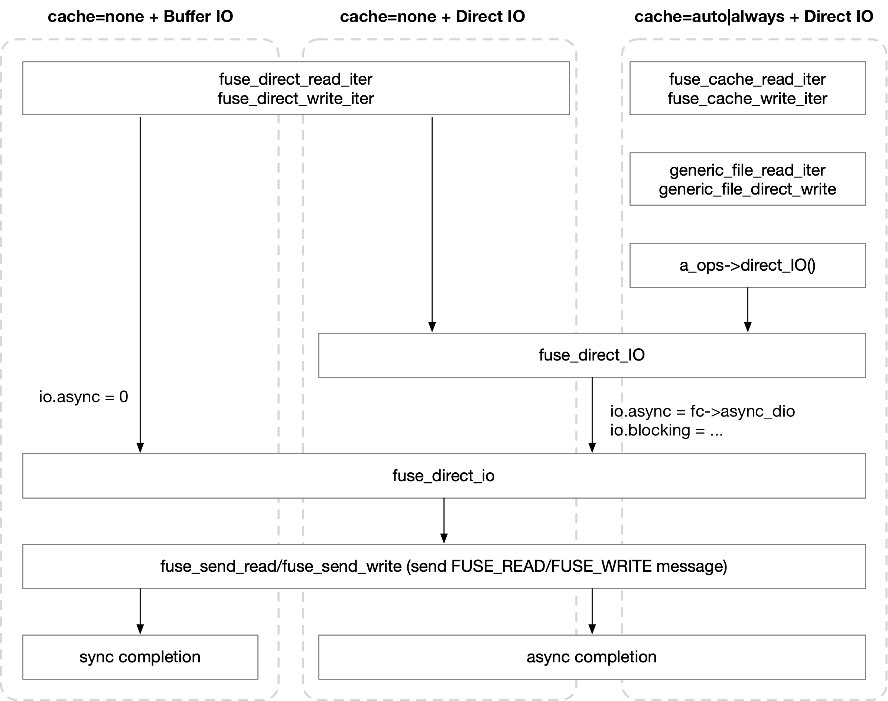

title:'FUSE - IO - Direct IO'
## FUSE - IO - Direct IO


FUSE 中 Direct IO 会 bypass page cache，直接向 fuse server 发送 FUSE_WRITE message，Direct IO 有两个入口

一个就是寻常的路径，即 fuse client 中 open(2) 系统调用的 @flag 参数设置上 O_DIRECT 标志，那么接下来对该文件的访问就是 Direct IO

```
open(2): @flag |= O_DIRECT 
    file->f_flags |= O_DIRECT
        
read()/write() syscall
    vfs_read/vfs_write
        new_sync_read.new_sync_write
            iocb->ki_flags |= IOCB_DIRECT
            f_op->read_iter()/write_iter()
```

另一个是 FUSE_OPEN reply 的 @fuse_open_out.open_flags 设置有 FOPEN_DIRECT_IO 标志的时候，无论是否 O_DIRECT open(2) 的这个文件，该文件都只能执行 direct IO，而不能执行 buffer IO

例如 virtiofsd 设置有 `-o cache=none` 参数时，FUSE_OPEN 回复的 @fuse_open_out.open_flags 总是会置上 FOPEN_DIRECT_IO 标志，从而让文件访问总是走 Direct IO 路径




#### fuse_direct_io

fuse Direct IO 的入口是 fuse_direct_io()

```c
ssize_t fuse_direct_io(struct io *io, struct iov_iter *iter,
		       loff_t *ppos, int flags)
```

描述对 @io->iocb->ki_filp 文件的 @ppos 偏移处开始执行 Direct IO，对应的 (iocb, iter) pair 为 (@io->iocb, @iter)

@flags 设置有 FUSE_DIO_WRITE 表示 direct write，否则就是 direct read

```
fuse_direct_io
    # since max_pages constraint of single FUSE_[READ|WRITE]
    # may need to send multiple FUSE_[READ|WRITE] messages
    # for each message:
        fuse_get_user_pages // construct fuse_args_pages
        fuse_send_read/fuse_send_write // send FUSE_[READ|WRITE]
```


#### cache=none + Buffer IO

可以看到该模式下，即使是 buffer IO 也会走 Direct IO 的路径，即直接向 fuse server 发送 FUSE_WRITE message

```sh
f_op->read_iter(), i.e. fuse_file_read_iter()
f_op->write_iter(), i.e. fuse_file_write_iter()
    fuse_direct_read_iter/fuse_direct_write_iter
        # io.async = 0
        fuse_direct_io
            fuse_send_read/fuse_send_write
```


#### cache=none + Direct IO

这种模式下毫无疑问会走 Direct IO 路径

```sh
f_op->read_iter(), i.e. fuse_file_read_iter()
f_op->write_iter(), i.e. fuse_file_write_iter()
    fuse_direct_read_iter/fuse_direct_write_iter
        fuse_direct_IO
            # io.async = fc->async_dio
            fuse_direct_io
                fuse_send_read/fuse_send_write
```


可以看到，cache=none (即 FOPEN_DIRECT_IO) 的时候，无论 direct IO 还是 buffer IO 都会走 Direct IO 路径，即直接向 fuse server 发送 FUSE_WRITE message，但是两者的区别是：

buffer IO 总是 sync completion 的，即在发送 FUSE_[READ|WRITE] message 之后，同步等待这些 IO 的完成

而 direct IO 会尝试走 async completion，而想要走 async 路径则需要同时满足两个条件

1) fc->async_dio 标志被设置，即 FUSE_INIT 协商过程中 reply 返回 FUSE_ASYNC_DIO，该标志表示对 direct IO 执行 async 路径
2) 传入的 iocb->ki_completion 不为 NULL，即当前 IO 是通过 aio/io_uring 这类异步 IO 框架下发的

当同时满足以上两个条件时，direct IO 就会走 async comletion 路径，此时在发送 FUSE_[READ|WRITE] message 之后，会立即返回 -EIOCBQUEUED；等到后面 IO 真的完成的时候再执行 iocb->ki_completion()

否则 direct IO 也还是会走 sync comletion 路径，即在发送 FUSE_[READ|WRITE] message 之后，同步等待这些 IO 的完成

```sh
fuse_direct_IO
    # io.async = fc->async_dio
    # io.blocking = ... (checking if submitted by aio/io_uring)
    
    fuse_direct_io
        fuse_send_read/fuse_send_write
    
    if io.async:
        if !io.blocking:
            return -EIOCBQUEUED      // async Direct IO
        else:
            # wait for IO completion //  sync Direct IO
```


#### cache=auto|always + Direct IO

这种模式下毫无疑问也是走 Direct IO 路径

```sh
f_op->read_iter(), i.e. fuse_file_read_iter()
f_op->write_iter(), i.e. fuse_file_write_iter()
    fuse_cache_read_iter/fuse_cache_write_iter
        generic_file_read_iter/generic_file_direct_write
            a_ops->direct_IO(), i.e. fuse_direct_IO()
                # io.async = fc->async_dio
                # io.blocking = ... (checking if submitted by aio/io_uring)

                fuse_direct_io
                    fuse_send_read/fuse_send_write
                    
                # async/sync completion according to io.async and io.blocking
```

这里的代码路径与 cache=none + Direct IO 模式基本一致，都是调用的 fuse_direct_IO()
