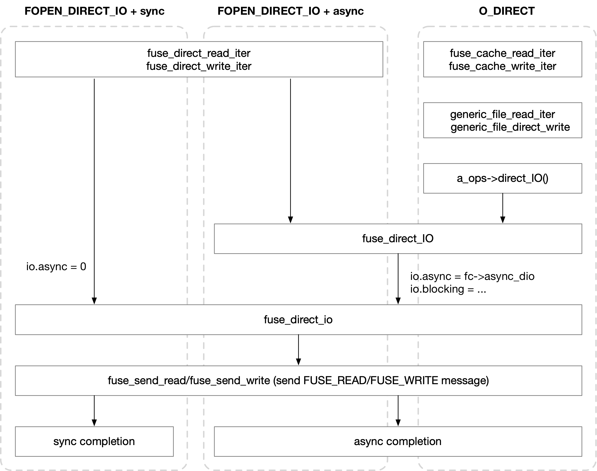

title:'FUSE - IO - Direct IO'
## FUSE - IO - Direct IO


### entry



FUSE Direct IO 有两个入口

#### O_DIRECT

一个就是寻常的路径，即 O_DIRECT open(2) 下发的 Direct IO

```
open(2): @flag |= O_DIRECT 
    file->f_flags |= O_DIRECT
        
read()/write() syscall
    vfs_read/vfs_write
        new_sync_read/new_sync_write
            iocb->ki_flags |= IOCB_DIRECT
            f_op->read_iter(), i.e. fuse_file_read_iter()
            f_op->write_iter(), i.e. fuse_file_write_iter()
                fuse_cache_read_iter/fuse_cache_write_iter
                    generic_file_read_iter/generic_file_direct_write
                        a_ops->direct_IO(), i.e. fuse_direct_IO()
                            # io.async = fc->async_dio
                            # io.blocking = ... (checking if submitted by libaio/io_uring)
            
                            fuse_direct_io
                                fuse_send_read/fuse_send_write
                                
                            # async/sync completion according to io.async and io.blocking
```


#### FOPEN_DIRECT_IO

另一个是 FUSE_OPEN reply 的 @fuse_open_out.open_flags 设置有 FOPEN_DIRECT_IO 标志的时候，无论是否 O_DIRECT open(2) 的这个文件，该文件都只能执行 direct IO，而不能执行 buffer IO

例如 virtiofsd 设置有 `-o cache=none` 参数时，FUSE_OPEN 回复的 @fuse_open_out.open_flags 总是会置上 FOPEN_DIRECT_IO 标志，从而让文件访问总是走 Direct IO 路径

##### FOPEN_DIRECT_IO + sync

FOPEN_DIRECT_IO 模式下，无论 buffer IO 还是 DIRECT IO 都强制走 Direct IO 路径，此时如果不是 async 下发（例如 libaio、io_uring）的，那么会同步下发 FUSE_WRITE/FUSE_READ 请求，并同步等待请求完成，最终返回成功执行的数据量

```sh
f_op->read_iter(), i.e. fuse_file_read_iter()
f_op->write_iter(), i.e. fuse_file_write_iter()
    fuse_direct_read_iter/fuse_direct_write_iter
        # io.async = 0
        fuse_direct_io
            fuse_send_read/fuse_send_write
                # send FUSE_WRITE/FUSE_READ
                fuse_simple_request
```

##### FOPEN_DIRECT_IO + async

FOPEN_DIRECT_IO 模式下，无论 buffer IO 还是 DIRECT IO 都强制走 Direct IO 路径，此时如果是 async 下发（例如 libaio、io_uring）的，那么会尝试异步下发 FUSE_WRITE/FUSE_READ 请求

```sh
f_op->read_iter(), i.e. fuse_file_read_iter()
f_op->write_iter(), i.e. fuse_file_write_iter()
    fuse_direct_read_iter/fuse_direct_write_iter
        fuse_direct_IO
            # io.async = fc->async_dio
            # io.blocking = ... (checking if submitted by libaio/io_uring)
            
            fuse_direct_io
                fuse_send_read/fuse_send_write
            
            # async/sync completion according to io.async and io.blocking
```


### core routine

fuse Direct IO 有两个主要的函数，其中

fuse_direct_io() 负责主要的 IO 下发工作，包括将大 IO 切分为多个 FUSE_WRITE/FUSE_READ 请求、FUSE 请求下发等

fuse_direct_IO() 会调用前者执行真正的 IO 下发操作，差异是，之前介绍过 fuse_direct_io() 中会将大 IO 切分为多个 FUSE_WRITE/FUSE_READ 请求下发，这些切分出来的多个请求之间可以是同步的（前一个切分出来的请求同步完成之后再下发下一个切分出来的请求）、也可以是异步的（异步下发所有切分出来的请求），fuse_direct_IO() 中无论是 sync 还是 async 下发的 IO，都会尝试异步下发所有切分出来的请求

#### fuse_direct_io

fuse_direct_io() 负责主要的 IO 下发工作，包括将大 IO 切分为多个 FUSE_WRITE/FUSE_READ 请求、FUSE 请求下发等

```c
ssize_t fuse_direct_io(struct io *io, struct iov_iter *iter,
		       loff_t *ppos, int flags)
```

描述对 @io->iocb->ki_filp 文件的 @ppos 偏移处开始执行 Direct IO，对应的 (iocb, iter) pair 为 (@io->iocb, @iter)

@flags 设置有 FUSE_DIO_WRITE 表示 direct write，否则就是 direct read


以 [FOPEN_DIRECT_IO + sync](mweblib://16738553480877#fopen-direct-io-sync) 为例介绍 fuse_direct_io() 在同步下发模式下，将一个大 IO（按照 max_read/max_write/max_pages 等限制）同步切分为多个 FUSE_WRITE/FUSE_READ 请求，即前一个切分出来的请求同步完成之后再下发下一个切分出来的请求

```sh
f_op->read_iter(), i.e. fuse_file_read_iter()
f_op->write_iter(), i.e. fuse_file_write_iter()
    fuse_direct_read_iter/fuse_direct_write_iter
        # io.async = 0
        fuse_direct_io
            # split large IO to multiple FUSE_[READ|WRITE] requests
            # for each request:
                fuse_get_user_pages // construct fuse_args_pages
                fuse_send_read/fuse_send_write
                    # send FUSE_WRITE/FUSE_READ and wait for completion
                    fuse_simple_request
```

#### fuse_direct_IO

FOPEN_DIRECT_IO + async 和 O_DIRECT 都会直接调用 fuse_direct_IO()，fuse_direct_IO() 会调用 fuse_direct_io() 执行真正的 IO 下发操作，差异是，之前介绍过 fuse_direct_io() 中会将大 IO 切分为多个 FUSE_WRITE/FUSE_READ 请求下发，这些切分出来的多个请求之间可以是同步的（前一个切分出来的请求同步完成之后再下发下一个切分出来的请求）、也可以是异步的（异步下发所有切分出来的请求），fuse_direct_IO() 中无论是 sync 还是 async 下发的 IO，都会尝试异步下发所有切分出来的请求

但前提条件是，fc->async_dio 标志被设置，即 FUSE_INIT 协商过程中 reply 返回 FUSE_ASYNC_DIO，该标志表示对 direct IO 执行 async 路径

> 这里在开启 FUSE_ASYNC_DIO 之后，fuse daemon 有可能收到针对同一个文件的并发的 WRITE 请求，因而只有当 fuse daemon 有能力处理这一情形时，才能开启 FUSE_ASYNC_DIO

如果不能异步下发，参考 [fuse_direct_io](mweblib://16738553480877#fuse-direct-io) 中 fuse_direct_io() 的同步下发模式

如果可以异步下发，那么就会异步下发所有切分出来的请求，之后 fuse_direct_IO() 则会立即返回 -EIOCBQUEUED；等到后面 IO 真的完成的时候再执行 iocb->ki_completion()

#### async submission & completion

由于 IO completion 是异步执行的，因而

- 需要为每个切分出来的 FUSE_WRITE/FUSE_READ 请求分配一个 struct fuse_io_args (ia) 结构，以存储 IO completion 异步执行时所需要的信息

```sh
fuse_direct_IO
    fuse_direct_io
        # split large IO to multiple FUSE_[READ|WRITE] requests
        # for each request:
            # allocate fuse_io_args for each FUSE_[READ|WRITE] request
            ia = fuse_io_alloc(io, max_pages)
            
            # construct fuse_args_pages
            fuse_get_user_pages(&ia->ap, ...)
            
            fuse_send_read/fuse_send_write
                # construct ia->ap.args
                fuse_write_args_fill(ia, ...)
                
                # send FUSE_WRITE/FUSE_READ asynchronously
                fuse_simple_background
```

- 同时需要为当前整体的 IO (即切分之前的大 IO) 分配一个 struct fuse_io_priv (io) 结构，以描述当前需要执行的 IO 的相关信息，每个 fuse_direct_io() 调用需要传入一个 fuse_io_priv

```sh
fuse_direct_IO
    io.async = fc->async_dio
    io->reqs = 1
    io->offset = iocb->ki_pos
    io->write = (iov_iter_rw(iter) == WRITE)
    
    fuse_direct_io(io, ...)
        ...
```

```c
/** The request IO state (for asynchronous processing) */
struct fuse_io_priv {
	int async;
	__u64 offset;
	struct kiocb *iocb;
	bool write;
	...
};
```

io->write 描述当前 fuse_io_priv 描述的 IO 是读还是写
io->offset 描述当前 IO 对 io->iocb->ki_filp 文件的 io->offset 偏移处开始执行 Direct IO


> async send

fuse_direct_io() 需要将一个大 IO 切分为多个 FUSE_WRITE/FUSE_READ 请求，在 fuse_direct_io() 的异步发送模式下，fuse_io_priv 与 fuse_io_args 即是“一对多”的关系

```c
/** The request IO state (for asynchronous processing) */
struct fuse_io_priv {
	struct kref refcnt;
	unsigned reqs;
	size_t size;
	...
};
```

io->reqs 描述当前 IO 切分出来的 FUSE_WRITE/FUSE_READ 请求的数量，即对应多少个 fuse_io_priv

由于 fuse_io_priv 在所有切分出来的子请求的异步 IO completion 都完成以后才能被释放，因而通过 io->refcnt 管理 fuse_io_priv 的引用计数，每个子请求即 fuse_io_priv 都会增加一个 io->refcnt 引用

io->size 描述当前 IO 已经下发了（但可能还没有完成）的 FUSE_WRITE/FUSE_READ 请求，即所有已经下发了的 fuse_io_priv 包含的数据量

```sh
fuse_direct_IO
    io.async = fc->async_dio
    io->reqs = 1
    io->offset = iocb->ki_pos
    io->write = (iov_iter_rw(iter) == WRITE)
    
    fuse_direct_io(io, ...)
        # split large IO to multiple FUSE_[READ|WRITE] requests
        # for each request:
            # allocate fuse_io_args for each FUSE_[READ|WRITE] request
            ia = fuse_io_alloc(io, max_pages)
            
            # construct fuse_args_pages
            fuse_get_user_pages(&ia->ap, ...)
            
            fuse_send_read/fuse_send_write
                # construct ia->ap.args
                fuse_write_args_fill(ia, ...)
                
                fuse_async_req_send
                    kref_get(&io->refcnt) // get one fuse_io_priv's refcount
                    io->size += num_bytes
                    io->reqs++
                
                # send FUSE_WRITE/FUSE_READ asynchronously
                fuse_simple_background
```


> return value

fuse_direct_io() 中在异步发送 FUSE_WRITE/FUSE_READ 请求之后，会返回所有成功异步发送的数据量，而回到 fuse_direct_IO() 中则会立即返回 -EIOCBQUEUED；

```sh
fuse_direct_IO
    io.async = fc->async_dio
    io->reqs = 1
    io->offset = iocb->ki_pos
    
    fuse_direct_io
        # split large IO to multiple FUSE_[READ|WRITE] requests
        # for each request:
            # allocate fuse_io_args for each FUSE_[READ|WRITE] request
            ia = fuse_io_alloc(io, max_pages)
            
            # construct fuse_args_pages
            fuse_get_user_pages(&ia->ap, ...)
            
            fuse_send_read/fuse_send_write
                # construct ia->ap.args
                fuse_write_args_fill(ia, ...)
                
                # send FUSE_WRITE/FUSE_READ asynchronously
                ia->ap.args.end = fuse_aio_complete_req
                fuse_simple_background
        
        # return all bytes successfully asynchronously sent
    
    if io.async:
        if !io.blocking:
            return -EIOCBQUEUED      // async Direct IO
```


> async completion

发送的 FUSE_WRITE/FUSE_READ 请求完成后，就会调用 fuse_aio_complete_req() 执行 IO completion 操作，其中主要是

- 释放这个子请求对应的 fuse_io_args 结构
- 减去对 io->refcnt 的引用计数

```
fuse_aio_complete_req
    # on FUSE_WRITE/FUSE_READ success, err = 0, pos = -1
    fuse_aio_complete(io, err, pos)
        --io->reqs
        kref_put(&io->refcnt, fuse_io_release) // drop refcnt for fuse_io_priv
    
    fuse_io_free(ia) // free fuse_io_args structure
```


当一个请求（fuse_io_priv）对应的所有子请求（fuse_io_args）都完成的时候，就会执行该请求的 IO completion 函数 (iocb->ki_complete())，同时释放对应的 fuse_io_priv 结构

```
fuse_aio_complete_req
    # on FUSE_WRITE/FUSE_READ success, err = 0, pos = -1
    fuse_aio_complete(io, err, pos)
        # when all sub-requests completed:
            --io->reqs decreased to 0:
                # execute IO completion
                res = io->size
                io->iocb->ki_complete(io->iocb, res) 
        kref_put(&io->refcnt, fuse_io_release)
            # drop last io->refcnt:
                fuse_io_release // free fuse_io_priv structure
    
    fuse_io_free(ia) // free fuse_io_args structure
```

一个请求（fuse_io_priv）对应的所有子请求（fuse_io_args）中，只要其中任意一个子请求失败了（FUSE_WRITE/FUSE_READ 请求返回 error），最终请求的 IO completion 函数 (iocb->ki_complete()) 中就会报错

```
fuse_aio_complete_req
    # once one FUSE_WRITE/FUSE_READ fails, err is non-zero
    fuse_aio_complete(io, err, pos)
        io->err = err
        
        # when all sub-requests completed:
            --io->reqs decreased to 0:
                # execute IO completion
                res = io->err
                io->iocb->ki_complete(io->iocb, res) 
        kref_put(&io->refcnt, fuse_io_release)
            # drop last io->refcnt:
                fuse_io_release // free fuse_io_priv structure
    
    fuse_io_free(ia) // free fuse_io_args structure
```


#### async submission: short read

fuse_direct_IO() 需要对请求异步发送过程中可能发生的 short read 状态进行处理，即一个请求（fuse_io_priv）对应的所有子请求（fuse_io_args）中，任意一个子请求 (FUSE_READ) 实际完成的数据量 (args->out_args[0].size) 小于请求下发阶段指定的数据量 (ia->read.in.size)

当发生 short read 的时候，最终请求的 IO completion 函数 (iocb->ki_complete()) 中传入的 res (即成功完成的数据量) 就是从 io->offset 偏移处开始一段成功读入的一段连续数据区间的长度

例如以下一个读请求被切分为三个子请求（FUSE_READ），其中后两个子请求都出现了 short read 的情况（D 表示成功读入的数据），那么此时这个读请求在执行 IO completion 函数 (iocb->ki_complete()) 的时候，传入的 res 参数示例如下

```
+---------------+---------------+---------------+
|DDDDDDDDDDDDDDD|DDDDDD         |DDDDDDDDDDDD   |
+---------------+---------------+---------------+
<--------------------->
            res
```

为了完成上述目标，增加 io->bytes 字段描述当发生 short read 的时候，截止目前为止，成功读入的连续数据区间的长度（即作为 iocb->ki_complete()) 的 res 参数）

在没有发生 short read 的时候，io->bytes 的值保持为初始值 -1

```c
/** The request IO state (for asynchronous processing) */
struct fuse_io_priv {
	ssize_t bytes;
	size_t size;
	__u64 offset;
	...
};
```

当遇到第一个 short read 的 FUSE_READ 请求时，就将这个 short read 的 FUSE_READ 请求成功读入的数据区间的尾部在整个大请求中的偏移写入 io->bytes，将其视为这个请求 short read 成功读入的数据长度（当然前提是假设这个 short read 子请求之前的所有子请求都没有发生 short read）

```
fuse_aio_complete_req
    # on short read, i.e. args->out_args[0].size != ia->read.in.size:
        # pos 表示当前这个子请求成功读入的数据区间的尾部在整个大请求中的偏移，
        pos = ia->read.in.offset - io->offset + outsize
    fuse_aio_complete(io, err, pos)
        # since pos >= 0 && io->bytes < 0:
            io->bytes = pos
```

即使这个 short read 子请求后面的其他子请求也发生了 short read，那么 io->bytes 也不需要更新

如果这个 short read 子请求前面的其他子请求都没有发生 short read，那么 io->bytes 也不需要更新，说明整个请求 short read 成功读入的数据长度就到这个 short read 的子请求这里为止

而如果这个 short read 子请求前面的其他子请求也发生了 short read，那么 io->bytes 就需要更新为前面发生 short read 的那个子请求在整个请求中的偏移，同时重复以上过程


对于最终发生 short read 的读请求来说，io->bytes 即作为最终请求的 IO completion 函数 (iocb->ki_complete()) 中传入的 res (即成功完成的数据量) 参数
```
fuse_aio_complete_req
    # on short read, i.e. args->out_args[0].size != ia->read.in.size:
        # pos 表示当前这个子请求成功读入的数据区间的尾部在整个大请求中的偏移，
        pos = ia->read.in.offset - io->offset + outsize
    fuse_aio_complete(io, err, pos)
        # since pos >= 0 && io->bytes < 0:
            io->bytes = pos
        
        # when all sub-requests completed:
            --io->reqs decreased to 0:
                # execute IO completion
                res = io->bytes
                io->iocb->ki_complete(io->iocb, res) 
```


> short write

FUSE 实际不支持 short write，尽管 async completion 流程中复用了 short read 的相关逻辑，但是最终在执行请求的 IO completion 函数 (iocb->ki_complete()) 的时候，实际传入的是 -EIO

```
fuse_aio_complete_req
    # on short write, i.e. ia->write.out.size != ia->write.in.size:
        # pos 表示当前这个子请求成功写入的数据区间的尾部在整个大请求中的偏移，
        pos = ia->write.in.offset - io->offset + ia->write.out.size
    fuse_aio_complete(io, err, pos)
        # since pos >= 0 && io->bytes < 0:
            io->bytes = pos
        
        # when all sub-requests completed:
            --io->reqs decreased to 0:
                # execute IO completion
                if (io->bytes >= 0 && io->write):
                    res = -EIO
                io->iocb->ki_complete(io->iocb, res) 
```


#### sync waiting for IO completion

fuse_direct_IO() 中，只要 FUSE_ASYNC_DIO 被开启，即使是同步 IO（不是 libaio、io_uring 这些异步框架下发的 IO），在 fuse_direct_io() 中也是调用的 fuse_simple_background() 接口异步发送的请求

对于这类同步 IO、但是 FUSE 请求又是异步发送的情况，在请求异步发送完成后，就必须在 fuse_direct_IO() 中同步等待这些异步发送的请求完成，此时通过 completion 机制来实现两者之间的同步

```c
/** The request IO state (for asynchronous processing) */
struct fuse_io_priv {
	struct completion *done;
	bool blocking;
	...
};
```

这种情况下，在请求发送阶段，当请求异步发送完成之后，就会在 fuse_direct_IO() 中通过 io->done 等待所有异步下发的请求完成

```sh
fuse_direct_IO
    io.async = fc->async_dio
    io->blocking = is_sync_kiocb(iocb)
    
    if (io->async && io->blocking):
        io->done = &wait
    
    fuse_direct_io
        # split large IO to multiple FUSE_[READ|WRITE] requests
        # for each request:
            # allocate fuse_io_args for each FUSE_[READ|WRITE] request
            ia = fuse_io_alloc(io, max_pages)
            
            # construct fuse_args_pages
            fuse_get_user_pages(&ia->ap, ...)
            
            fuse_send_read/fuse_send_write
                # construct ia->ap.args
                fuse_write_args_fill(ia, ...)
                
                # send FUSE_WRITE/FUSE_READ asynchronously
                ia->ap.args.end = fuse_aio_complete_req
                fuse_simple_background
        
        # return all bytes successfully asynchronously sent
    
    if io.async:
        if io.blocking:
            wait_for_completion(&wait)
```


#### parallel direct write optimization

一般文件的 READ/WRITE 路径中都是持有 inode 锁 (inode->i_rwsem)，从而确保在内核侧对同一文件的读写都是严格串行的，例如在 cache=none 模式下 BUFFER/DIRECT WRITE 实际执行的都是 direct IO，此时每个 direct IO 操作都是持有 inode lock 保护的，从而确保在内核侧对同一文件的 direct write 是没有并发的

```sh
f_op->write_iter(), i.e. fuse_file_write_iter()
    fuse_direct_write_iter
        /* Don't allow parallel writes to the same file */
        inode_lock(inode)
        
        fuse_direct_IO
            # io.async = fc->async_dio
            fuse_direct_io
               fuse_send_write
        
        inode_unlock(inode)
```

```c
struct inode {
	struct rw_semaphore	i_rwsem;
	...
}
```

对于本地文件系统，限制 direct write 的并发是合理的，不然并发的 direct write 有可能带来 race；然而对于 fuse 文件系统来说，内核侧的 fuse 只是向 fuse daemon 发送 WRITE 请求，如果 fuse daemon 侧能够处理并发的 WRITE 请求，在内核侧并发地下发 direct write 请求并不会导致任何问题

因而 v6.2 引入的 commit 153524053bbb ("fuse: allow non-extending parallel direct writes on the same file") 优化就允许内核侧并发地下发 direct write 请求，此时在下发 direct write 的过程中不再是申请独占 inode lock (write lock)，而是申请 shared inode lock (read lock)，但是在满足以下条件的情况下才会开启该优化

- 只针对 @fuse_open_out.open_flags 设置有 FOPEN_DIRECT_IO 标志而导致的 direct write，无论是否 O_DIRECT open(2) 的这个文件
- 只针对 non-extending write，考虑到 extend write 场景下文件的 i_size 在发生 partial write error 的时候，i_size 的回退比较难处理

```sh
f_op->write_iter(), i.e. fuse_file_write_iter()
    fuse_direct_write_iter
        if ff->open_flags & FOPEN_PARALLEL_DIRECT_WRITES, and
           non-extending write:
        inode_lock_shared(inode)
        
        fuse_direct_IO
            ... # send WRITE request
        
        inode_unlock_shared(inode)
```


