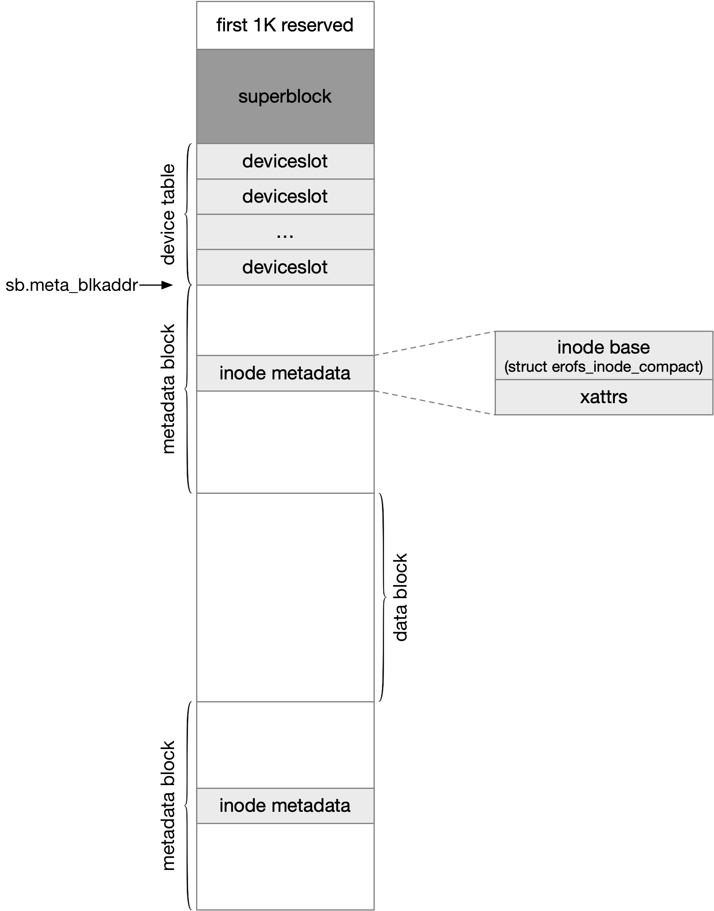

title:'EROFS - Spec - 01 Base'
## EROFS - Spec - 01 Base


EROFS (Enhanced Read-Only FileSystem) 的 on-disk 磁盘格式为




### block

erofs 是 block-based 的文件系统，整个文件系统以 block 为单位进行寻址

super block 的 @blkszbits 字段就描述 block size 为 (1 << blkszbits)

```c
struct erofs_super_block {
	__u8 blkszbits;         /* support block_size == PAGE_SIZE only */
	...
};
```


### superblock

superblock 位于文件系统的第一个 block，其中前面 1024 (EROFS_SUPER_OFFSET) 字节是 reserved 的，其后紧接着的就是 128 字节的 superblock

```c
/* erofs on-disk super block (currently 128 bytes) */
struct erofs_super_block {
	__le32 magic;           /* file system magic number */
	__le32 checksum;        /* crc32c(super_block) */
	__le32 feature_compat;
	__u8 blkszbits;         /* support block_size == PAGE_SIZE only */
	__u8 sb_extslots;	/* superblock size = 128 + sb_extslots * 16 */

	__le16 root_nid;	/* nid of root directory */
	__le64 inos;            /* total valid ino # (== f_files - f_favail) */

	__le64 build_time;      /* inode v1 time derivation */
	__le32 build_time_nsec;	/* inode v1 time derivation in nano scale */
	__le32 blocks;          /* used for statfs */
	__le32 meta_blkaddr;	/* start block address of metadata area */
	__le32 xattr_blkaddr;	/* start block address of shared xattr area */
	__u8 uuid[16];          /* 128-bit uuid for volume */
	__u8 volume_name[16];   /* volume name */
	__le32 feature_incompat;
	union {
		/* bitmap for available compression algorithms */
		__le16 available_compr_algs;
		/* customized sliding window size instead of 64k by default */
		__le16 lz4_max_distance;
	} __packed u1;
	__le16 extra_devices;	/* # of devices besides the primary device */
	__le16 devt_slotoff;	/* startoff = devt_slotoff * devt_slotsize */
	__u8 reserved2[38];
};
```


### inode

剩余的存储空间划分为 metadata area 与 data area 两部分，metadata area 部分存储inode table，包括 on-disk inode、inline xattr、inline data 等；data area 部分则存储文件的数据

metadata area 和 data area 都可以分散存储为多个 block

```
----+----------------+--------------+----------------+----
    | metadata block |  data block  | metadata block | 
----+----------------+--------------+----------------+----
    ^
@meta_blkaddr    
```

```c
struct erofs_super_block {
	__le32 meta_blkaddr;	/* start block address of metadata area */
	...
};
```

superblock 的 @meta_blkaddr 字段描述 metadata area 的起始物理地址，以 block 为单位，该字段一般是 0


```c
struct erofs_super_block {
	/* inode slot unit size in bit shift */
	unsigned char islotbits;
	...
};
```

superblock 的 @islotbits 字段描述 on-disk inode 的大小为 (1 << islotbits)


inode metadata (包括 inode、inline xattr、inline data) 确保不会跨越 block boundary


#### inode id

erofs 中 inode id 同时用于对 inode 进行快速寻址

```c
struct erofs_inode_compact {
	__le32 i_ino;           /* only used for 32-bit stat compatibility */
	...
};
```

on-disk inode 的 @i_ino 字段即为对应的 inode id，此时这个 on-disk inode 在磁盘上的物理地址即为

```
meta_blkaddr * block_size + nid << islotbits
```

之前介绍过，metadata block 可以与 data block 交替排布，此时 node id 会在整个物理地址空间 (包括 data block) 中均匀排布，只是 data block 地址空间内的 node id 相当于是一个 hole，并不真正呈现给用户

也就是说两个 metadata block 中，相邻的两个 inode id 并不连续

```
                nid M               nid M+X
----+----------------+--------------+----------------+----
    | metadata block |  data block  | metadata block | 
----+----------------+--------------+----------------+----
    ^
@meta_blkaddr    
```


#### inode format

erofs 支持 compatible/extended 两种 on-disk inode format

on-disk inode 的 @i_format 字段的 bit 0 就描述 on-disk inode format，0 表示 compatible format，1 表示 extended format

```c
struct erofs_inode_compact {
	__le16 i_format;	/* inode format hints */
	...
}
```

```c
/* 32-byte on-disk inode */
#define EROFS_INODE_LAYOUT_COMPACT      0
/* 64-byte on-disk inode */
#define EROFS_INODE_LAYOUT_EXTENDED     1
```


- compatible inode format

```c
/* 32-byte reduced form of an ondisk inode */
struct erofs_inode_compact {
	__le16 i_format;	/* inode format hints */

/* 1 header + n-1 * 4 bytes inline xattr to keep continuity */
	__le16 i_xattr_icount;
	__le16 i_mode;
	__le16 i_nlink;
	__le32 i_size;
	__le32 i_reserved;
	union {
		/* file total compressed blocks for data mapping 1 */
		__le32 compressed_blocks;
		__le32 raw_blkaddr;

		/* for device files, used to indicate old/new device # */
		__le32 rdev;

		/* for chunk-based files, it contains the summary info */
		struct erofs_inode_chunk_info c;
	} i_u;
	__le32 i_ino;           /* only used for 32-bit stat compatibility */
	__le16 i_uid;
	__le16 i_gid;
	__le32 i_reserved2;
};
```


- extended inode format

```c
/* 64-byte complete form of an ondisk inode */
struct erofs_inode_extended {
	__le16 i_format;	/* inode format hints */

/* 1 header + n-1 * 4 bytes inline xattr to keep continuity */
	__le16 i_xattr_icount;
	__le16 i_mode;
	__le16 i_reserved;
	__le64 i_size;
	union {
		/* file total compressed blocks for data mapping 1 */
		__le32 compressed_blocks;
		__le32 raw_blkaddr;

		/* for device files, used to indicate old/new device # */
		__le32 rdev;

		/* for chunk-based files, it contains the summary info */
		struct erofs_inode_chunk_info c;
	} i_u;

	/* only used for 32-bit stat compatibility */
	__le32 i_ino;

	__le32 i_uid;
	__le32 i_gid;
	__le64 i_mtime;
	__le32 i_mtime_nsec;
	__le32 i_nlink;
	__u8   i_reserved2[16];
};
```

compatible format 的 on-disk inode 是 32 字节大小的，存在以下限制

- @i_size 字段是 32 bit 的，即文件大小的上限为 UINT_MAX
- @i_uid/@i_gid 字段是 16 bit 的，即 UID/GID 的上限为 USHRT_MAX
- @i_nlink 字段是 16 bit 的，即 i_nlink 的上限为 USHRT_MAX

因而如果文件的大小、UID/GID 或 i_nlink 超过上述上限，就必须使用 extended format


此外 compatible ondisk inode 是没有 timestamp 字段的，此时文件系统的 build time 统一作为所有文件的 ctime/mtime/atime

```c
struct erofs_super_block {
	__le64 build_time;      /* inode v1 time derivation */
	__le32 build_time_nsec;	/* inode v1 time derivation in nano scale */
	...
};
```

因而如果需要启用 inode 的 on-disk timestamp，就需要使用 extended format

extended format 的 on-disk inode 是 64 字节大小的

```c
struct erofs_inode_extended {
	__le64 i_mtime;
	__le32 i_mtime_nsec;
	...
};
```

此时 on-disk mtime timestamp 作为文件的 ctime/mtime/atime


用户可以通过 mkfs.erofs 的 `-Eforce-inode-compact` 参数强制启用 compatible format，或者 `-Eforce-inode-extended` 强制启用 extended format