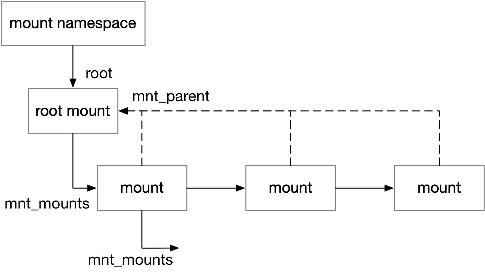
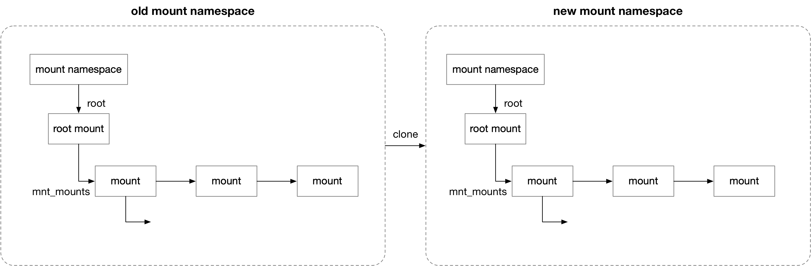
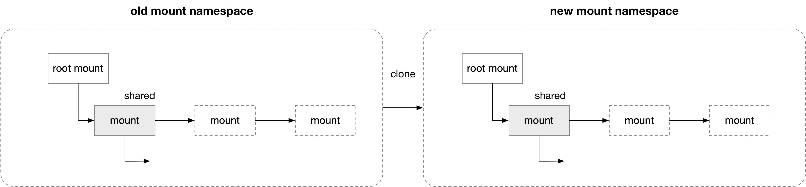
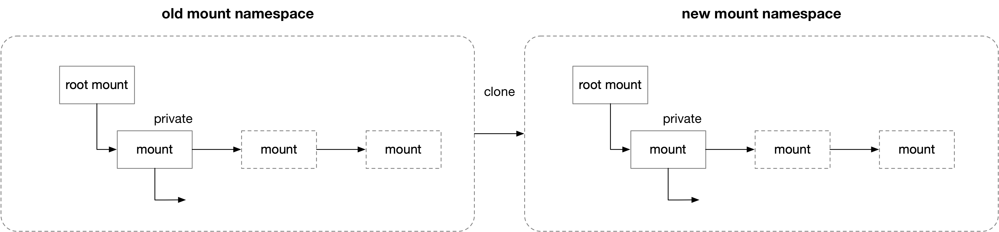
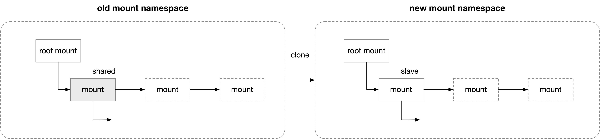

title:'Mount - Propagation'
## Mount - Propagation


### mount tree

#### mount tree hierarchy

每个 mount namespace 下的所有 mount 实例组织为一棵 mount tree



在这棵 mount tree 中，child mount 通过 @mnt_child 字段添加到 parent mount 的 @mnt_mounts 链表中，从而构成一棵 mount tree

```c
struct mount {
	struct list_head mnt_mounts;	/* list of children, anchored here */
	struct list_head mnt_child;	/* and going through their mnt_child */
	...
}
```

mount namespace 的 @root 就指向该 mount tree 的 root mount 实例

```c
struct mnt_namespace {
	struct mount *	root;
	...
};
```


同时 child mount 的 @mnt_parent 字段指向其 parent mount

```c
struct mount {
	struct mount *mnt_parent;
	...
}
```


通常使用以下逻辑，深度优先遍历一棵 mount tree 下的所有 mount 实例，其中 @root 是这棵 mount tree 下的 root mount 实例，@s 作为遍历过程的 cursor

```
for (s = root; s; s = next_mnt(s, root)) {
    # handle @s instance
    ...
}
```

其中 next_mnt() 返回这棵 mount tree 中，以深度优先遍历算法，@s 实例的下一个 mount 实例


此外同一个 mount namespace 下的所有 mount 实例还组织成一个 @list 链表，mount 实例通过 @mnt_list 添加到该链表中

@mounts 描述该 mount namespace 下所有 mount 实例的数量

```c
struct mnt_namespace {
	struct list_head	list;
	unsigned int		mounts; /* # of mounts in the namespace */
	...
};
```

```c
struct mount {
	struct list_head mnt_list;
	...
}
```


#### clone of mount tree

unshare(1) 指定 "-m" 参数时会创建新的 mount namespace，其中会对 old mount namespace 中的 old mount tree 作 clone 操作得到一棵 new mount tree，挂载到 new mount namespace 中



```
unshare(2)
    ksys_unshare
        unshare_nsproxy_namespaces
            create_new_namespaces
                copy_mnt_ns
                    copy_tree
                        # for each mount in the mount tree
                            new = clone_mnt(old, root, flag)
```


### share

> peer group

同一个 peer group 中的所有 mount 实例通过 @mnt_share 链表组织在一起

每个 peer group 都有一个 group ID，mount 实例的 @mnt_group_id 就描述了其所在的 peer group ID

```c
struct mount {
	struct list_head mnt_share;	/* circular list of shared mounts */
	int mnt_group_id;		/* peer group identifier */
	...
}
```


#### setup

"mount --make-shared mountpoint" 可以将 mount 实例修改为 shared propagation type

```
mount(2)
    mount(..., MS_SHARED)
        do_mount
            do_change_type
                # for shared propagation type
                    invent_group_ids(mnt, ...)
                        # alloc a peer group ID
                        mnt->mnt_group_id = ...
```

其中就会为该 mount 实例分配对应的 peer group ID


#### clone mount tree

之前介绍过，在 unshare(2) 创建新 mount namespace 的时候，会对原来的 old mount tree 作 clone 操作得到一棵新的 new mount tree

这一过程中如果 unshare(1) 没有 "-U" 参数，即不创建新 user namespace 的情况下，原来 old mount tree 中 shared propagation type 的 mount 实例，clone 到 new mount tree 中得到的 new mount 实例也是 shared propagation type 的，这两个 mount 实例就同属同一个 peer group



```
unshare(2)
    ksys_unshare
        unshare_nsproxy_namespaces
            create_new_namespaces
                copy_mnt_ns
                    copy_tree
                        # for each mount in the mount tree
                            new = clone_mnt(old, root, flag)
                                # @flag has no CL_SLAVE, CL_PRIVATE, CL_SHARED_TO_SLAVE
                                new->mnt_group_id = old->mnt_group_id;
                                list_add(&new->mnt_share, &old->mnt_share)
```


### private

private propagation type 的 mount 实例并不属于任何 peer group，因而其 @mnt_group_id 为 0

#### setup

"mount --make-private mountpoint" 可以将 mount 实例修改为 private propagation type

```
mount(2)
    mount(..., MS_PRIVATE)
        do_mount
            do_change_type
                # for private propagation type
                    change_mnt_propagation(mnt, ...)
                        do_make_slave
                            mnt_release_group_id
                                # release a peer group ID
                                mnt->mnt_group_id = 0
```

其中会将该 mount 实例的 peer group ID 设为 0


#### clone mount tree

之前介绍过，在 unshare(2) 创建新 mount namespace 的时候，会对原来的 old mount tree 作 clone 操作得到一棵新的 new mount tree

这一过程中，原来 old mount tree 中 private propagation type 的 mount 实例，clone 到 new mount tree 中得到的 new mount 实例也是 private propagation type 的



```
unshare(2)
    ksys_unshare
        unshare_nsproxy_namespaces
            create_new_namespaces
                copy_mnt_ns
                    copy_tree
                        # for each mount in the mount tree
                            new = clone_mnt(old, root, flag)
                                # @flag has no CL_SLAVE, CL_PRIVATE, CL_SHARED_TO_SLAVE
                                new->mnt_group_id = old->mnt_group_id, i.e. 0
                                list_add(&new->mnt_share, &old->mnt_share)
```

可以看到 clone 得到的 new mount 实例的 @mnt_group_id 是 0，new mount 实例也不会添加到任一个 peer group


### slave

master/slave 之间是一对多的关系，即一个 master mount 可以对应多个 slave mount，此时这个 master mount 下新挂载的 mount 实例，会传播到其对应的所有 slave mount 下面

master mount 的 @mnt_slave_list 链表就组织了其所有的 slave mount，slave mount 通过 @mnt_slave 字段添加到其 master mount 的 @mnt_slave_list 链表

slave mount 的 @mnt_master 就指向其 master mount

```c
struct mount {
	struct list_head mnt_slave_list;/* list of slave mounts */
	struct list_head mnt_slave;	/* slave list entry */
	struct mount *mnt_master;	/* slave is on master->mnt_slave_list */
	...
}
```

#### setup

"mount --make-slave mountpoint" 可以将 mount 实例修改为 slave propagation type

```
mount(2)
    mount(..., MS_PRIVATE)
        do_mount
            do_change_type
                # for private propagation type
                    change_mnt_propagation(mnt, ...)
                        do_make_slave
                            # if mnt is a member of peer group
                                # find a peer mount that has the same root dentry as mnt in the peer group as the master
                                mnt->mnt_group_id = 0
                                # add mnt into master's mnt_slave_list list
                                mnt->mnt_master = master
```

如果这个 mount 实例之前是 shared propagation type 的，那么会在其所属的 peer group 中找到一个合适的 peer mount 作为其 master，其中会优先寻找具有相同 root dentry 的 peer mount 作为 master


#### clone mount tree

之前介绍过，在 unshare(2) 创建新 mount namespace 的时候，会对原来的 old mount tree 作 clone 操作得到一棵新的 new mount tree

这一过程中如果 unshare(1) 指定了 "-U" 参数，即创建新 user namespace 的情况下，原来 old mount tree 中 shared propagation type 的 mount 实例，clone 到 new mount tree 中得到的 new mount 实例会变成 slave propagation type 的



```
unshare(2)
    ksys_unshare
        unshare_nsproxy_namespaces
            create_new_namespaces
                copy_mnt_ns
                    copy_tree
                        # for each mount in the mount tree
                            new = clone_mnt(old, root, flag)
                                # @flag has CL_SHARED_TO_SLAVE, but no CL_SLAVE, CL_PRIVATE
                                new->mnt_group_id = 0
                                list_add(&new->mnt_slave, &old->mnt_slave_list);
                                new->mnt_master = old;
```


### propagation

```
mount device  B/b
```

将设备挂载到 mount 实例 B 的挂载点 b，此时

1. 如果挂载实例 B 是 non-shared (private, slave or unbindable)

mount 过程中会创建一个新的 mount，那么此时只是将这个新创建 mount 


propagation的核心逻辑位于 attach_recursive_mnt()，描述将新挂载的实例 @source_mnt 挂载到实例 @dest_mnt 的 @dest_mp 挂载点上

```c
int attach_recursive_mnt(struct mount *source_mnt,
			struct mount *dest_mnt, struct mountpoint *dest_mp,
			bool moving)
```

```
ksys_mount
    do_mount
        do_new_mount
            do_add_mount
                graft_tree
                    attach_recursive_mnt
```

如果 @dest_mnt 是 shared propagation type 的

```
attach_recursive_mnt
    # if @dest_mnt is shared propagation type,
    propagate_mnt(dest_mnt, dest_mp, source_mnt, &tree_list)
        # 1. propagate source_mnt to all the peer of dest_mnt
        for each peer of dest_mnt except dest_mnt itself:
            propagate_one
                type = CL_MAKE_SHARED
                clone = copy_tree(source_mnt, ...)
                mnt_set_mountpoint
                    # set cloned mount's parent to current dest_mnt
                add cloned mount into @tree_list local list
                
        # 2. propagate source_mnt to all the slave of dest_mnt, and all the slave of dest_mnt's peer
            # propagate source_mnt to the slave, and all the peer of the slave
            propagate_one
                type = CL_MAKE_SHARED
                clone = copy_tree(source_mnt, ...)
                mnt_set_mountpoint
                    # set cloned mount's parent to current dest_mnt
                add cloned mount into @tree_list local list

    # for each previously cloned mount in @tree_list local list
        commit_tree
            __attach_mnt
                # add this cloned mount to @mount_hashtable[]
```

那么会将 @source_mnt 实例 clone 挂载到

- @dest_mnt 的所有 peer mount 下面 (shared)
- 以及 @dest_mnt 的所有 slave mount (slave)、以及这些 slave mount 的 peer mount 下面 (slave and shared)
- 以及 @dest_mnt 的所有 peer mount 的所有 slave mount (slave)、以及这些 slave mount 的 peer mount 下面 (slave and shared)

这里会首先针对上述的每个 target dest mount，对 @source_mnt 执行 clone 操作得到一个 cloned mount，每个 cloned mount 的 parent mount 设置为对应的 target dest mount

所有这些 cloned mount 暂时维护在 @tree_list 本地链表中，最后在 commit tree 阶段将该本地链表中的所有 cloned mount 添加到 @mount_hashtable[] hashtable 中，这样在 target dest mount 下执行 pathname lookup 的时候就可以找到该 target dest mount 下的 cloned mount (因为 pathname lookup 过程中，检测到 mntpoint 的 DCACHE_MOUNTED 标记后，在全局的 @mount_hashtable[] hashtable 中寻找该 mntpoint 对应的 mount 实例)