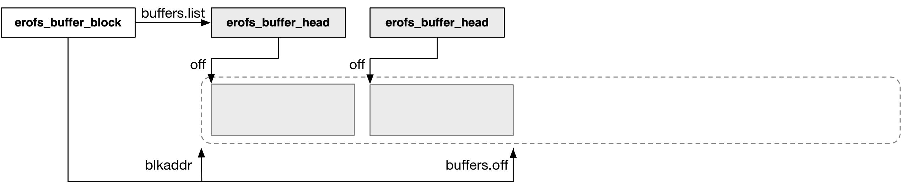

title:'erofs-utils - block'
## erofs-utils - block


### erofs_buffer_block

erofs_buffer_block 抽象一个 block 区间，这个区间可以超过 block size

```c
struct erofs_buffer_block {
	...
};
```


> blkh.list list

blkh.list 全局链表维护所有的 erofs_buffer_block

```c
static struct erofs_buffer_block blkh = {
	.list = LIST_HEAD_INIT(blkh.list),
	.blkaddr = NULL_ADDR,
};
```

erofs_buffer_block 通过 @list 字段添加到 blkh.list 链表中

```c
struct erofs_buffer_block {
	struct list_head list;
	...
};
```


> blkaddr

```c
struct erofs_buffer_block {
	erofs_blk_t blkaddr;
	int type;
	...
};
```


### erofs_buffer_head

每个 erofs_buffer_block 可以切分为多个 erofs_buffer_head，erofs_buffer_head 就用于抽象 erofs_buffer_block 中的一个 slice 区间

```c
struct erofs_buffer_head {
	...
};
```




erofs_buffer_block 的 buffers.list 链表就管理该 erofs_buffer_block 下的所有 erofs_buffer_head

```c
struct erofs_buffer_block {
	...
	struct erofs_buffer_head buffers;
};
```

erofs_buffer_head 通过 @list 字段添加到 erofs_buffer_block 的 buffers.list 链表中

```c
struct erofs_buffer_head {
	struct list_head list;
	struct erofs_buffer_block *block;
	...
};
```


erofs_buffer_head 的 @off 描述该 slice 在 erofs_buffer_block 中的 offset

```c
struct erofs_buffer_head {
	erofs_off_t off;
	...
};
```

erofs_buffer_block 内嵌的 buffers.off 则描述了该 erofs_buffer_block 中下一个可用的 offset，即该 erofs_buffer_block 中所有 erofs_buffer_head 之后的 offset

换句话说，该 erofs_buffer_block 描述的区间大小为 ROUND_UP(buffers.off, BLOCK_SIZE)


### map

之前介绍过 blkh.list 全局链表维护所有的 erofs_buffer_block

```c
static struct erofs_buffer_block blkh = {
	.list = LIST_HEAD_INIT(blkh.list),
	.blkaddr = NULL_ADDR,
};
```

last_mapped_block 指向 blkh.list 全局链表中最后一个已经分配 block 地址的 erofs_buffer_block

换句话说，last_mapped_block 的 next 指向 blkh.list 全局链表中第一个还没有分配 block 地址的 erofs_buffer_block

```c
/* last mapped buffer block to accelerate erofs_mapbh() */
static struct erofs_buffer_block *last_mapped_block = &blkh;
```


```

                .blkaddr = XXX           .blkaddr = NULL_ADDR       .blkaddr = NULL_ADDR            
blkh.list    +--------------------+     +--------------------+     +--------------------+
-----------> | erofs_buffer_block | --> | erofs_buffer_block | --> | erofs_buffer_block | -->
             +--------------------+     +--------------------+     +--------------------+
                      ^
             last_mapped_block
```


@tail_blkaddr 全局变量描述下一个可以分配 (也就是空闲可用) 的 block 地址，从 0 开始

```c
static erofs_blk_t tail_blkaddr;
```


erofs_mapbh() 用于为 erofs_buffer_block 分配对应的 block 地址

```c
erofs_blk_t erofs_mapbh(struct erofs_buffer_block *bb)
```

其中会在 blkh.list 全局链表中，为从 last_mapped_block->next 指向的 erofs_buffer_block 开始，一直到 @bb 为止的每个 erofs_buffer_block 依次分配 block 地址，其分配策略就是简单地将 tail_blkaddr 分配给 last_mapped_block->next 指向的 erofs_buffer_block、根据该 erofs_buffer_block 的大小 (即 ROUND_UP(buffers.off, BLOCK_SIZE)) 更新 tail_blkaddr、再将 tail_blkaddr 分配给 blkh.list 全局链表中的下一个 erofs_buffer_block

