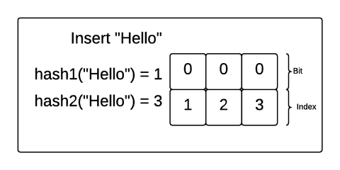

title:'Bloom Filter'
## Bloom Filter

Bloom Filter 的表现形式是一个 bitmap，用于描述对于特定一个元素，是否在该 bitmap 描述的 set 中

Bloom Filter 表现为一个 m bit 的 bitmap，其中的每个 bit 的初始值均为 0

当把一个元素添加到该 bitmap 描述的 set 中的时候，通过 k 个 hash function 映射得到 k 个 hash value (这里每个 hash function 输出的 hash value 的取值范围都是 [0, m-1] ) 作为 bitmap 的 index，将 bitmap 中的这 k bits 置为 1

当后面需要查询某个特定元素是否在 set 内的时候，同样通过这 k 个 hash function 映射得到 k 个 hash value，在 bitmap 中查询这 k bits 的值

- 如果这 k bits 中有任一 bit 为 0，就说明这个元素不在 set 内
- 如果这 k bits 全为 1，那么说明这个元素 **可能** 在 set 内

下图就描述了 m=3,k=2 的 bloom filter 在将 "Hello" 和 "Bloom" 这两个元素添加到 set 的流程

上述描述的，在查询某个特定元素是否在 set 内的时候，如果这 k bits 全为 1，那么说明这个元素可能在 set 内 (考虑到 hash conflict，两个不同的元素可能映射到相同的 hash value)，这称为 False Positives