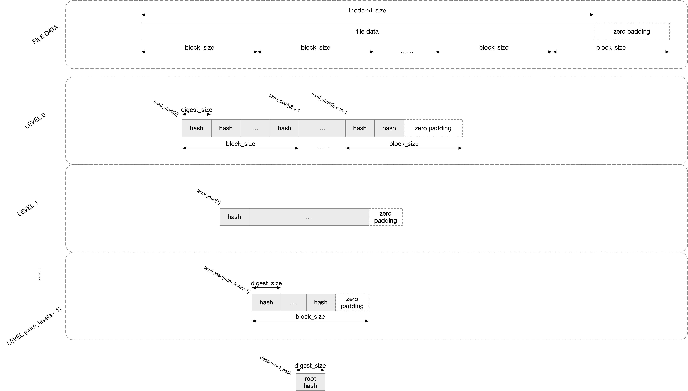
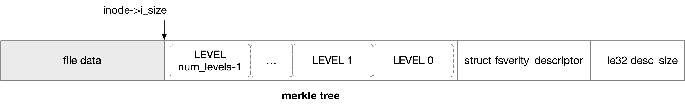

title:'fs-verity - Base'
## fs-verity - Base


### build merkle tree

fs-verity 提供文件粒度的文件数据的校验 (verity) 功能，其核心是为文件构建一棵 merkle tree




fs-verity 本质上是在签名阶段将文件数据的每个数据块都计算出一个 hash，之后将文件数据与计算出来的 hash 一起作为一个 golden image 进行分发；之后在访问文件数据的时候，将访问到的数据块按照之前一样的算法计算出一个 hash，将计算出来的 hash 与随 image 一起分发的该数据块的 hash 进行比对，如果两者一致，就证明当前访问的数据块校验 (verity) 通过

例如当使用 SHA-256 算法时，由于 SHA-256 算法是对输入的任意 64 字节的数据，输出 32 字节的 hash 值，因而 fs-verity 就是对文件数据的每 64 字节 (block_size) 计算出一个 32 字节 (digest_size) 的 hash 值，所有这些 hash 值构成一个 hash 数组，也就是上述 merkle tree 中的 (level 0) leaf node


按理说这些 hash 数组 (也就是 level 0) 已经足够实现文件数据的校验了，但是 fs-verity 中随每个文件一起分发的是一棵 merkle tree，上述的 hash 数组只是作为 merkle tree 中的 (level 0) leaf node；在此基础上，将 level 0 hash 数组也按照 block_size 粒度计算出相应的 hash，所有 hash 构成 level 1 hash 数组；重复以上过程，直到最后一层 hash 数组的大小小于等于一个 block_size，从而构成 merkle tree 的最后一层

最后一层 hash 数组作为输入，计算出来的 hash 称为整棵 merkle tree 的 hash，即 root hash

为什么单单 level 0 hash 数组不足以校验文件数据，而需要一整棵 merkle tree 呢？其实单单 level 0 hash 数组已经足够校验文件数据了，但是这些 level 0 hash 数组是保存在 golden image 中随文件一起分发的，那又如何确保 level 0 hash 数组本身的一致性呢？

merkle tree 就是用来解决 level 0 hash 数组本身的一致性问题的，在 merkle tree 中，level 1 用于对 level 0 进行校验，level 2 用于对 level 1 进行校验，以此往复


fs-verity 中，每个文件的 merkle tree 是以 append 的形式保存在文件数据后面的，其中高 level 的节点先保存，level 0 节点最后保存




file_digest 用来唯一地标识一个文件的数据

> The fs-verity file digest is a cryptographic digest that identifies
the file contents

不能简单地将 merkle tree 的 root hash 作为 file_digest，因为单单 root hash 很容易发生 hash conflict，即两个不同数据的文件，完全有可能对应同一个 root hash

因而 file_digest 实际上是对 fsverity_descriptor 作 hash 运算得到的一个 hash 值，fsverity_descriptor 是文件相关元数据的集合 (包括 merkle tree)


```c
struct merkle_tree_params {
	unsigned int num_levels;	/* number of levels in Merkle tree */
	u64 tree_size;			/* Merkle tree size in bytes */
	unsigned long tree_pages;	/* Merkle tree size in pages */

	/*
	 * Starting block index for each tree level, ordered from leaf level (0)
	 * to root level ('num_levels - 1')
	 */
	unsigned long level_start[FS_VERITY_MAX_LEVELS];
	...
};
```

#### FS_IOC_ENABLE_VERITY

```c
ioctl(file, FS_IOC_ENABLE_VERITY, struct fsverity_enable_arg *arg)
```

用户态在执行 FS_IOC_ENABLE_VERITY ioctl 的时候，需要输入 fsverity_enable_arg 参数，该参数描述了 fs-verity 的相关配置

```c
struct fsverity_enable_arg {
	__u32 version;
	__u32 hash_algorithm;
	__u32 block_size;
	__u32 salt_size;
	__u64 salt_ptr;
	__u32 sig_size;
	__u32 __reserved1;
	__u64 sig_ptr;
	__u64 __reserved2[11];
};
```

@version 必须为 1

> hash algorithm

```c
struct fsverity_enable_arg {
	__u32 hash_algorithm;
	...
};
```

@hash_algorithm 描述生成 merkle tree 使用的 hash 函数，目前 fs-verity 框架只支持 SHA-256 和 SHA-512 两个 hash 算法

```c
#define FS_VERITY_HASH_ALG_SHA256   1
#define FS_VERITY_HASH_ALG_SHA512   2
```


fsverity_hash_alg 描述一个 hash 算法

```c
/* A hash algorithm supported by fs-verity */
struct fsverity_hash_alg {
	const char *name;	  /* crypto API name, e.g. sha256 */
	unsigned int digest_size; /* digest size in bytes, e.g. 32 for SHA-256 */
	unsigned int block_size;  /* block size in bytes, e.g. 64 for SHA-256 */
	/*
	 * The HASH_ALGO_* constant for this algorithm.  This is different from
	 * FS_VERITY_HASH_ALG_*, which uses a different numbering scheme.
	 */
	enum hash_algo algo_id;
	...
};
```

@name 描述该 hash 算法的名称

该算法对输入的 @block_size 字节的数据流执行 hash 运算，输出 @digest_size 字节的 hash 值；例如 SHA-256 算法就是对输入的任意 64 字节的数据，输出 32 字节的 hash 值

目前 fs-verity 框架只支持 SHA-256 和 SHA-512 两个 hash 算法，它们对应的 fsverity_hash_alg 结构分别为

```c
	[FS_VERITY_HASH_ALG_SHA256] = {
		.name = "sha256",
		.digest_size = SHA256_DIGEST_SIZE,
		.block_size = SHA256_BLOCK_SIZE,
		.algo_id = HASH_ALGO_SHA256,
	},
	[FS_VERITY_HASH_ALG_SHA512] = {
		.name = "sha512",
		.digest_size = SHA512_DIGEST_SIZE,
		.block_size = SHA512_BLOCK_SIZE,
		.algo_id = HASH_ALGO_SHA512,
	}
```


> block size

```c
struct fsverity_enable_arg {
	__u32 block_size;
	...
};
```

@block_size 描述计算 merkle tree 时的 block size

配置的 block size 必须是 [1024, PAGE_SIZE] 之间的 power-of-2 数值，同时不能超过文件系统自身的 block size


- routine


```sh
# FS_IOC_ENABLE_VERITY ioctl
fsverity_ioctl_enable
    enable_verity
        # initialize merkle_tree_params from fsverity_enable_arg
        fsverity_init_merkle_tree_params
        
        # fail if verity is already enabled or is already being enabled
        sb->s_vop->begin_enable_verity()
        
        # build merkle tree
        build_merkle_tree(..., &params, desc->root_hash)
            # build merkle tree
            # for each block of merkle tree:
                # write this block to file
                # (append merkle tree after file data)
                write_merkle_tree_block
                    sb->s_vop->write_merkle_tree_block()
                        pagecache_write(inode, ...)
            # calculate root hash and stored in desc->root_hash
        
        # iniitalize fsverity_descriptor
        
        # initialize fsverity_info from fsverity_descriptor
        fsverity_create_info
            # calculate file digest from fsverity_descriptor
            # and stored in vi->file_digest
            compute_file_digest
        
        sb->s_vop->end_enable_verity(..., desc, ...)
            # append fsverity_descriptor after merkle tree
            pagecache_write(inode, desc, ...)
            
            # append __le32 (describing size of fsverity_descriptor) after fsverity_descriptor
            
        # store fsverity_info in inode->i_verity_info
        fsverity_set_info
```


文件必须具备 write 权限，但是执行 FS_IOC_ENABLE_VERITY ioctl 的 fd 必须是 read-only 的，从而确保执行 FS_IOC_ENABLE_VERITY ioctl 的当下，没有其他具有 write 权限的 fd

file_digest 实际上是对 fsverity_descriptor 作 hash 运算得到的一个 hash 值，可以用来唯一地标识一个文件的数据

> The fs-verity file digest is a cryptographic digest that identifies
the file contents


### verity with merkle tree when read


```
.read_folio()/.readahead()
    # read data from disk and fill into folio
    if verity is enabled for this inode:
        fsverity_verify_folio
            fsverity_verify_blocks
                verify_data_blocks(inode, inode->i_verity_info, folio, ...)
                for each page in this folio:
                    verify_data_block(inode, inode->i_verity_info, page, page's offset in the file, ...)
                        # read merkle tree from disk
                        sb->s_vop->read_merkle_tree_page()
                        
                        # verify the content of this page with merkle tree
```


### later open when verity enabled

```
# open(2)
f_ops->open()
    fsverity_file_open
        if verity is enabled for this inode:
            __fsverity_file_open
                ensure_verity_info
                    # read fsverity_descriptor from disk
                    fsverity_get_descriptor
                        s_vop->get_verity_descriptor()
                        validate_fsverity_descriptor
                    
                    # create fsverity_info from fsverity_descriptor
                    fsverity_create_info

                    # store fsverity_info in inode->i_verity_info
                    fsverity_set_info
```