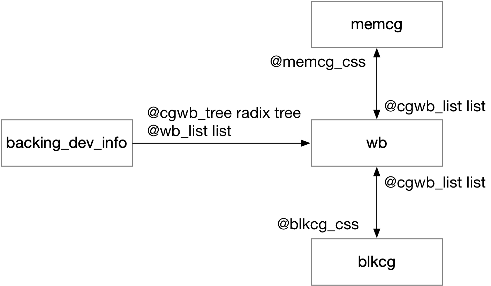

title:'Cgroup Writeback - Routine'
## Cgroup Writeback - Routine


在 cgroup v1 中，cgroup writeback 迟迟无法实现，block cgroup 只能对 read 以及 direct write 产生的 IO 进行统计并限流，而不能统计 buffer write 产生的 IO。这是因为 writeback 过程中，dirty page cache 的回写是由 worker thread 发起的，此时一开始往这个 page cache 写入数据的进程信息已经丢失，因而就不能确定将这个 page cache 回写产生的 IO 统计到哪个 block cgroup 下面。因而在此之前所有 writeback 产生的 IO 都是统计在 root block cgroup 下面

以上问题的本质是 cgroup v1 中各个 subsystem specific cgroup 之间是相互割裂的，虽然我们可以确定发生回写的 page cache 属于哪个 memory cgroup，但是由于 subsystem specific cgroup 之间的联系是割裂的，因而我们不能通过 memory cgroup 找到对应的 block cgroup

cgroup v2 正好解决了以上问题，cgroup v2 中我们可以通过 memory cgroup 找到对应的 block cgroup，这样 page cache 发生回写时，我们就可以确定将该 page cache 回写产生的 IO 统计到哪个 block cgroup 下面


### per-memcg-blkcg-bdi writeback

在实现 cgroup writeback 以前，writeback 流程中就使用 'struct bdi_writeback' 来描述一个 blkdev 中与回写相关的信息，那个时候 bdi_writeback 是 per-bdi 的，即每个 blkdev 有一个对应的 bdi_writeback（以下简称为 wb）

而为了支持 cgroup writeback，bdi_writeback 被改造成是 per-cgroup 的，即 per-memcg-blkcg-bdi 的，即一个 blkdev 下每个 (memcg,blkcg) pair 都有一个对应的 wb，相当于原先一个 blkdev 下唯一的 wb 被拆分为多个 wb

```c
struct bdi_writeback {
	struct cgroup_subsys_state *memcg_css; /* the associated memcg */
	struct cgroup_subsys_state *blkcg_css; /* and blkcg */
	...
}
```

此时 bdi 中的 @wb 描述该 blkdev 本身 (不考虑 cgroup writeback 时) 的 root wb，同时使用 @wb_list 链表和 @cgwb_tree radix tree 组织该 blkdev 对应的所有 wb，其中 @cgwb_tree radix tree 使用 wb 对应的 memcg->id 作为 index key

```c
struct backing_dev_info {
	struct bdi_writeback wb;  /* the root writeback info for this bdi */
	struct list_head wb_list; /* list of all wbs */
	struct radix_tree_root cgwb_tree; /* radix tree of active cgroup wbs */
	...
};
```

同时每个 memcg/blkcg 的 @cgwb_list 链表组织该 memcg/blkcg 对应的所有 wb




### inode's majority dirtier

一个 inode 可能被多个进程同时进行写操作，而这些进程又可能分属于不同的 block cgroup，这就需要考虑怎样将同一个 inode 回写过程中发生的 IO 统计到对应的 block cgroup 下

这里必须考虑到 page cache 与 writeback 管理机制上存在的差异。page cache 是以 page frame 为单位进行管理的，而 writeback 则是以 inode 为单位进行的，原有的 writeback 机制中本来就是整个整个 inode 进行回写的

因而我们就必须要确定一个 inode 的归属权，即一个 inode 在同一时刻只能归属于一个 blkcg，之后该 inode 回写产生的 IO 都记帐到该 blkcg 下面，我们就把 inode 归属的 blkcg 称为 inode 的 majority dirtier


上述问题等价于寻找 inode 对应的 wb，inode 的 @i_wb 字段就描述了该 inode 的 majority dirtier

```c
struct inode {
	...
	struct bdi_writeback	*i_wb; /* the associated cgroup wb */
}
```


当 inode 第一次执行 buffer write 操作的时候，就会设置该 inode 的 majority dirtier 的初始值，即寻找对应的 wb

```sh
inode_attach_wb(inode, page)
    if (!inode->i_wb)
        __inode_attach_wb(inode, page)
            if (inode_cgwb_enabled(inode)) 
                memcg_css = ... // get page's corresponding memcg
                wb_get_create(bdi, memcg_css, ...) // create wb
                
                cmpxchg(&inode->i_wb, NULL, wb) // store created wb in inode->i_wb
```


#### inode attach wb

在寻找 inode 对应的 wb 的过程中，由于 wb 是 per-memcg-blkcg-bdi 的，因而在寻找 wb 之前需要确定 (memcg, blkcg, bdi) triple 三元组

1. bdi

首先 bdi 是确定的，在确定 inode 之后，就能确定该 inode 文件所在的 blkdev 即 bdi；因而以上问题就转化为确定 (memcg, blkcg) pair 二元组


2. memcg

- write data

buffer write() 系统调用中，往文件写入数据时，就会触发创建对应的 wb

```sh
# iomap based buffered IO
f_op->write_iter(kiocb, iov_iter)
    iomap_file_buffered_write()
        iomap_apply(..., IOMAP_WRITE, ..., iomap_write_actor)
            iomap_write_actor
                # copy ...
                
                iomap_write_end
                    __iomap_write_end
                        iomap_set_page_dirty(page)
                            __set_page_dirty(page, mapping, ...)
                                account_page_dirtied(page, mapping)
                                    inode_attach_wb(inode, page)
```

```sh
# fiemap based buffered IO
f_op->write_iter(kiocb, iov_iter)
    generic_perform_write
        a_ops->write_begin() // find buffer page and copy
        a_ops->write_end()
            block_write_end
                __block_commit_write
                    mark_buffer_dirty
                        __set_page_dirty(page, mapping, ...)
                                account_page_dirtied(page, mapping)
                                    inode_attach_wb(inode, page)
```

此时是根据当前写入的 data page (通过 page->mem_cgroup) 找到对应的 memcg 

```sh
inode_attach_wb(inode, page)
    if (!inode->i_wb):
        __inode_attach_wb(inode, page)
            if (inode_cgwb_enabled(inode))
                if page != NULL:
                    # get page's corresponding memcg 
                    memcg_css = mem_cgroup_css_from_page(page)
                        return page->mem_cgroup->css
                wb_get_create(bdi, memcg_css, ...)
```


- write metadata

修改文件的元数据 (例如 atime/size 等)，即修改 inode 结构体时，如果该 inode 之前还没有绑定的 wb，那么此时也会触发 inode 绑定到对应的 wb，此时是确定当前运行进程 (即 current) 所在的 memcg 为对应的 memcg

```sh
# mark inode dirty
__mark_inode_dirty(inode, ...)
    inode_attach_wb(inode, NULL)
        if (!inode->i_wb):
            # get current process' corresponding memcg
            memcg_css = task_get_css(current, ...)
            wb_get_create(bdi, memcg_css, ...)
```


3. blkcg

接下来就需要根据 memcg 来确定对应的 blkcg

cgroup v2 中通过 unified cgroup hierarchy 可以很轻松地找到 memcg 对应的 blkcg


#### find wb

在确定了 (memcg, blkcg, bdi) triple 三元组之后，首先会尝试复用之前已经创建了的 wb，实际上就是在 bdi->cgwb_tree radix tree 中根据 memcg 的 id 找到对应的 wb

```sh
wb_get_create(bdi, memcg_css, ...)
    wb = wb_get_lookup(bdi, memcg_css)
        wb = radix_tree_lookup(&bdi->cgwb_tree, memcg_css->id)
            blkcg_css = .... // find blkcg according to given memcg
            if wb->blkcg_css != blkcg_css:
                wb = NULL
```

#### create wb

如果当前 (memcg, blkcg, bdi) triple 三元组对应的 wb 尚未创建，就会新创建一个 wb，新创建的 wb 会添加到 bdi 的 @cgwb_tree radix tree 以及 @wb_list 链表

```sh
wb_get_create(bdi, memcg_css, ...)
    cgwb_create(..., memcg_css)
        blkcg_css = .... // find blkcg according to given memcg
        
        # allocate wb
        wb->memcg_css = memcg_css
        wb->blkcg_css = blkcg_css
        
        # insert wb into bdi's @cgwb_tree radix tree and @wb_list list
        # insert wb into memcg's @cgwb_list list
        # insert wb into blkcg's @cgwb_list list
```


### block throttle

当开启 cgroup block throttling 时，需要确定当前下发的 bio 归属于哪个 blkcg，即当前这个 bio 产生的 IO 流量记账到哪个 blkcg 下面，并根据该 blkcg 的 throttling 规则进行限流

```sh
generic_make_request_checks
    blkcg_bio_issue_check(q, bio)
        blkcg = bio_blkcg(bio)
```

在 cgroup writeback 之前，当前下发的 bio 就归属于当前提交该 bio 的进程 (current) 所在的 blkcg，从而其产生的 IO 也是记账到当前进程所在的 blkcg 下

因而对于 direct IO，其提交的 IO 就会记账到当前提交该 IO 的进程所在的 blkcg 下；而对于 buffer IO，dirty page 的回写操作都是由 worker thread 内核线程发起的，内核线程都是在 root blkcg 下面，因而回写操作产生的 IO 实际都记账在 root blkcg

也就是说在 cgroup writeback 实现之前，block throttling 只能对 read、direct write 操作产生的 IO 进行限流，而不能对 buffer write 进行限流


而为了支持 cgroup writeback，增加 bio->bi_blkg 字段描述该 bio 归属于哪个 blkcg

```c
struct bio {
	struct blkcg_gq		*bi_blkg;
}
```

此时这个 bio 产生的 IO 就会记账到该 blkcg 下面

```
submit_bio(bio)
    submit_bio_noacct
        submit_bio_checks
            blk_throtl_bio
                blkg = bio->bi_blkg
                    # throttle on this blkcg
```

> writeback data

在 writeback 过程中，在回写数据 (page cache) 的时候就会将回写产生的 bio->bi_blkg 字段设置为当前正在回写的文件 (inode) 对应的 majority dirtier 即 (inode->i_wb->blkcg_css)

```sh
wb_writeback
    writeback_sb_inodes
        for each dirty inode in wb->b_io:
            wbc_attach_and_unlock_inode(wbc, indoe)
                wbc->wb = inode_to_wb(inode), i.e., inode->i_wb // account IO into inode's majority dirtier
            
            __writeback_single_inode
                do_writepages
                    mapping->a_ops->writepages(), e.g., ext4_writepages()
                        ext4_io_submit_init(io, wbc)
                            io->io_wbc = wbc
                        
                        mpage_prepare_extent_to_map
                            mpage_process_page_bufs
                                mpage_submit_page
                                    ext4_bio_write_page
                                        io_submit_add_bh
                                            io_submit_init_bio
                                                wbc = io->io_wbc
                                                wbc_init_bio(wbc, bio)
                                                    blkcg_css = wbc->wb->blkcg_css
                                                    bio_associate_blkcg(bio, blkcg_css)
                                                        bio->bi_blkg = ... # blkcg derived from blkcg_css
```


> writeback metadata

而回写元数据 (inode) 的时候，回写产生的 bio->bi_blkg 则为 NULL，即元数据的会写并不限流

```sh            
__writeback_single_inode
    # writeback data
    do_writepages
    
    # writeback metadata
    write_inode(inode, wbc)
        s_op->write_inode(inode, wbc), e.g. ext4_write_inode()
            sync_dirty_buffer
                submit_bh(..., bh)
                    submit_bh_wbc(..., bh, 0, @wbc = NULL)
                        # since wbc is NULL
                        bio->bi_blkg = NULL              
```

