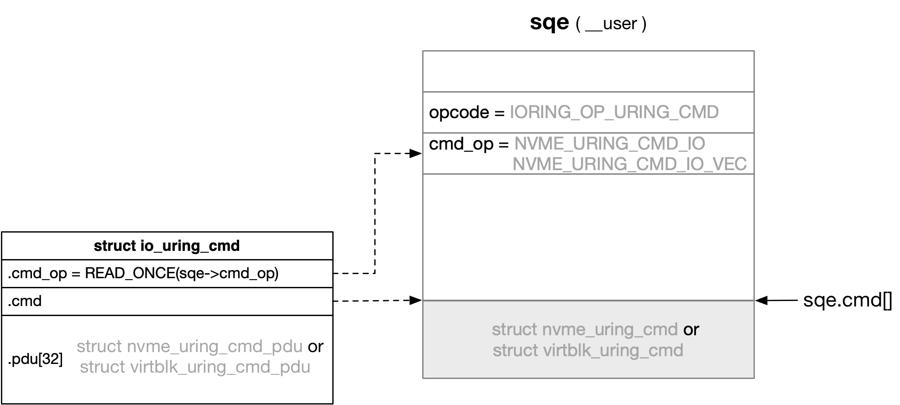

title:'io_uring - uring_cmd'
## io_uring - uring_cmd


### io_uring: IORING_OP_URING_CMD

io_uring 层增加 IORING_OP_URING_CMD 命令

此时 sqe.cmd 字段就存储 cmd specific 的数据结构

```c
struct io_uring_sqe {
	union {
		...
		/*
		 * If the ring is initialized with IORING_SETUP_SQE128, then
		 * this field is used for 80 bytes of arbitrary command data
		 */
		__u8	cmd[0];
	};
	...
}
```

此时 io_uring 在处理 IORING_OP_URING_CMD 命令的时候，就会调用目标文件的 .uring_cmd() 回调函数

```sh
io_uring_enter
    io_submit_sqes
        io_get_sqe // get sqe from @tail
        io_submit_sqe
            io_queue_sqe
                __io_queue_sqe
                    io_issue_sqe
                        io_uring_cmd
                            file->f_op->uring_cmd()
                            e.g. nvme_ns_chr_uring_cmd()
```


### nvme: 

对于 nvme passthrough 来说，sqe.cmd_op 描述了nvme 支持的 uring_cmd 的两种 subcmd，分别为 NVME_URING_CMD_IO 和 NVME_URING_CMD_IO_VEC

```c
struct io_uring_sqe {
	union {
		...
		struct {
			__u32	cmd_op;
			...
		};
	};
	...
```


此外用户在 sqe.cmd 存储 driver specific 数据结构

```c
struct io_uring_sqe {
	union {
		...
		/*
		 * If the ring is initialized with IORING_SETUP_SQE128, then
		 * this field is used for 80 bytes of arbitrary command data
		 */
		__u8	cmd[0];
	};
	...
```

例如对于 nvme，该字段存储的就是 struct nvme_uring_cmd 结构体，每个 struct nvme_uring_cmd 结构体就描述一个需要执行的 nvme cmd

```c
struct nvme_uring_cmd {
	__u8	opcode;
	__u8	flags;
	__u16	rsvd1;
	__u32	nsid;
	__u32	cdw2;
	__u32	cdw3;
	__u64	metadata;
	__u64	addr;
	__u32	metadata_len;
	__u32	data_len;
	__u32	cdw10;
	__u32	cdw11;
	__u32	cdw12;
	__u32	cdw13;
	__u32	cdw14;
	__u32	cdw15;
	__u32	timeout_ms;
	__u32   rsvd2;
};
```

- 对于 NVME_URING_CMD_IO，{addr, data_len} 就描述 user buffer
- 对于 NVME_URING_CMD_IO_VEC，addr 实际指向一个 struct iovec 数组，data_len 描述这个数组的长度


其路径是

```sh
# nvme driver
.uring_cmd().e.g. nvme_ns_chr_uring_cmd()
    nvme_ns_uring_cmd
        case NVME_URING_CMD_IO:
            nvme_uring_cmd_io
                struct nvme_uring_cmd *cmd = sqe.cmd
                # initialize "struct nvme_command" from nvme_uring_cmd
                
                # alloc and init request from nvme_command
                struct request *req = nvme_alloc_user_request()
                
                # init sgs list for the request
                nvme_map_user_request(req, ...)
                    bio_map_user_iov(req, addr, data_len, ...)
                        # alloc and init bio with {addr, data_len}
                        # insert bio into the request
                        rq->bio = bio 
                
                # submit the request
                blk_execute_rq_nowait(req, ...)
```


```sh
# nvme driver
.uring_cmd().e.g. nvme_ns_chr_uring_cmd()
    nvme_ns_uring_cmd
        case NVME_URING_CMD_IO_VEC:
            nvme_uring_cmd_io
                struct nvme_uring_cmd *cmd = sqe.cmd
                # initialize "struct nvme_command" from nvme_uring_cmd
                
                # alloc and init request from nvme_command
                struct request *req = nvme_alloc_user_request()
                
                # init sgs list for the request
                nvme_map_user_request(req, ...)
                    blk_rq_map_user_io
                        # copy iovec array from user space to kernel
                        import_iovec
                        
                        blk_rq_map_user_iov(req, addr, data_len, ...)
                            # iterate each iovec and map to bio->bi_io_vec[]
                            bio_map_user_iov
                                # alloc and init bio with {addr, data_len}
                                # insert bio into the request
                                rq->bio = bio 
                
                # submit the request
                blk_execute_rq_nowait(req, ...)
```


struct nvme_command 描述在 nvme 协议层面的一个 nvme 请求

```c
struct nvme_common_command {        struct nvme_rw_command {
	__u8			opcode;                 __u8    opcode;
	__u8			flags;                  __u8    flags;
	__u16			command_id;            __u16    command_id;
	__le32			nsid;                 __le32  nsid;
	__le32			cdw2[2];              __le32  cdw2;
	                                   __le32  cdw3;
	__le64			metadata;             __le64  metadata;
	union nvme_data_ptr	dptr;      union nvme_data_ptr dptr;
	
	struct_group(cdws,
	__le32			cdw10;                __le64  slba;
	__le32			cdw11;
	                
	__le32			cdw12;                __le16  length;
	                                   __le16  control;
	                                   
	__le32			cdw13;                __le32  dsmgmt;
	
	__le32			cdw14;                __le32  reftag;
	
	__le32			cdw15;                __le16  apptag;
	                                   __le16  appmask;
	);
};
```

对于一个 READ/WRITE 命令来说

- cdw10/cdw11 就共同描述了 starting logical block address
- cdw12 的其中一部分描述了需要操作的 logical block 区间的长度

而在 nvme passthrough 模式下，用户在提交 sqe 的时候，在 sqe.cmd 字段（即 struct nvme_uring_cmd 结构体）中就描述一个需要执行的 nvme cmd，即对应的 struct nvme_command 的各个字段

```sh
# nvme driver
.uring_cmd().e.g. nvme_ns_chr_uring_cmd()
    nvme_ns_uring_cmd
        case NVME_URING_CMD_IO:
            nvme_uring_cmd_io
                struct nvme_uring_cmd *ioucmd = sqe.cmd
                struct nvme_command cmd;
                
                # initialize "struct nvme_command" from nvme_uring_cmd
                cmd.common.opcode = ioucmd->opcode
                cmd.common.cdw10 = ioucmd->cdw10;
                cmd.common.cdw11 = ioucmd->cdw11;
                cmd.common.cdw12 = ioucmd->cdw12;
                ...
                
                # alloc and init request from nvme_command
                struct request *req = nvme_alloc_user_request(&cmd, ...)
                    # allocate request
                    
                    if nvme_is_write(&cmd), i.e. cmd.common.opcode & 1:
                        req->cmd_flags = REQ_OP_DRV_OUT
                    else:
                        req->cmd_flags = REQ_OP_DRV_IN
                    
                    # and then initialize a passthrough request
                    nvme_init_request
                        struct nvme_request *nr = nvme_req(req);
                        memcpy(nr->cmd, cmd, sizeof(*cmd));
                
                ...
                
                # init sgs list for the request
                nvme_map_user_request(req, ...)
                
                # submit the request
                blk_execute_rq_nowait(req, ...)
```

由于 nvme passthrough 模式下，用户在提交 sqe 的时候已经在 nvme_uring_cmd 中设置好了 nvme_command 的各个字段，因而内核在处理用户提交的 sqe 的时候，只是直接将 nvme_uring_cmd 拷贝到 nvme_command

之后在 .queue_rq() 中处理这个 nvme 请求（struct nvme_command）的时候，对于 passthrough 模式下发下来的请求，就会跳过 nvme_setup_cmd() 阶段（因为 passthrough 模式下发下来的 struct nvme_command，其各个字段已经由用户传下来的 nvme_uring_cmd 设置好了）

```
.queue_rq(), i.e. nvme_queue_rq()
    nvme_prep_rq
        nvme_setup_cmd
         if req_op(req) is REQ_OP_DRV_IN/REQ_OP_DRV_OUT:
            /* these are setup prior to execution in nvme_init_request() */
            # skip nvme_setup_cmd
        
        nvme_map_data
    
    # copy this nvme_command to nvme sqe ring
    nvme_sq_copy_cmd
    
    # write the db register to notify the device
    nvme_write_sq_db
```


### data structure



io_uring 的 opcode 增加 IORING_OP_URING_CMD 命令

此时 sqe.cmd_op 描述 driver specific 的 subcmd，sqe.cmd 字段存储 driver specific 的数据结构，这两个字段都由实现 uring_cmd 特性的驱动自己解析

```c
struct io_uring_sqe {
	union {
		...
		/*
		 * If the ring is initialized with IORING_SETUP_SQE128, then
		 * this field is used for 80 bytes of arbitrary command data
		 */
		__u8	cmd[0];
	};
	...
}
```

例如对于 nvme，sqe.cmd 字段存储的就是 struct nvme_uring_cmd 结构体，每个 struct nvme_uring_cmd 结构体就描述一个需要执行的 nvme cmd

```c
struct nvme_uring_cmd {
	__u8	opcode;
	__u8	flags;
	__u16	rsvd1;
	__u32	nsid;
	__u32	cdw2;
	__u32	cdw3;
	__u64	metadata;
	__u64	addr;
	__u32	metadata_len;
	__u32	data_len;
	__u32	cdw10;
	__u32	cdw11;
	__u32	cdw12;
	__u32	cdw13;
	__u32	cdw14;
	__u32	cdw15;
	__u32	timeout_ms;
	__u32   rsvd2;
};
```

nvme 支持两个 subcmd，分别为 NVME_URING_CMD_IO 和 NVME_URING_CMD_IO_VEC

- 对于 NVME_URING_CMD_IO，{addr, data_len} 就描述 user buffer
- 对于 NVME_URING_CMD_IO_VEC，addr 实际指向一个 struct iovec 数组，data_len 描述这个数组的长度


此外 struct io_uring_cmd 是 io_uring 在解析每条 uring_cmd (sqe) 时，在内存中保存的这条 uring_cmd 相关的信息，struct io_uring_cmd 实际上是内嵌在 struct io_kiocb 中的（io_uring 在解析每条 sqe 的时候都会分配一个对应的 struct io_kiocb）

```c
struct io_kiocb {
	union {
		struct io_cmd_data	cmd;
		...
	};
	...
}
```

```
io_submit_sqes
    # for each sqe:
        struct io_kiocb *req = io_alloc_req()
        io_submit_sqe
            io_init_req
                ->prep(), i.e. io_uring_cmd_prep()
                    struct io_uring_cmd *ioucmd = req->cmd
                    ioucmd->cmd_op = READ_ONCE(sqe->cmd_op)
                    ioucmd->cmd = sqe->cmd
```