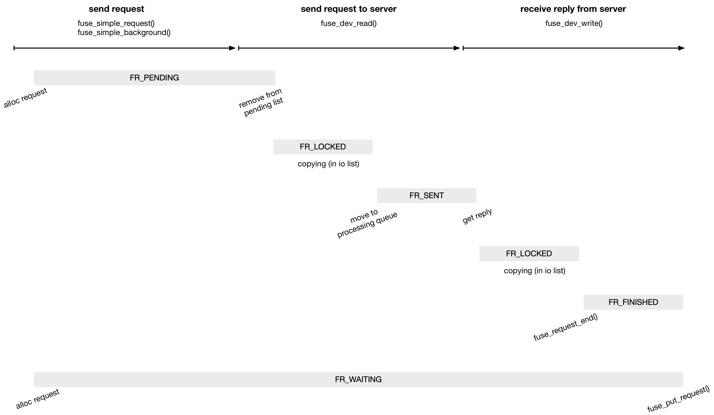

title:'FUSE - State'
## FUSE - State


```c
struct fuse_req {
	/* Request flags, updated with test/set/clear_bit() */
	unsigned long flags;
	...
}
```

req->flags 分为两部分，一部分描述请求的属性，另一部分描述请求的状态机

### type

#### FR_BACKGROUND

> FR_BACKGROUND:	request is sent in the background

FR_BACKGROUND 描述这是一个 background 请求，即通过 fuse_simple_background() 接口下发的请求，

```
fuse_simple_background
    # for force request:
        fuse_request_alloc
        __set_bit(FR_BACKGROUND, &req->flags)
    # else for non-force request
        fuse_get_req
            fuse_request_alloc
            if for_background:
                __set_bit(FR_BACKGROUND, &req->flags)
```

#### FR_ISREPLY

> FR_ISREPLY:		set if the request has reply

FR_ISREPLY 描述这个请求是有 reply 的，目前只有 FUSE_FORGET 和部分 notify 请求是没有 reply 的

```
fuse_simple_request
    # for force request:
        fuse_request_alloc
    # else for non-force request
        fuse_get_req
            fuse_request_alloc
    
    if (!args->noreply):
        __set_bit(FR_ISREPLY, &req->flags)

```

目前所有 background 请求都是有 reply 的

```
fuse_simple_background
    # for force request:
        fuse_request_alloc
    # else for non-force request
        fuse_get_req
            fuse_request_alloc

    fuse_request_queue_background
        __set_bit(FR_ISREPLY, &req->flags)
```

在将请求发送到 fuse server 的过程中，对于没有 reply 的请求，会直接对该请求调用 fuse_request_end()；而对于有 reply 的请求，则是将请求缓存到 processing queue，之后当返回 reply 的时候，就会到 processing queue 中寻找对应的请求

```
# fuse server reads request from /dev/fuse
fuse_dev_read
    fuse_dev_do_read
        ...
        # when data copying is done (request has been sent to userspace)
        
        # complete the request for request without reply
        if !test_bit(FR_ISREPLY, &req->flags):
            fuse_request_end(req)
        
        # otherwise move the request to processing queue
        else:
            list_move_tail(&req->list, &fpq->processing[hash])
            set_bit(FR_SENT, &req->flags)
```


#### FR_ASYNC

> FR_ASYNC:		request is asynchronous

FR_ASYNC 通常用于 background 请求，描述请求完成（例如返回 reply）的时候需要调用 args->end() 回调函数

```c
struct fuse_args {
	void (*end)(struct fuse_mount *fm, struct fuse_args *args, int error);
	...
}
```

通常只有 background 请求会设置 args->end()，从而触发 FR_ASYNC 状态

```
fuse_simple_request
    # for force request:
        fuse_request_alloc
    # else for non-force request
        fuse_get_req
            fuse_request_alloc
    
    fuse_args_to_req
        if (args->end):
            __set_bit(FR_ASYNC, &req->flags);
```

```
fuse_simple_background
    # for force request:
        fuse_request_alloc
    # else for non-force request
        fuse_get_req
            fuse_request_alloc

    fuse_args_to_req
        if (args->end):
            __set_bit(FR_ASYNC, &req->flags);
```

后面请求完成的时候就会调用 args->end() 回调函数

```
fuse_request_end
    test_and_set_bit(FR_FINISHED, &req->flags)
    
    if (test_bit(FR_ASYNC, &req->flags))
        req->args->end()
```


### state



#### FR_PENDING

> FR_PENDING:		request is not yet in userspace

FR_PENDING 描述请求被分配出来、到请求缓存在 pending list 中、一直到请求开始被处理（但是还没有下发给 server）的这一阶段

> start

fuse_simple_request() 和 fuse_simple_background() 接口都是调用 fuse_request_alloc() 分配请求

```
fuse_simple_request/fuse_simple_background
    # for force request:
        fuse_request_alloc
    # else for non-force request
        fuse_get_req
            fuse_request_alloc

```

在请求分配完成的时候，就会置上 FR_PENDING

```
fuse_request_alloc
    fuse_request_init
        __set_bit(FR_PENDING, &req->flags)
```

> end

后面 fuse server 将请求从 pending list 中移出（但是还没有发送到 fuse server）的时候，就会清除 FR_PENDING

```
# fuse server reads request from /dev/fuse
fuse_dev_read
    fuse_dev_do_read
        # get one request from pending list
        clear_bit(FR_PENDING, &req->flags)
```


#### FR_LOCKED

> FR_LOCKED:		data is being copied to/from the request

fuse server 在获取 request 的时候，需要将请求、以及请求中携带的数据拷贝到用户态缓存中，实际上就是将 request 发送到 userspace 的过程；类似地，在发送 reply 的时候，需要将用户态缓存中存储的 reply、以及 reply 中携带的数据拷贝到内核态缓存中，实际上就是将 reply 发送到 kernelspace 的过程

上述数据拷贝的过程中，就会将请求临时地缓存在 io list 中，同时使用 FR_LOCKED 描述请求的这一阶段，该状态主要用于与 abort 操作进行同步

> send request

```
# fuse server reads request from /dev/fuse
fuse_dev_read
    fuse_dev_do_read
        ...
        # get one request from pending list
        
        fuse_copy_one
            fuse_copy_fill
                lock_request
                    set_bit(FR_LOCKED, &req->flags)
        
        # when copy done
        clear_bit(FR_LOCKED, &req->flags)
```

> receive reply

```
# fuse server writes reply to /dev/fuse
fuse_dev_write
    fuse_dev_do_write
        ...
        # find request with unique id
        
        set_bit(FR_LOCKED, &req->flags)
        copy_out_args

        # when copy done
        clear_bit(FR_LOCKED, &req->flags)
```


#### FR_ABORTED

> FR_ABORTED:		the request was aborted

FR_ABORTED 描述请求处于 aborted 状态，即 fuse 连接被 abort 的时候，所有在 io list 中，即处于数据拷贝状态的请求，都会被置上这一状态，该状态主要用于实现 abort 操作与 data copying 操作的同步

```
fuse_abort_conn
    # for each request in io list
        set_bit(FR_ABORTED, &req->flags)
```

在请求处于 FR_LOCKED 期间，请求中携带的数据 page 可能正处于 mapping 状态，以执行数据拷贝操作，此时一个并发执行的 abort 操作，只能对 unlocked 的请求执行 end_requests() 操作，而不能对 locked 的请求执行 end_requests() 操作；对于这些 locked 的请求，则是等到执行数据拷贝操作的 fuse server 进程在 unlock 请求的时候，发现请求处于 aborted 状态，此时再执行 end_request() 操作

fuse_abort_conn() 中先跳过那些处于 locked 状态的请求，而只对 unlocked 的请求执行 end_requests() 操作

```
fuse_abort_conn
    # for each request in io list
        set_bit(FR_ABORTED, &req->flags)
        if test_bit(FR_LOCKED, &req->flags):
            # skip this locked request
            
        # for other unlocked requests:
            end_requests
```

而正在执行数据拷贝操作的请求，在拷贝过程中发现请求变成 aboted 状态时，就会停止拷贝，进入清理流程，对该请求执行 fuse_request_end() 操作

```
# fuse server reads request from /dev/fuse
fuse_dev_read
    fuse_dev_do_read
        ...
        # get one request from pending list
        
        fuse_copy_one
            fuse_copy_fill
                unlock_request
                    if test_bit(FR_ABORTED, &req->flags):
                        return -ENOENT # stop copying
        clear_bit(FR_LOCKED, &req->flags)
        if !fpq->connected:
            fuse_request_end
```

#### FR_PRIVATE

> FR_PRIVATE:		request is on private list

FR_PRIVATE 也是用于实现 abort 操作与 data copying 操作的同步

在执行 abort 操作过程中，对于正处于 data copying 状态的请求，会将 unlocked 状态的请求筛选出来并缓存到一个本地的 to_end list 链表中，之后释放 fpq->lock 之后，再遍历 to_end list 链表对这些请求执行 end_requests() 操作

而同时执行 data copying 的上下文中，当发现这个 unlocked 请求变成 aborted 状态的时候，就会停止拷贝，进入清理流程；在清理流程中照常会尝试将该请求从原先的 io list 或 processing queue 中移除；此时如果这个请求已经被 abort 上下文移到本地的 to_end list 链表中，那么此时 data copying 上下文将该请求从 to_end list 链表中移除就会造成 race，造成 to_end list 链表 corruption

为了解决这一问题，v4.2 引入的 commit 77cd9d4 ("fuse: add req flag for private list") 就引入 FR_PRIVATE 状态来保护 to_end list 链表的并发操作

此时 abort 操作过程中，对于正处于 data copying 状态的请求，将 unlocked 状态的请求缓存到本地的 to_end list 链表的时候，该请求就会进入 FR_PRIVATE 状态，以通知 data copying 上下文

```
fuse_abort_conn
    # for each request in io list
        set_bit(FR_ABORTED, &req->flags)
        if !test_bit(FR_LOCKED, &req->flags):
            set_bit(FR_PRIVATE, &req->flags)
            list_move(&req->list, &to_end)
    
    spin_unlock(&fpq->lock)
            
    # handle requests in to_end list
    ...
```

而同时执行 data copying 的上下文中，当发现这个 unlocked 请求变成 aborted 状态的时候，进入清理流程；在清理流程中在尝试将该请求从原先的链表中移除的时候，当检查到这个请求处于 FR_PRIVATE 状态，即该请求此时正处于 to_end 链表中，那么此时 data copying 上下文中就不会将这个请求从 to_end list 链表中移除

```
# fuse server reads request from /dev/fuse
fuse_dev_read
    fuse_dev_do_read
        ...
        # get one request from pending list
        
        fuse_copy_one
            fuse_copy_fill
                unlock_request
                    if test_bit(FR_ABORTED, &req->flags):
                        return -ENOENT # stop copying
        clear_bit(FR_LOCKED, &req->flags)
        if !fpq->connected:
            goto out_end;
        
        out_end:
        if (!test_bit(FR_PRIVATE, &req->flags):
            list_del_init(&req->list)
        fuse_request_end
```

#### FR_SENT

> FR_SENT:		request is in userspace, waiting for an answer

请求发送给 fuse server 之后，如果这个请求是有 reply 的 (FR_ISREPLY)，那么这个请求就会缓存在 processing queue 中，直到后面 fuse server 返回 reply，FR_SENT 就描述请求的这一阶段，表示请求已经发送到 fuse server，但是还没有返回 reply

> start

```
# fuse server reads request from /dev/fuse
fuse_dev_read
    fuse_dev_do_read
        ...
        # when data copying is done (request has sent to userspace)
        
        # move request to processing queue
        set_bit(FR_SENT, &req->flags)
```

> end

```
# fuse server writes reply to /dev/fuse
fuse_dev_write
    fuse_dev_do_write
        ...
        # find request with unique id
        
        clear_bit(FR_SENT, &req->flags)
        # remove request from processing queue
```

#### FR_FINISHED

> FR_FINISHED:		request is finished

FR_FINISHED 描述请求处于完成阶段，在调用 fuse_request_end() 的时候，请求就会进入这一状态
在请求成功完成即接收到 reply 而调用 fuse_request_end()，或者在错误处理中对请求调用 fuse_request_end() 的时候，请求都会进入这一阶段

```
fuse_request_end
    test_and_set_bit(FR_FINISHED, &req->flags)
```

#### FR_WAITING

> FR_WAITING:		request is counted as "waiting"

FR_WAITING 描述请求从被分配出来、到释放之前的整个阶段，用于描述这个 fuse 连接中所有 fuse 请求的数量

```c
struct fuse_conn {
	/** The number of requests waiting for completion */
	atomic_t num_waiting;
	...
}
```

此外还有 fc->num_waiting 计数器描述这个 fuse 连接中所有 fuse 请求的数量

> start

fuse_simple_request() 和 fuse_simple_background() 接口中，在请求分配出来的时候都会给请求置上 FR_WAITING，同时增加 num_waiting 计数

```
fuse_simple_request
    # for force request:
        atomic_inc(&fc->num_waiting)
        fuse_request_alloc
        __set_bit(FR_WAITING, &req->flags)
    # else for non-force request
        fuse_get_req
            atomic_inc(&fc->num_waiting)
            fuse_request_alloc
            __set_bit(FR_WAITING, &req->flags)
```

```
fuse_simple_background
    # for force request:
        fuse_request_alloc
    # else for non-force request
        fuse_get_req
            atomic_inc(&fc->num_waiting)
            fuse_request_alloc
            __set_bit(FR_WAITING, &req->flags)
    
    fuse_request_queue_background
        if !test_bit(FR_WAITING, &req->flags):
            __set_bit(FR_WAITING, &req->flags);
            atomic_inc(&fc->num_waiting);
```

> end

后面请求完成的时候，就会相应减去 num_waiting 计数

```
fuse_put_request
    if test_bit(FR_WAITING, &req->flags):
        __clear_bit(FR_WAITING, &req->flags);
        fuse_drop_waiting
            atomic_dec_and_test(&fc->num_waiting)
```

> rationale

abort 操作中，当对所有 unlocked 请求执行 end_requests() 操作之后，需要等待所有请求都完成，包括 locked 请求也执行完 fuse_request_end() 操作之后，才能继续执行后续的操作

这一过程实际上就是通过等待 fc->num_waiting 计数清零完成的

```
fuse_conn_destroy
    fuse_abort_conn
    fuse_wait_aborted
        wait_event(fc->blocked_waitq, atomic_read(&fc->num_waiting) == 0)
```

每个请求完成的时候，都会检查 fc->num_waiting 计数是否清零，当 fc->num_waiting 计数清零的时候，就唤醒 aborter

```
fuse_put_request
    if test_bit(FR_WAITING, &req->flags):
        __clear_bit(FR_WAITING, &req->flags);
        fuse_drop_waiting
            if atomic_dec_and_test(&fc->num_waiting) && !fc->connected:
                /* wake up aborters */
                wake_up_all(&fc->blocked_waitq);
```