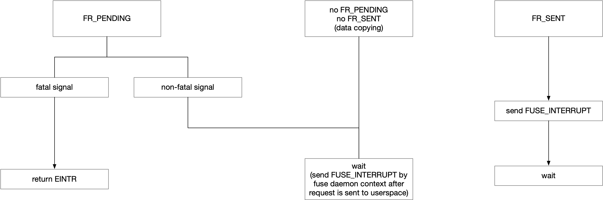

title:'FUSE - Interrupt'
## FUSE - Interrupt

### wait interruptible

原来fuse文件系统的使用者进程在发送 FUSE 请求的时候，在 fuse_wait_answer() 里都是 wait_event_killable()，也就是可以被 fatal 信号打断的，从而防止 fuse server 一直没有完成请求而使得进程长时间进入 D 状态

同时当进程被信号打断的时候，如果 1)请求已经度过 FR_PENDING 状态，即此时请求正在被发送到 userspace（即此时请求处于 data copying 阶段，请求已经被 fuse daemon 从 pending list 中取出开始往 userspace 拷贝）、或者请求已经被发送到 userspace，但是 2)请求尚未完成的时候，进程上下文也不能直接完成这个请求，因为请求已经开始被处理，此时请求已经占用了一些 lock 资源或者引用计数，此时如果直接完成请求（并释放引用计数），就会导致文件引用计数清零并发送 FUSE_RELEASE、FUSE_FORGET 请求，而此时 user daemon 还在处理这个文件的请求

为此引入了 background 请求的机制，当进程被信号打断、同时 user daemon 已经开始介入请求的处理，但是请求尚未完成的时候，将该请求转变为 background 请求，然后当前上下文返回；之后等到后面 reply 返回的时候，再完成对应的 background 请求并释放相应的引用计数

```
fuse_wait_answer
  # wait for request being finished
  wait_event_killable(..., req->state == FUSE_REQ_FINISHED)  
  
  # interrupted
  if req->state != FUSE_REQ_FINISHED: 
	req->out.h.error = -EINTR;
	req->interrupted = 1;
	
	# request has not been touched by user daemon
	if req->state == FUSE_REQ_PENDING:
		list_del(&req->list);
		__fuse_put_request(req);  # finish request immediately

	# else request has been touched by user daemon:
		put this request into bg_queue list (background request list)
```

此时 fuse_wait_answer() 里被信号打断的时候，如果请求尚处于 PENDING 状态，即 user daemon 还没有开始介入请求的处理，那么可以直接释放该请求并立即返回；而如果 user daemon 已经开始介入请求的处理、但是请求尚未完成，那么会发送一个 background 请求，后面等到 userspace 返回这个请求的 reply 的时候，这个 background 请求会释放掉，相当于由这个 background 请求负责处理后面返回的 reply


### wait uninterruptible

后面在引入了 abort 之后，实际上可以通过将整个 fuse 文件系统 abort 掉，来解决上述用户进程因为 fuse daemon 长时间未返回而长时间 D 状态导致的 deadlock 问题，因而上述用户进程在发送完请求之后必须使用 wait_event_killable() 也就是睡眠过程必须能被信号中断的限制也就没有必要了

因而后来 v2.6.18 引入的 commit 51eb01e ("fuse: no backgrounding on interrupt") 中，在发送完请求后，直接进入 uninterruptible 即 D 状态等待 reply，此时进程不能被任何信号中断

```
request_wait_answer
    # for forced request, wait uninterruptible directly
    if test_bit(FR_FORCE, &req->flags):
        wait_event(..., req->state == FUSE_REQ_FINISHED);
```

#### FR_FORCE

该行为由 FR_FORCE 控制，也就是只有 FR_FORCE 类型的请求才会走上述路径

> FR_FORCE:		force sending of the request even if interrupted

目前只有 fuse_simple_request() 接口发送的请求才能声明为 FR_FORCE 类型；同时为了将请求声明为 FR_FORCE 类型，还需要在分配请求之前设置 args->force

```
fuse_simple_request
    if args->force:
        __set_bit(FR_FORCE, &req->flags);
```

目前只有 FUSE_FLUSH、FUSE_RELEASE、FUSE_FORGET 这些请求是 FR_FORCE 的


### no backgrounding on interrupt

上述 v2.6.18 引入的 commit 51eb01e ("fuse: no backgrounding on interrupt") 描述的 uninterruptible 等待 reply 的行为只对 FR_FORCE 类型的请求开启，其他类型的请求默认还是 killable 等待 reply 返回，即等待过程中有可能被 fatal 信号中断

但相对于之前，之前当被信号打断、同时 user daemon 已经开始介入请求的处理、但是还没有收到 reply 的时候，需要发送一个 background 请求，由这个 background 请求负责处理后面返回的 reply

而在 commit 51eb01e ("fuse: no backgrounding on interrupt") 引入后，进程被信号打断之后，进程会直接进入 uninterruptible 状态等待 reply 返回；因为有 abort 兜底，进程进入 uninterruptible 等待状态并不会导致 deadlock；同时因为此时进程直接自己进入 uninterruptible 等待状态，因而也就不需要再发送一个 background 请求了

```
request_wait_answer
    # wait for request being finished
    wait_event_killable(..., req->state == FUSE_REQ_FINISHED)

    # interrupted
        # request is not yet in userspace:
        if test_bit(FR_PENDING, &req->flags)
            req->out.h.error = -EINTR
            return # finish request immediately
        
        # else request has been touched by user daemon:
            # wait uninterruptible until the reply received
            wait_event(..., req->state == FUSE_REQ_FINISHED);
```


### request interruption

为了实现 file locking operations 操作，v2.6.18 引入的 commit a4d27e7 ("fuse: add request interruption") 引入 FUSE_INTERRUPT 请求

> This is needed for file locking operations which have to be interruptible.  However filesystem may implement interruptibility of other operations (e.g.  like NFS 'intr' mount option).

此时当 request_wait_answer() 中被信号打断、同时请求已经发送到 user daemon 但是请求尚未完成的时候，向 user daemon 发送一个 FUSE_INTERRUPT 请求，来告诉 user daemon 下发这一请求的进程已经被信号打断，也就是说此时 user daemon 会收到原请求、以及对应的 FUSE_INTERRUPT 请求这两个请求

> The userspace filesystem may ignore the INTERRUPT requests entirely,
or may honor them by sending a reply to the _original_ request, with
the error set to EINTR.


此时当进程在 request_wait_answer() 中是通过 wait_event_interruptible() 进入睡眠状态，即可以被任何信号中断

```
request_wait_answer
    # wait for request being finished
    wait_event_interruptible(..., req->state == FUSE_REQ_FINISHED)
```

之后如果进程被信号打断，同时这个请求没有完成 (即不是 FR_FINISHED 状态)，那么分为以下三种情况处理：




1. 请求处于 FR_PENDING 阶段，即 user daemon 还没有介入这个请求的处理

1.1 如果是被 fatal 信号中断的

那么将这个请求从 pending list 中移除后，直接按照 EINTR 完成这个请求并返回

```
request_wait_answer
    # wait for request being finished
    wait_event_interruptible(..., req->state == FUSE_REQ_FINISHED)

    # if interrupted and request is not finished (without FR_FINISHED):
        # if interrupted by fatal signal:
            # request is not yet in userspace:
            if test_bit(FR_PENDING, &req->flags)
                req->out.h.error = -EINTR
                return # finish request immediately
```

1.2 如果是被 non-fatal 信号中断的

那么进程被中断后，只是将请求置上 FR_INTERRUPTED 标记，之后进程重新进入等待状态，等待 reply 返回

```
request_wait_answer
    # wait for request being finished
    wait_event_interruptible(..., req->state == FUSE_REQ_FINISHED)

    # if interrupted and request is not finished (without FR_FINISHED):
        set_bit(FR_INTERRUPTED, &req->flags);
        
        # if interrupted by non-fatal signal:
            wait_event_killable(..., req->state == FUSE_REQ_FINISHED)
```

之后等这个请求被发送到 userspace 之后，user daemon 上下文中会紧接着同步地发送一个 FUSE_INTERRUPT 请求

```
# fuse server reads request from /dev/fuse
fuse_dev_read
    fuse_dev_do_read
        ...
        # data copying (request is being sent to userspace)
        fuse_copy_one
        
        # when data copying is done (request has sent to userspace):
        # move request to processing queue
        set_bit(FR_SENT, &req->flags)
        
        if test_bit(FR_INTERRUPTED, &req->flags):
            queue_interrupt
```


2. 请求已经度过了 FR_PENDING 阶段，但是还没有进入 FR_SENT 阶段，即请求处于 data copying 阶段，请求处于正在被发送到 userspace 的过程中

那么进程被中断后，只是将请求置上 FR_INTERRUPTED 标记，之后进程重新进入等待状态，等待 reply 返回；只是这里的差异是：

- 如果是被 fatal 信号中断的，那么是通过 wait_event() 进入睡眠等待状态
- 如果是被 non-fatal 信号中断的，那么是通过 wait_event_killable() 进入睡眠等待状态

```
request_wait_answer
    # wait for request being finished
    wait_event_interruptible(..., req->state == FUSE_REQ_FINISHED)

    # if interrupted and request is not finished (without FR_FINISHED):
        set_bit(FR_INTERRUPTED, &req->flags);
        
        # wait for request being finished
            # if interrupted by fatal signal:
                wait_event(..., req->state == FUSE_REQ_FINISHED)
            # else:
                wait_event_killable(..., req->state == FUSE_REQ_FINISHED)
```

之后等这个请求被发送到 userspace 之后，user daemon 上下文中会紧接着同步地发送一个 FUSE_INTERRUPT 请求

```
# fuse server reads request from /dev/fuse
fuse_dev_read
    fuse_dev_do_read
        ...
        # data copying (request is being sent to userspace)
        fuse_copy_one
        
        # when data copying is done (request has sent to userspace):
        # move request to processing queue
        set_bit(FR_SENT, &req->flags)
        
        if test_bit(FR_INTERRUPTED, &req->flags):
            queue_interrupt
```


3. 请求已经处于 FR_SENT 阶段，即请求已经发送到 userspace

此时进程被中断后，就会发送一个 FUSE_INTERRUPT 请求，之后进程重新进入等待状态，等待 reply 返回；只是这里的差异是：

- 如果是被 fatal 信号中断的，那么是通过 wait_event() 进入睡眠等待状态
- 如果是被 non-fatal 信号中断的，那么是通过 wait_event_killable() 进入睡眠等待状态

```
request_wait_answer
    # wait for request being finished
    wait_event_interruptible(..., req->state == FUSE_REQ_FINISHED)

    # if interrupted and request is not finished (without FR_FINISHED):
        set_bit(FR_INTERRUPTED, &req->flags)
        
        # request has been sent to user daemon:
        if test_bit(FR_SENT, &req->flags):
            # send FUSE_INTERRUPT request to userspace
            queue_interrupt(req)
        
        # wait for request being finished
            # if interrupted by fatal signal:
                wait_event(..., req->state == FUSE_REQ_FINISHED)
            # else:
                wait_event_killable(..., req->state == FUSE_REQ_FINISHED)
```


#### FR_INTERRUPTED

> FR_INTERRUPTED:	the request has been interrupted

FR_INTERRUPTED 就描述请求还没完成 (not FR_FINISHED yet) 的时候，进程在 request_wait_answer() 中被信号打断


#### FUSE_INTERRUPT

上述介绍到，当进程被信号中断的时候，如果该请求处于 FR_SENT 阶段，即请求已经发送到 userspace，那么此时就会调用 queue_interrupt() 尝试向 user daemon 发送一个 FUSE_INTERRUPT 请求，来告诉 user daemon 下发这一请求的进程已经被信号打断

先将需要发送 FUSE_INTERRUPT 的请求添加到 interrupts 链表中，之后就唤醒 fuse daemon 去进行相应处理

```
queue_interrupt
    list_add_tail(&req->intr_entry, &fiq->interrupts)
    fiq->ops->wake_interrupt_and_unlock(fiq)
```

interrupts 链表中汇集了所有需要发送 FUSE_INTERRUPT 请求的请求

```c
struct fuse_iqueue {
	/** Pending interrupts */
	struct list_head interrupts;
	...
}
```

fuse daemon 在读取 /dev/fuse 以获取需要处理的请求的过程中，会优先处理 interrupts 链表需要发送的 FUSE_INTERRUPT 请求

```
# fuse server reads request from /dev/fuse
fuse_dev_read
    fuse_dev_do_read
        if !list_empty(&fiq->interrupts):
            # get one request from interrupts list
            fuse_read_interrupt(..., req)
                # initialize FUSE_INTERRUPT request
                # and then send FUSE_INTERRUPT request to userspace
                fuse_copy_one
```
