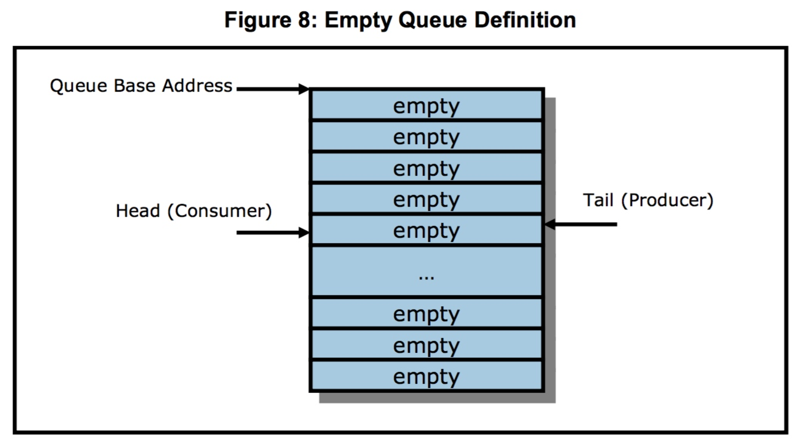
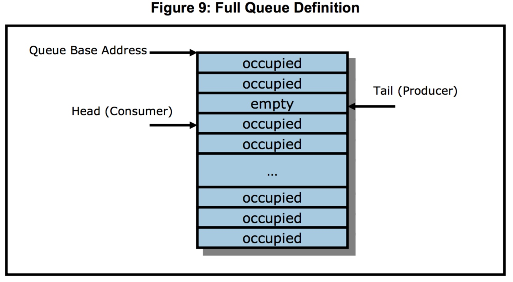
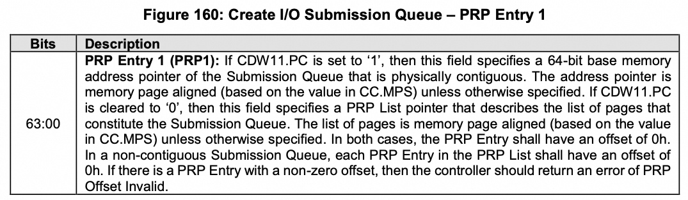
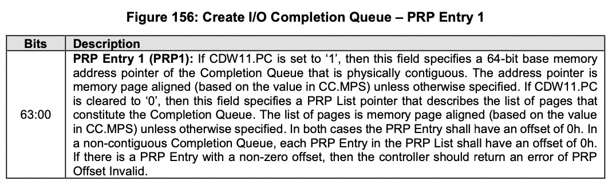
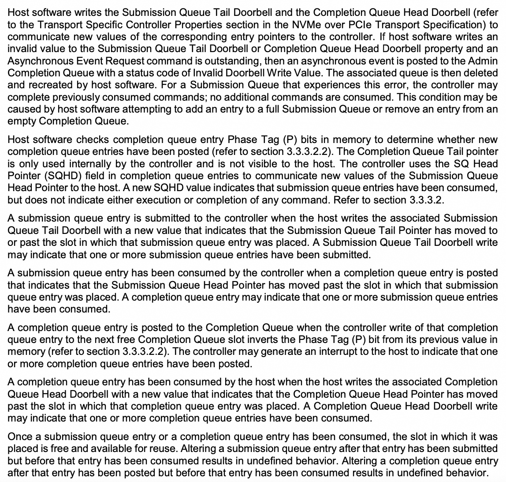
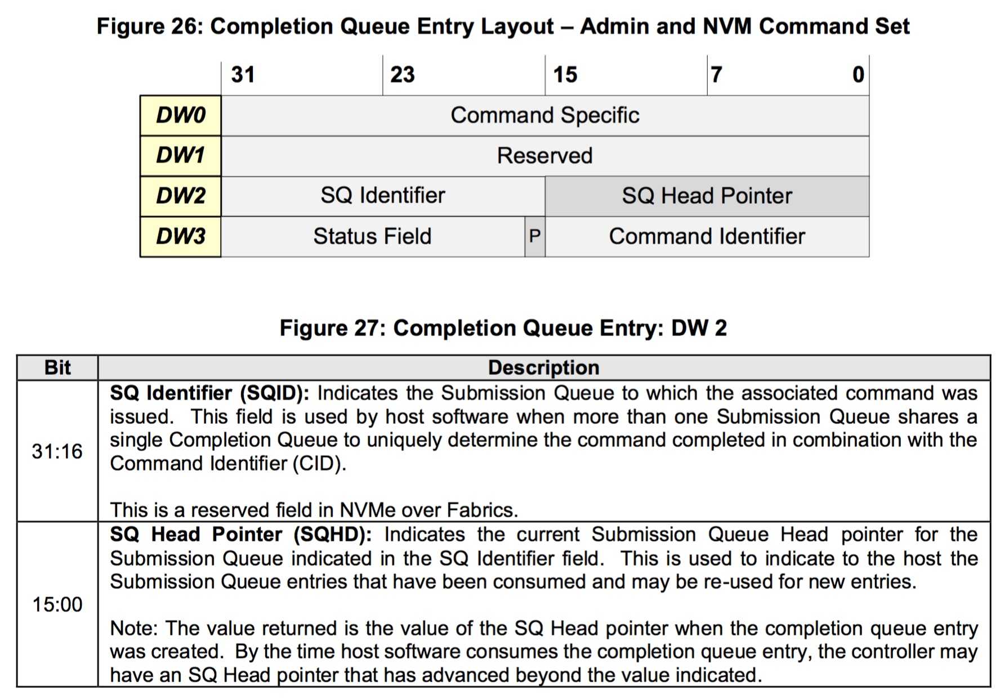
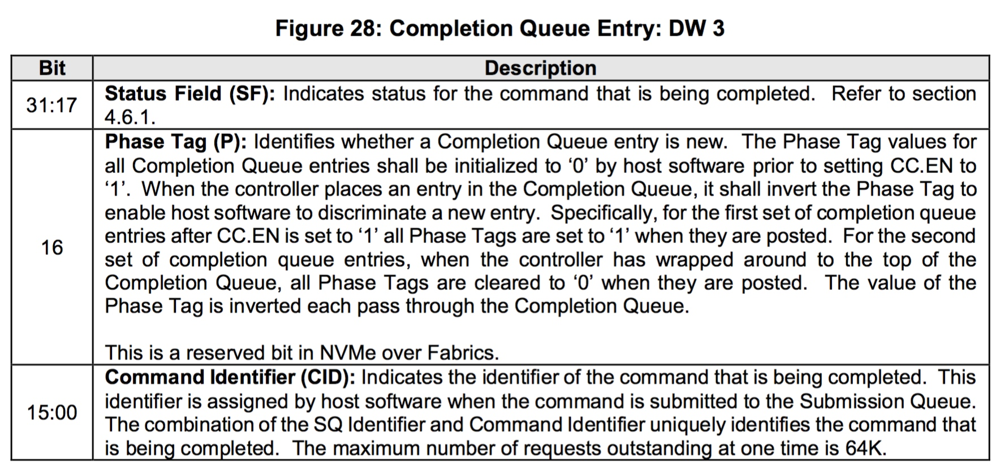
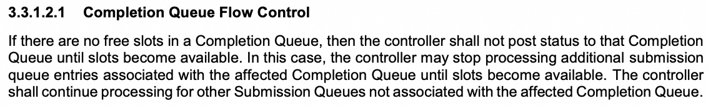

title:'NVMe - Protocol'
## NVMe - Protocol

#### Submission/Completion Queue ring

每个 Submission/Completion Queue ring 都维护有两个指针

- tail 指向下一个 empty entry，即producer将新产生的queue entry保存在其指向的queue entry中
- head 指向下一个 full entry，即consumer从其指向的queue entry中取出一个queue entry进行处理

host software 和 controller 之间共享 Submission Queue ring 和 Completion Queue ring，host software 在分配好 Submission/Completion Queue ring 占用的内存区间后

- 通过 Create I/O Submission Queue 命令的 PRP Entry 1 (PRP1) 字段指定 Submission Queue ring 的地址 (64-bit base memory address pointer)

- 通过 Create I/O Completion Queue 命令的 PRP Entry 1 (PRP1) 字段指定 Completion Queue ring 的地址 (64-bit base memory address pointer)

#### Submission/Completion flow

host software 和 controller 之间只共享 Submission Queue ring 和 Completion Queue ring 内存，submission/completion head/tail 则是通过其他方式在 host software 和 controller 之间同步

##### submission queue

1. host software 在填充 submission queue (submission tail 指向下一个可以填充的 sqe) 后，通过 Submission Queue Tail Doorbell 寄存器向 controller 通知最新的 submission tail
2. controller 自己内部维护 submission head (对 host software 不可见)，根据内部维护的 submission head 以及 Submission Queue Tail Doorbell 寄存器描述的 submission tail，controller 就知道 submission queue 中所有需要处理的 sqe
3. controller 在消费完 sqe 之后，通过 cqe 的 SQ Head Pointer (SQHP) 字段向 host software 通知 (现在 controller 端最新的) submission head

4. host software 接收到最新的 submission head 之后，submission queue 中对应的 sqe 就可以复用

##### completion queue

1. controller 自己内部维护 completion tail (对 host software 不可见)；controller 在完成请求之后，在 completion queue 中填充一个 cqe (completion tail 指向下一个可以填充的 cqe)，之后通过发起一个中断通知 host software
2. host software 在接到中断以后，通过 completion queue 中各个 cqe 的 Phase Tag (P) 字段来识别所有有效的 cqe (并更新 host software 自己维护的 completion head)

4. host software 在处理完所有有效的 cqe 之后，通过 Completion Queue Head Doorbell 寄存器向 controller 通知最新的 completion head

当 controller 检测到 completion queue 满了的时候，controller 应该等待可用的 cqe 空出来，此时 controller 可以停止处理新的 sqe

