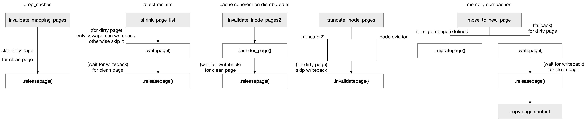

title:'IO - writepage'
## IO - writepage




### releasepage / invalidatepage

.invalidatepage() 和 .releasepage() 都是用于在释放 page cache 的时候，在回收 clean page 的时候，释放 folio->private 数据

其中 .releasepage() 主要在 [invalidate-mapping-pages](mweblib://15901425962070#invalidate-mapping-pages) 和 [invalidate-inode-pages2](mweblib://15901425962070#invalidate-inode-pages2) 中释放 clean page 的过程中释放 folio->private 数据

而 .invalidatepage() 主要是在 [truncate-inode-pages](mweblib://15901425962070#truncate-inode-pages) 中释放 clean page 的过程中释放 folio->private 数据

两者的区别在于两者的返回值不一样：

invalidate_mapping_pages() 与 invalidate_inode_pages2() 中都是回收一些 page cache 或者令 page cache 失效掉，因而这些函数是允许失败返回的以提示调用者，例如 release_folio() 回调函数是可以允许失败的，例如对于 dirty/writeback page 并不会释放 folio->private，或者该 page cache 对应的 buffer head 存在引用而无法被释放，此时回调函数就会返回 false，此时该 page cache 就会继续保留在 address space 中，此时 invalidate_inode_pages2() 返回 -EBUSY、invalidate_mapping_pages() 返回的回收的 clean page 的数量则不包含这个跳过的 page；因而 .releasepage() 的返回值是 int 类型，描述调用的成功与否

而 truncate_inode_pages() 主要用于 truncate(2) 过程中释放掉设定的 new file size 以后的 old page cache，该操作是不允许失败的（该函数的返回值类型是 void），因而 invalidate_folio() 回调函数中无论如何都需要释放 folio->private，同时 page cache 无论如何都会从 address space 中移除并释放掉；因而 .invalidatepage() 的返回值类型是 void

```c
struct address_space_operations {
	int (*releasepage) (struct page *, gfp_t);
	void (*invalidatepage) (struct page *, unsigned int, unsigned int);
	...
}
```


### writepage / launder_page

.writepage() 和 .launder_page() 都是用于在释放 page cache 的时候，在回收 dirty page 的时候，对这个 dirty page 执行回写操作，待回写完成后再回收这个 page

> writepage

a_ops->writepage() 回调函数主要用于 direct reclaim 过程中，对于挑选出来待回收的 page cache (如果是 dirty 的话) 执行回写操作，回写完成后就会释放这个 page

```c
struct address_space_operations {
	int (*writepage)(struct page *page, struct writeback_control *wbc);
	...
}
```

它和 .writepages() 回调函数的差异在于，.writepages() 的任务是尽可能多地回写 dirty page，因而可以一次性回写多个 dirty page，其实现通常是调用 write_cache_pages() 在文件的 address_space 中尽可能多地寻找 dirty page 并进行回写；而 .writepage() 的任务则是对于 direct claiming 算法已经挑选出来的 (dirty) page 进行回写，以便后续释放并回收这个 page，因而一次 .writepage() 调用只需要对传入的 page 进行回写即可


> launder_page

.launder_page() 主要用于 invalidate page cache 的路径中，比较多地用于分布式文件系统中用于实现强数据一致性，例如一个节点对某个文件写入新数据，另一个节点上就需要对同个文件的 page cache 进行 invalidate 操作，以使得 old page cache 失效掉，此时对于 dirty page 就会调用 .launder_page() 回调函数以实现 dirty page 的回写操作，等待回写完成后再释放这个 page

只有分布式文件系统（例如 fuse、nfs）这类因为数据一致性而有 invalidate page cache 需求的文件系统，才需要实现 .launder_page() 回调函数

```c
struct address_space_operations {
	int (*launder_page) (struct page *);
	...
}
```


> 两者的差别在于：

1. .writepage() 调用的时候，page 的 dirty flag 已经被 caller 清除；而 .launder_page() 则需要自己清除 page's dirty flag

.writepage() 调用的时候，调用 .writepage() 的 caller 已经调用过 clear_page_dirty_for_io () 清除 page's dirty flag

```
do_try_to_free_pages
    shrink_zones
        shrink_node
            shrink_node_memcg
                shrink_list
                    shrink_inactive_list
                        shrink_page_list
                            # for each inactive page cache
                                # lock page
                                trylock_page(page)
                                
                                pageout
                                    # Clear a page's dirty flag
                                    clear_page_dirty_for_io(page)
                                    
                                    # set PG_Reclaim flag
                                    SetPageReclaim(page)
                                    
                                    a_ops->writepage(page, &wbc)
                                        # set PG_Writeback flag
                                        set_page_writeback(page)
                                        
                                        # writeback dirty page
```

而 .launder_page() 则需要自己调用 clear_page_dirty_for_io() 来清除 page's dirty flag

```sh
# page cache based
invalidate_inode_pages2_range
    # wait until others release the lock
    lock_page(page);
    
    # for dirty page, writeback the dirty page
    do_launder_page(mapping, page)
        a_ops->launder_page(page)
            # clear PG_Dirty flag
            clear_page_dirty_for_io(page)
            
            # writeback dirty page
```

2. .writepage() 可以选择跳过当前传入的 dirty page 的回写；而 .launder_page() 则不允许跳过当前 dirty page 的回写

.writepage() 主要用于 direct reclaim 过程中，尽可能多地回收 page cache 以释放内存，因而 .writepage() 中允许跳过这个 dirty page 的回写，即跳过这个 page 的回收，此时 direct reclaim 过程中就会尝试回收其他 page

```
do_try_to_free_pages
    shrink_zones
        shrink_node
            shrink_node_memcg
                shrink_list
                    shrink_inactive_list
                        shrink_page_list
                            # for each inactive page cache
                                # lock page
                                trylock_page(page)
                                
                                pageout
                                    # Clear a page's dirty flag
                                    clear_page_dirty_for_io(page)
                                    
                                    # set PG_Reclaim flag
                                    SetPageReclaim(page)
                                    
                                    a_ops->writepage(page, &wbc)
                                        # set PG_Writeback flag
                                        set_page_writeback(page)
                                        
                                        # if skip this page : return 0
                                            redirty_page_for_writepage(wbc, page) // redirty page
                                            # unlock page
                                            # return 0
                                
```

而 .launder_page() 主要用于 invalidate page cache 的路径中，因而这一过程中不允许跳过当前 dirty page 的回写


3. .writepage() 中不需要等待 dirty page 回写完成；而 .launder_page() 中需要等待 dirty page 回写完成

.writepage() 对于 dirty page 的回写是异步的，即回调函数中在下发回写 IO 后就可以返回，而不需要等待回写 IO 完成；此时当 .writepage() 返回的时候回写 IO 还没有完成，就会将这个 page 放回到对应的 inactive LRU list 中，后面 direct reclaim 下一轮扫描 LRU list 的时候就会再次扫描到这个 page，如果那个时候这个 page 的回写完成了，就会回收该 page

```
do_try_to_free_pages
    shrink_zones
        shrink_node
            shrink_node_memcg
                shrink_list
                    shrink_inactive_list
                        shrink_page_list
                            # for each inactive page cache
                                # lock page
                                trylock_page(page)
                                
                                pageout
                                    # Clear a page's dirty flag
                                    clear_page_dirty_for_io(page)
                                    
                                    wbc.sync_mode = WB_SYNC_NONE,
                                    wbc.nr_to_write = SWAP_CLUSTER_MAX,
                                    wbc.range_start = 0,
                                    wbc.range_end = LLONG_MAX,
                                    wbc.for_reclaim = 1,
                                    
                                    # set PG_Reclaim flag
                                    SetPageReclaim(page)
                                    
                                    a_ops->writepage(page, &wbc)
                                        # set PG_Writeback flag
                                        set_page_writeback(page)
                                        
                                        # if success:return 0
                                            # send writeback request
                                            # unlock page
                                            # return 0
                                    
                                    /* page has been sent to the disk successfully, page is unlocked */
                                    return PAGE_SUCCESS
                                
                                # writeback IO has not completed
                                if PageWriteback(page):
                                    # move pages back to LRU list
```


而 .launder_page() 中 dirty page 的回写是同步的，即回调函数中在下发回写 IO 后需要等待 dirty page 回写完成；当 .launder_page() 返回的时候，caller 中就会立即释放这个 page

```sh
# page cache based
invalidate_inode_pages2_range
    # wait until others release the lock
    lock_page(page);
    
    # for dirty page, writeback the dirty page
    do_launder_page(mapping, page)
        a_ops->launder_page(page)
            # clear PG_Dirty flag
            clear_page_dirty_for_io(page)
            # writeback dirty page
            # wait for writeback IO completion
    
    # remove from address space, and free page cache
    invalidate_complete_page2(mapping, page)
```


#### writepage

当由于内存紧张而导致 page 分配失败，进而进入 direct reclaim 时，会在 LRU list 中挑选出适合回收的 page frame，如果挑选出来的是 page cache，则调用对应文件系统的 writepage() 回调函数以对这个 page 执行回写操作

```
do_try_to_free_pages
    shrink_zones
        shrink_node
            shrink_node_memcg
                shrink_list
                    shrink_inactive_list
                        shrink_page_list
                            # for each inactive page cache
                                # lock page
                                trylock_page(page)
                                
                                pageout
                                    # Clear a page's dirty flag
                                    clear_page_dirty_for_io(page)
                                    
                                    wbc.sync_mode = WB_SYNC_NONE,
                                    wbc.nr_to_write = SWAP_CLUSTER_MAX,
                                    wbc.range_start = 0,
                                    wbc.range_end = LLONG_MAX,
                                    wbc.for_reclaim = 1,
                                    
                                    # set PG_Reclaim flag
                                    SetPageReclaim(page)
                                    
                                    a_ops->writepage(page, &wbc)
                                        # set PG_Writeback flag
                                        set_page_writeback(page)
                                        
                                        # if success:return 0
                                        # skip this page : return 0
                                        # on failure: return negativeerror error code
                                    
                                    /* page has been sent to the disk successfully, page is unlocked */
                                    return PAGE_SUCCESS
```


具体地 a_ops->writepage() 中

```
a_ops->writepage(page, &wbc)
    # on success: return 0
        # send writeback request
        # unlock page
        # return 0
    
    # on failure: return negativeerror error code
        # unlock page
        # return negativeerror error code
        
    # skip this page : return 0
        redirty_page_for_writepage(wbc, page) // redirty page
        # unlock page
        # return 0
```


之后 direct reclaim 中会检查这个 page 的 PG_Writeback 标记是否完成。如果此时这个 page 的 writeback IO 还没有完成，即 page 的 PG_Writeback 标记还没有被清掉，那么此时这个 page 会被添加回到 LRU list，之后 direct reclaim 开始处理下一个挑选出来准备回收的 page frame

```
do_try_to_free_pages
    shrink_zones
        shrink_node
            shrink_node_memcg
                shrink_list
                    shrink_inactive_list
                        shrink_page_list
                            # for each inactive page cache
                                # lock page
                                trylock_page(page)
                                
                                pageout
                                    # Clear a page's dirty flag
                                    clear_page_dirty_for_io(page)
                                    
                                    wbc.sync_mode = WB_SYNC_NONE,
                                    wbc.nr_to_write = SWAP_CLUSTER_MAX,
                                    wbc.range_start = 0,
                                    wbc.range_end = LLONG_MAX,
                                    wbc.for_reclaim = 1,
                                    
                                    # set PG_Reclaim flag
                                    SetPageReclaim(page)
                                    
                                    a_ops->writepage(page, &wbc)
                                        # set PG_Writeback flag
                                        set_page_writeback(page)
                                        
                                        # on success: return 0
                                        # skip this page : return 0
                                        # on failure: return negativeerror error code
                                    
                                    /* page has been sent to the disk successfully, page is unlocked */
                                    return PAGE_SUCCESS
                                
                                # if the writeback IO has not completed,
                                # move this page back to LRU list;
                                # otherwise free this page
                                trylock_page(page)
                                if PageWriteback(page):
                                    unlock_page(page)
                                    # move this page back to LRU list
                                else:
                                    # free this page                                 
```

当 writeback IO 完成的时候，就会清除 page 的 PG_Writeback 和 PG_Reclaim 标记

```
# when the writeback IO completed
end_page_writeback(page)
    ClearPageReclaim(page)
    test_clear_page_writeback(page)
```

等到下一次重新触发 direct reclaim 的时候，再重新回收这个 page frame 的时候，如果这个 page 的回写 IO 还没有完成，那么这个时候就会进入睡眠等待状态，等待这个 page 的回写 IO 完成

```
do_try_to_free_pages
    shrink_zones
        shrink_node
            shrink_node_memcg
                shrink_list
                    shrink_inactive_list
                        shrink_page_list
                            # for each inactive page cache
                                # lock page
                                trylock_page(page)
                                
                                # the writeback IO has not completed
                                if PageWriteback(page) && PageReclaim(page):
                                    unlock_page(page);
                                    wait_on_page_writeback(page);
                                    # then go back and try same page again
                                    # move this page back to LRU list                                       
```


#### launder_page

```sh
# page cache based
invalidate_inode_pages2_range
    # wait until others release the lock
    lock_page(page);
    
    # for dirty page, writeback the dirty page
    do_launder_page(mapping, page)
        a_ops->launder_page(page)
            # clear PG_Dirty flag
            clear_page_dirty_for_io(page)
            # writeback dirty page
            # wait for writeback IO completion
    
    invalidate_complete_page2(mapping, page)
        # there's block buffer list for FIEMAP,
        # or 'struct iomap_page' for IOMAP
        if page_has_private(page):
            try_to_release_page
                a_ops->releasepage()
                    try_to_free_buffers(page)
                        drop_buffers(page)
                        # if all buffer heads are not busy, i.e., refcount of buffer head is 0
                        (for each buffer head) free_buffer_head // free buffer head
            
            # if releasepage() succeed, i.e., all buffer heads are not busy and thus freed
            
            __delete_from_page_cache(page, ...) // delete from address space
            a_ops->freepage(), usually NULL
    
    pagevec_release // free page cache
```


### migrate_folio

由于 .writepage() 提交给文件系统的 page 都是按照 LRU 顺序、而非文件内连续顺序的，因而 .writepage() 的性能较差，因而后续 low memory 路径中不推荐走 direct reclaim 路径，而推荐 memory migration 路径，此时各个文件系统不需要实现 .writepage() 回调函数，只需要实现 .migrate_folio() 回调函数即可，同时 .migrate_folio() 回调函数往往直接实现为 filemap_migrate_folio()

```c
struct address_space_operations xxx_file_aops  = {
	.migrate_folio	= filemap_migrate_folio,
	...
}
```

此时 direct reclaim 路径中，当 a_ops->writepage() 回调函数未定义时，就不会在 direct reclaim 中回写并回收 dirty page cache，此时 low memory 路径中依赖 memory compacting (调用 a_ops->migrate_folio()) 规整内存

```
shrink_folio_list
    pageout
        if mapping->a_ops->writepage == NULL:
            return PAGE_ACTIVATE;
```

commit e1c420a ("fuse: Remove fuse_writepage")


