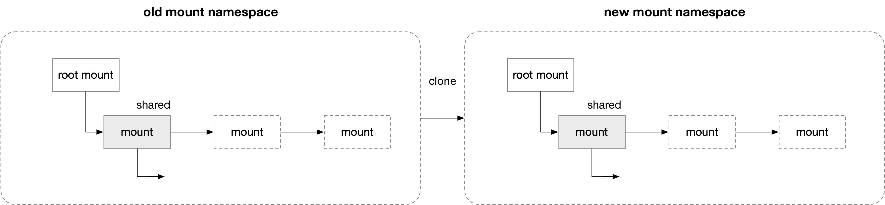

title:'Mount - Propagation -shared'
## Mount - Propagation - shared

> peer group

同一个 peer group 中的所有 mount 实例通过 @mnt_share 链表组织在一起

每个 peer group 都有一个 group ID，mount 实例的 @mnt_group_id 就描述了其所在的 peer group ID

```c
struct mount {
struct list_head mnt_share;	/* circular list of shared mounts */
	int mnt_group_id;		/* peer group identifier */
	...
}
```

### new mount

在新挂载文件系统的时候，每个新挂载的 mount 都是一个新的 peer group

例如

```
mount /dev/vdb /mnt
```

如果 dest_mnt 本身就是 shared 的，例如 “/” 所在的根文件系统就是 shared 的，同时其所在的 peer group ID 为 1

```
# mountinfo
22 1 253:1 / / rw,relatime shared:1 - ext4 /dev/root rw
```

那么新挂载的 mount 默认也是 shared 的，同时每个新挂载的 mount 都是一个新的 peer group

```
mount(2)
    do_mount
        do_new_mount_fc
            # create new mount structure
            mnt = vfs_create_mount(fc);
            
            do_add_mount
                graft_tree
                    attach_recursive_mnt(source_mnt, dest_mnt, dest_mp)
                        # since dest_mnt is shared:
                            # 1. alloc a new mnt_group_id for source_mnt,
                            #    and source_mnt is shared by default
                            invent_group_ids(source_mnt)
                                # if source_mnt is just initialized
                                # (mnt_group_id is 0):
                                    # alloc a new mnt_group_id for source_mnt
                                    mnt_alloc_group_id(source_mnt)
                            
                            # source_mnt is shared by default
                            set_mnt_shared(source_mnt)
                        
                        # 2. attach source_mnt to dest_mnt's mount tree,
                        # i.e. add source_mnt to dest_mnt's @mnt_mounts tree
                        commit_tree(source_mnt)
```

此时

```
# mountinfo
22 1 253:1 / / rw,relatime shared:1 - ext4 /dev/root rw
164 22 253:16 / /root/tmp rw,relatime shared:140 - xfs /dev/vdb rw,attr2,inode64,logbufs=8,logbsize=32k,noquota
```

### make-shared

如果一个新挂载的 mount 一开始不是 shared 的，那么可以通过 "mount --make-shared mountpoint" 将 mount 实例修改为 shared propagation type

```
mount(2)
    mount(..., MS_SHARED)
        do_mount
            do_change_type
                # for shared propagation type
                    invent_group_ids(mnt, ...)
                        # alloc a peer group ID
                        mnt->mnt_group_id = ...
```

其中就会为该 mount 实例分配对应的 peer group ID


### bind mount

bind mount 的时候，会对 source 目录所在的 mount (记为 source mount) 执行 clone 得到一个 mount，这个 clone 得到的 mount (记为 cloned mount) 就与原来的 source mount 在同一个 peer group，这样在 source mount 下挂载的新挂载都会自动传播到 cloned mount 上，从而实现 bind mount 的效果


例如

```
mount --bind /root/data /mnt
```

如果 dest_mnt 本身就是 shared 的，例如 “/” 所在的根文件系统就是 shared 的，同时其所在的 peer group ID 为 1

```
# mountinfo
22 1 253:1 / / rw,relatime shared:1 - ext4 /dev/root rw
```

那么 bind mount 会继承 source mount 的 peer group，以及是否 shared 的属性

```
mount(2)
    do_mount
        do_loopback
            # 1. clone source mount,
            #    clone mount will inherit source mount's mnt_group_id
            __do_loopback
                mnt = clone_mnt(old, ...)
                    mnt = alloc_vfsmnt()
                    mnt->mnt_group_id = old->mnt_group_id // inherit mnt_group_id
                    mnt->mnt.mnt_flags = old->mnt.mnt_flags // inherit MNT_SHARED flag
                    
                    # since source mount is shared:
                    # add cloned mount into source mount's @mnt_share list
                    list_add(&mnt->mnt_share, &old->mnt_share)
                
            graft_tree
                attach_recursive_mnt(source_mnt, dest_mnt, dest_mp)
                    # since dest_mnt is shared:
                        # source_mnt is shared by default
                        set_mnt_shared(source_mnt)
                    
                    # 2. attach source_mnt to dest_mnt's mount tree,
                    # i.e. add source_mnt to dest_mnt's @mnt_mounts tree
                    commit_tree(source_mnt)
```

此时

```
# mountinfo
22 1 253:1 / / rw,relatime shared:1 - ext4 /dev/root rw
160 22 253:1 /mnt /root/data rw,relatime shared:1 - ext4 /dev/root rw
```


### clone 


#### clone mount tree

之前介绍过，在 unshare(2) 创建新 mount namespace 的时候，会对原来的 old mount tree 作 clone 操作得到一棵新的 new mount tree

这一过程中如果 unshare(1) 没有 "-U" 参数，即不创建新 user namespace 的情况下，原来 old mount tree 中 shared propagation type 的 mount 实例，clone 到 new mount tree 中得到的 new mount 实例也是 shared propagation type 的，这两个 mount 实例就同属同一个 peer group





```
unshare(2)
    ksys_unshare
        unshare_nsproxy_namespaces
            create_new_namespaces
                copy_mnt_ns
                    # no "-U"
                    copy_tree
                        # for each mount in the mount tree
                            new = clone_mnt(old, root, flag)
                                # @flag has no CL_SLAVE, CL_PRIVATE, CL_SHARED_TO_SLAVE
                                new->mnt_group_id = old->mnt_group_id;
                                list_add(&new->mnt_share, &old->mnt_share)
```
