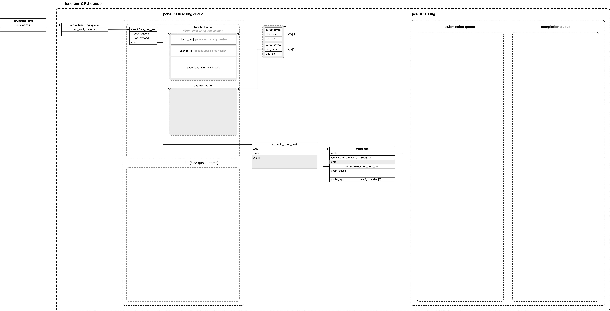
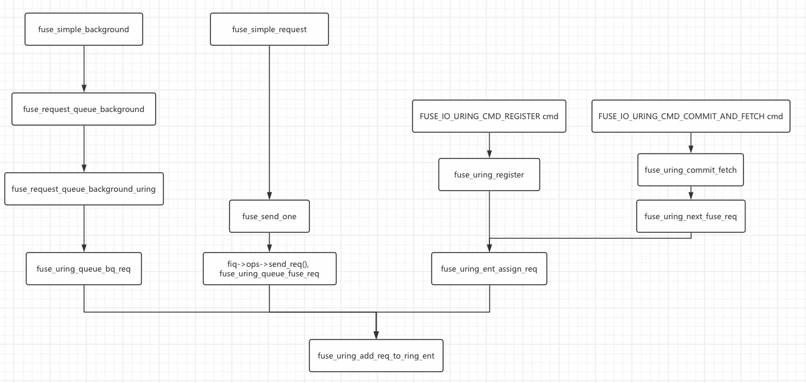
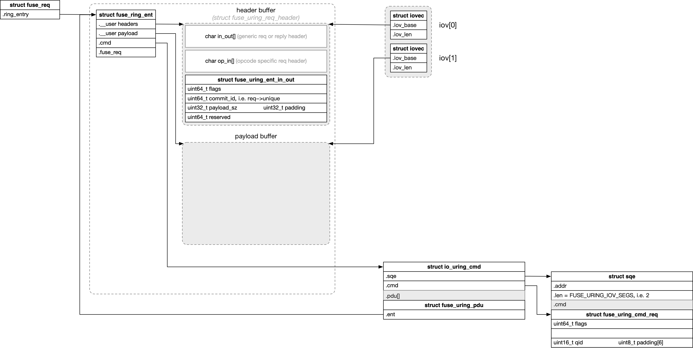
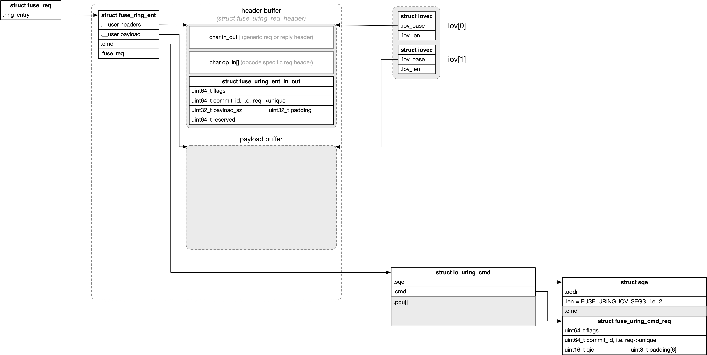

title:'FUSE - Feature - uring'
## FUSE - Feature - uring


### 1. server: ring setup

#### 1.1 setup per-CPU uring instance

fuse server 首先创建 per-CPU iouring 实例

```libfuse
# fuse server: handles FUSE_INIT
fuse_uring_start
    fuse_create_ring # create libfuse internal ring data structure
    fuse_uring_start_ring_threads # create per-CPU uring thread

# per-CPU uring thread
fuse_uring_thread
    _fuse_uring_init_queue
        fuse_queue_setup_io_uring
            io_uring_queue_init_params # liburing: create uring structure
            io_uring_register_files # liburing: register "/dev/fuse" devfd
```

#### 1.2 setup per-CPU fuse ring

之后 fuse server 需要为 per-CPU uring 实例创建对应的 per-CPU fuse ring

##### 1.2.1 fuse ring entry

fuse ring 实际上由一个个的 ring entry (由 struct fuse_ring_ent 描述) 组成，每个 ring entry 实际上就描述了一个用于承载 FUSE 请求的 user buffer 缓存，包括 header buffer 和 payload buffer 两部分构成

在 send request 阶段：
- header buffer 的 in_out[] 后面用于存储 generic request header，i.e. struct fuse_in_header
- header buffer 的 op_in[]  后面用于存储 opcode specific request header
- payload buffer            后面用于存储请求的 payload 数据


##### 1.2.2 register fuse ring entry



fuse server 在分配好一个 ring entry 对应的用户态缓存区之后，就需要下发 FUSE_URING_REQ_REGISTER subcmd 来向内核注册这一个 ring entry (i.e. 用户态缓存)；每个 FUSE_URING_REQ_REGISTER subcmd 只能注册一个 ring entry，fuse server 需要为每一个 ring entry 调用一次 FUSE_URING_REQ_REGISTER subcmd，所有注册的 ring entry 都添加到 queue->ent_avail_queue list 链表就共同组成了一个 per-CPU fuse ring，fuse ring 的 queue depth 深度和 io_uring 的 submission queue 的深度是解耦开的

当前 libfuse 实现中，per-CPU fuse ring 的深度和 per-CPU uring 的 submission queue 的深度是相同的

```
# fuse server: handles FUSE_INIT
fuse_uring_start
    fuse_create_ring # create libfuse internal ring data structure
    fuse_uring_start_ring_threads # create per-CPU uring thread

# per-CPU uring thread
fuse_uring_thread
    _fuse_uring_init_queue
        # create uring instance
        fuse_queue_setup_io_uring
            
        fuse_uring_prepare_fetch_sqes
            # register ring entry (header + payload) for each sqe:
                sqe = io_uring_get_sqe() # liburing: get the next available sqe entry
                
                sqe.opcode = IORING_OP_URING_CMD
                sqe.subcmd = FUSE_URING_REQ_REGISTER
                sqe.fd = "/dev/fuse" devfd
                sqe.addr = ptr to an iovec array (iovec[0] is header, iovec[1] is payload)
                sqe.cmd = ptr to 'fuse_uring_cmd_req'
                                                    .qid = queue->id
                                                    .commit_id = 0
                                                    .flags = 0

        io_uring_submit # liburing: submit submission queue 
```

在注册 ring entry (FUSE_URING_REQ_REGISTER subcmd) 过程中，driver specific data (存储在 sqe.cmd[]，由 struct fuse_uring_cmd_req 描述) 中只有 qid 字段是有效的，描述当前需要注册的 ring entry 是属于哪个 per-CPU fuse ring 的

```c
struct fuse_uring_cmd_req {
	/* queue the command is for (queue index) */
	uint16_t qid;
	...
};
```

同时 sqe.addr 指向一个 iovec[2] 的数组，这个 iovec[] 数组就描述了这个 ring entry 描述的用户态缓存区间，其中 iovec[0] 描述 header buffer，iovec[1] 描述 payload buffer；sqe.len 必须是 2

```
# kernel
io_uring_enter(2) 
    fuse_uring_cmd
        case FUSE_IO_URING_CMD_REGISTER:
            fuse_uring_register
                # alloc 'struct fuse_ring'
                fuse_uring_create
                    ring->nr_queues = num_possible_cpus()
                    fc->ring = ring
                    
                # alloc 'struct fuse_ring_queue'
                qid = READ_ONCE(cmd_req->qid)
                queue = ring->queues[qid]
                fuse_uring_create_queue(queue, qid)
                
                # create 'struct fuse_ring_ent' for FUSE_IO_URING_CMD_REGISTER cmd
                ent = fuse_uring_create_ring_ent(cmd, queue)
                fuse_uring_do_register(ent, ...)
                    # move this ent to queue->ent_avail_queue list
                    ent->state = FRRS_AVAILABLE
                    
                    # wait for all CPU has sent FUSE_IO_URING_CMD_REGISTER cmd:
                        # convert from classical /dev/fuse read/write interface to uring based interface
                        fiq->ops = fuse_io_uring_ops
                        ring->ready = true
```

当每个 per-CPU fuse ring queue 都 ready 就绪 (每个 per-CPU ring queue 都注册了至少一个 ring entry) 时，整个 fuse connection 就会切换到 uring-based 数据路径 (而在此之前还是 classical /dev/fuse read/write based 数据路径)


> fuse server 在初始化阶段需要为 per-CPU fuse ring 的每个 ring entry 调用一次 FUSE_URING_REQ_REGISTER subcmd，这一步不但是为了向内核注册一个个的 ring entry (i.e. 用户态缓存)，从而共同组成一个 per-CPU fuse ring；此外这每一个 FUSE_URING_REQ_REGISTER subcmd 都作为一个 uring sqe，后面 fuse client 需要下发 FUSE 请求的时候，下发的 FUSE 请求实际就作为 uring cqe 以通知 fuse server
>
> 需要注意的是，当 FUSE_URING_REQ_REGISTER subcmd 执行完成后，对应的 uring cqe 就可以释放了 (并在之后可以被复用)，而不需要等到对应的 uring cqe (下发的 FUSE 请求) 到来；即 io_uring 的 submission queue 和 completion queue 是解耦的，每个 ring entry 与一个 io_uring_cmd (uring request, i.e. 'struct io_kiocb') 是一一对应的，从而在 io_uring 层面实现 sqe 与 cqe 的一一映射；同时通过 sqe.user_data (64 bit) -> req->cqe.user_data -> cqe.user_data 来在用户态层面实现 sqe 与 cqe 的一一映射
> 
> ```
> io_uring_enter
>   io_submit_sqes
>       io_submit_sqe
>           io_init_req
>               req->cqe.user_data = READ_ONCE(sqe->user_data)
> ```
> 
> ```
> fuse_simple_request
>   ...
>   io_uring_cmd_done
>       io_req_complete_defer
>           # add this io_kiocb to ctx->submit_state->compl_reqs list
> 
> io_submit_flush_completions
>   # for each 'struct io_kiocb *req' in ctx->submit_state->compl_reqs list
>       io_fill_cqe_req(ctx, req)
>           io_get_cqe(ctx, &cqe)
>           memcpy(cqe, &req->cqe, ...)
> ```


### 2. client: send request


上文介绍到，fuse server 在初始化阶段需要为 per-CPU fuse ring 的每个 ring entry 调用一次 FUSE_URING_REQ_REGISTER subcmd，这一步不但是为了向内核注册一个个的 ring entry (i.e. 用户态缓存)，从而共同组成一个 per-CPU fuse ring；此外这每一个 FUSE_URING_REQ_REGISTER subcmd 都作为一个 uring sqe，后面 fuse client 需要下发 FUSE 请求的时候，下发的 FUSE 请求实际就作为 uring cqe 以通知 fuse server




#### forground request

下发 FUSE 请求的过程，实际上就是从 queue->ent_avail_queue list 中找到一个空闲的 ring entry (作为 uring sqe)，下发的 FUSE 请求就作为对应的 uring cqe 以通知 fuse server；这一过程中会将这个 ring entry 从原来的 queue->ent_avail_queue list 移除，转移到 queue->ent_w_req_queue list，以描述这个 ring entry 当前被占用

之后需要将 FUSE 请求携带的数据拷贝到这个 ring entry 描述的 header buffer 和 payload buffer 缓存中
- header buffer 的 in_out[] 存储 generic request header，i.e. struct fuse_in_header
- header buffer 的 op_in[]  存储 opcode specific request header
- payload buffer 存储请求的 payload 数据，header buffer 的 ring_ent_in_out.payload_sz 描述了 payload buffer 中有效数据的长度
- header buffer 的 ring_ent_in_out.commit_id 描述了这个请求的唯一标识符，即 req->unique

```
fuse_simple_request
    __fuse_request_send
        fuse_send_one(fiq, req)
            fiq->ops->send_req(fiq, req), i.e. fuse_uring_queue_fuse_req()
                # get ring queue in this CPU
                fuse_uring_task_to_queue
                    qid = task_thread_info(current)->cpu
                    queue = fc->ring->queues[qid]
                
                # get the first entry (fuse_ring_ent) in queue->ent_avail_queue list
                fuse_uring_add_req_to_ring_ent(ent, req)
                    ent->fuse_req = req
                    ent->state = FRRS_FUSE_REQ
                    
                    # move this entry to queue->ent_w_req_queue list
                    
                    fuse_uring_add_to_pq
                    req->ring_entry = ent
                    # add this req to pq->processing[] hash table
                
                fuse_uring_dispatch_ent(ent)
                    # schedule uring worker (the uring worker context)
                        fuse_uring_send_in_task
                            fuse_uring_prepare_send(ent, req)
                                fuse_uring_copy_to_ring
                                    fuse_uring_args_to_ring
                                        # copy req's specific header to ring entry's header buffer
                                        # copy req's payload to ring entry's payload buffer
                                        # fill ring_ent_in_out into entry's header buffer
                                            ent_in_out.commit_id = req->in.h.unique
                                            ent_in_out.payload_sz = cs.ring.copied_sz
                                                            i.e. actual copied size of payload buffer
                                    # copy req's generic header to ring entry's header buffer
                            
                            fuse_uring_send(ent, ...)
                                ent->state = FRRS_USERSPACE
                                # move this entry (fuse_ring_ent) to queue->ent_in_userspace list
                                ent->cmd = NULL
                                
                                # send as cqe replying to the previous FUSE_IO_URING_CMD_REGISTER cmd
                                io_uring_cmd_done
```

之后就是将这个 FUSE 请求作为一个 uring cqe 进行下发，这一过程中是使用 ring entry 的 cmd 字段指向的 io_uring_cmd (uring request, i.e. 'struct io_kiocb') 定位到对应的 sqe，之后进而通过 sqe.user_data (64 bit) -> req->cqe.user_data -> cqe.user_data 以使得用户态定位到这个 cqe 对应的 ring entry (libfuse 中在最初下发 sqe 的时候，sqe.user_data 存储的就是 ring entry 指针)

这一过程中会将 ring entry 的 cmd 字段清空 (因为后面就要发送 uring cqe 了，对应的 io_uring_cmd 会被释放)


#### background request

```
fuse_simple_background
    fuse_request_queue_background
        fuse_request_queue_background_uring
            fuse_uring_queue_bq_req
                # get ring queue in this CPU
                fuse_uring_task_to_queue
                
                # add this req to queue->fuse_req_bg_queue list
                # when active_background is under max_background threshold:
                    # move this req to queue->fuse_req_queue list
                
                # get first entry (fuse_ring_ent) in queue->ent_avail_queue list
                # get first req in queue->fuse_req_queue list

                fuse_uring_add_req_to_ring_ent(ent, req)
                    # move this entry to queue->ent_w_req_queue list,
                    # add this req to pq->processing[] hash table
                
                fuse_uring_dispatch_ent
                    # copy req's data to this ring entry's header & payload buffer
                    # send as cqe replying to the previous FUSE_IO_URING_CMD_REGISTER cmd
```


### 3. server: fetch request

上文介绍到 fuse client 发送 FUSE 请求的过程，实际上就是向 io_uring 填充一个 cqe 的过程，因而 fuse server 只需要 polling uring completion queue 就可以获取需要处理的 FUSE 请求，其具体过程是根据 cqe.user_data 定位到 ring entry (即用户态缓存)，而这个 ring entry 就正描述了一个 FUSE 请求

```libfuse
# per-CPU uring thread
fuse_uring_thread
    # create uring structure and send FUSE_URING_REQ_REGISTER for each sqe
    _fuse_uring_init_queue

    while loop:
        io_uring_submit_and_wait # liburing: wait for at least one cqe
        
        _fuse_uring_queue_handle_cqes
            io_uring_for_each_cqe # liburing: for each pending cqe (i.e. each comming req)
                fuse_uring_handle_cqe(..., cqe)
                    ent = io_uring_cqe_get_data(cqe) # liburing: get user data of this cqe
                    fuse_session_process_uring_cqe

```


### 4. server: send reply

fuse server 在准备好 FUSE 请求对应的 reply 之后，就会通过 FUSE_IO_URING_CMD_COMMIT_AND_FETCH subcmd 来向内核回复 reply

#### 4.1 setup reply buffer

fuse server 准备 reply 的过程，实际上就是往 ring entry 描述的缓存中填充 reply 的过程，其中
- header buffer 的 in_out[] 存储 generic reply header，i.e. struct fuse_out_header
- header buffer 的 op_in[]  是 unused 的
- 无论 opcode specific reply header、还是需要回复的 data 数据，都存储在 payload buffer 中，header buffer 的 ring_ent_in_out.payload_sz 描述了 payload buffer 中有效数据的长度

```
# server
send_reply
    send_reply_uring
        fuse_uring_commit_sqe
            sqe = io_uring_get_sqe # liburing: get the next available sqe entry
            sqe.opcode = IORING_OP_URING_CMD
            sqe.subcmd = FUSE_IO_URING_CMD_COMMIT_AND_FETCH
            sqe.fd = "/dev/fuse" devfd
            sqe.addr = ptr to an iovec array (iovec[0] is header, iovec[1] is payload)
            sqe.cmd = ptr to 'fuse_uring_cmd_req'
                                                .qid = queue->id
                                                .commit_id = ent->req_commit_id
                                                .flags = 0

        io_uring_submit # liburing: submit submission queue 
            
```

#### 4.2 commit FUSE reply

fuse server 在准备好 FUSE 请求对应的 reply (实际上就是一个 ring entry 描述的用户态缓存) 之后，就会通过 FUSE_IO_URING_CMD_COMMIT_AND_FETCH subcmd 来向内核回复 reply

这一过程中 driver specific data (i.e. 'struct fuse_uring_cmd_req') 的 qid 字段就描述了承载这个 FUSE reply 的 ring entry 隶属于哪一个 per-CPU fuse ring，commit_id 字段描述了这个 reply 对应的 FUSE 请求的唯一标识符，实际上就是复用了请求下发阶段 header buffer 的 ring_ent_in_out.commit_id 字段存储的 req->unique，内核在接收到 reply 的时候就是通过这个字段找到 reply 对应的 request 请求

```c
struct fuse_uring_cmd_req {
	uint64_t flags;

	/* entry identifier for commits */
	uint64_t commit_id;

	/* queue the command is for (queue index) */
	uint16_t qid;
	uint8_t padding[6];
};
```

```
# kernel
io_uring_enter(2) 
    opcode = IORING_OP_URING_CMD
    subcmd = FUSE_IO_URING_CMD_COMMIT_AND_FETCH
    fd = "/dev/fuse" devfd
    addr = ptr to an iovec array

    fuse_uring_cmd
        case FUSE_IO_URING_CMD_COMMIT_AND_FETCH:
            fuse_uring_commit_fetch
                commit_id = READ_ONCE(cmd_req->commit_id)
                qid = READ_ONCE(cmd_req->qid)
                queue = ring->queues[qid]
                
                # Find a request based on the unique ID of the fuse request
                req = fuse_request_find(&queue->fpq, commit_id)
                # delete this req from pq->processing[] hash table
                
                ent = req->ring_entry
                ent->state = FRRS_COMMIT
                # move this ring entry to queue->ent_commit_queue list
                
                # 1. commit the request reply (fill as a sqe)
                # i.e. Read data from the ring buffer, which user space has written to
                fuse_uring_commit(ent, req, ...)
                    # copy generic reply header from user header buffer
                    
                    fuse_uring_copy_from_ring
                        # copy driver specific data (fuse_uring_ent_in_out) from user header buffer
                        # copy payload from user payload buffer (including opcode specific reply header)
                    fuse_uring_req_end
                        fuse_request_end(req)
                
                ...
```



需要注意的是，这里在发送 FUSE_IO_URING_CMD_COMMIT_AND_FETCH 的时候，fuse_ring_ent 和其对应的用户态缓存和之前 FUSE_IO_URING_CMD_REGISTER 使用的 fuse_ring_ent 和用户态缓存是同一个；但是此时 io_uring_cmd 和 sqe 则是全新的，之前 FUSE_IO_URING_CMD_REGISTER 对应的 sqe 和 io_uring_cmd 已经在发送 FUSE 请求（即相当于 send iourng cqe）的时候随着 iouring cqe 已经被释放了，此时发送 FUSE_IO_URING_CMD_COMMIT_AND_FETCH 的时候，就会创建新的 sqe 和 io_uring_cmd


#### 4.3 fetch next FUSE request

FUSE_IO_URING_CMD_COMMIT_AND_FETCH subcmd 中除了回复 FUSE reply 以外，还会直接取出下一个需要处理的 FUSE 请求发送给 fuse server，即将这个 FUSE 请求作为当前 FUSE_IO_URING_CMD_COMMIT_AND_FETCH subcmd 填充的 uring sqe 对应的 uring cqe 进行下发

此外这一过程中会直接复用之前承载 FUSE reply 的这个 ring entry，来承载当前这个新的 FUSE 请求，这一过程需要将这个 ring entry 与当前 FUSE_IO_URING_CMD_COMMIT_AND_FETCH subcmd 新下发的 uring sqe 联系在一起，也就是将 ring entry 的 cmd 字段重新指向当前新下发的 FUSE_IO_URING_CMD_COMMIT_AND_FETCH subcmd 对应的 io_uring_cmd

```
# kernel
io_uring_enter(2) 
    opcode = IORING_OP_URING_CMD
    subcmd = FUSE_IO_URING_CMD_COMMIT_AND_FETCH
    fd = "/dev/fuse" devfd
    addr = ptr to an iovec array

    fuse_uring_cmd
        case FUSE_IO_URING_CMD_COMMIT_AND_FETCH:
            fuse_uring_commit_fetch
                commit_id = READ_ONCE(cmd_req->commit_id)
                qid = READ_ONCE(cmd_req->qid)
                queue = ring->queues[qid]
                
                # Find a request based on the unique ID of the fuse request
                req = fuse_request_find(&queue->fpq, commit_id)
                # delete this req from pq->processing[] hash table
                
                ent = req->ring_entry
                ent->state = FRRS_COMMIT
                # move this ring entry to queue->ent_commit_queue list
                
                ent->cmd = cmd
                
                # 1. commit the request reply (fill as a sqe)
                # i.e. Read data from the ring buffer, which user space has written to
                fuse_uring_commit(ent, req, ...)
                    
                
                # 2. Fetching the next request to be processed
                fuse_uring_next_fuse_req
                    # free and make the ring entry available again
                    fuse_uring_ent_avail(ent, queue)
                        # move the ring entry to queue->ent_avail_queue list
                        ent->state = FRRS_AVAILABLE
                        
                    req = fuse_uring_ent_assign_req(ent)
                        # fetch next request to be processed from queue->fuse_req_queue list
                        fuse_uring_add_req_to_ring_ent
                            # reuse this ring entry just previously freed to process this request
                            # move this ring entry to queue->ent_w_req_queue list
                            fuse_uring_add_to_pq
                                # move this request to processing hash table
                    
                    fuse_uring_send_next_to_ring
                        # copy req's header and payload to user buffer
                        fuse_uring_prepare_send
                        
                        # move this ring entry to queue->ent_in_userspace list
                        
                        # send as cqe replying to the sqe (previous request reply)
                        # associated with the ring entry
                        io_uring_cmd_done
```