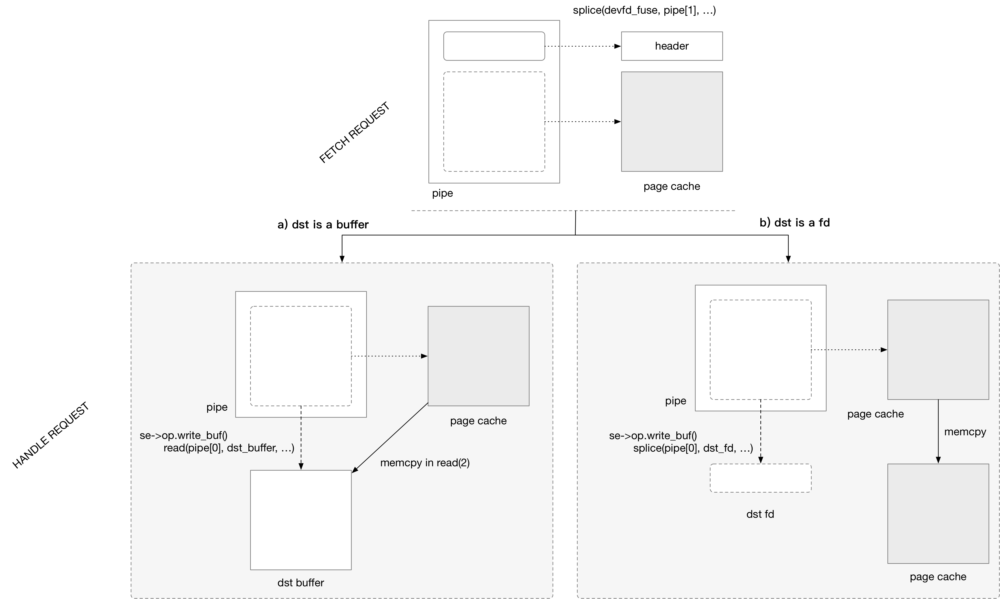
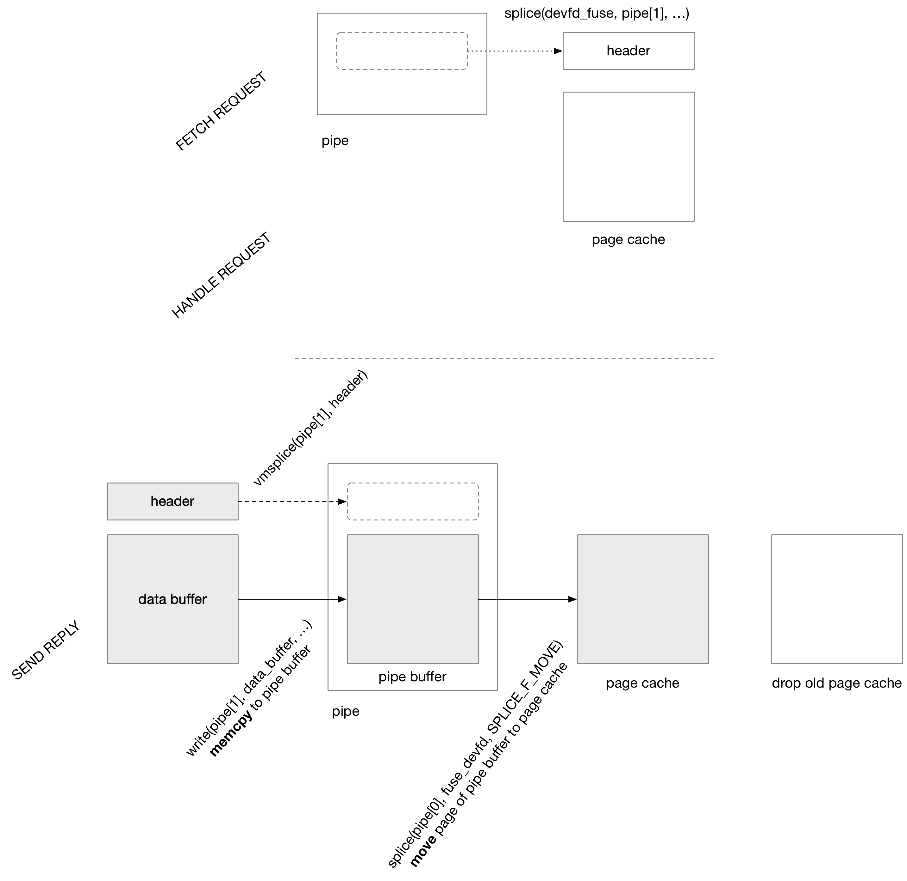

title:'libfuse - buffer'
## libfuse - buffer

libfuse 中使用 struct fuse_buf 来描述一个用户态缓存


每个 fuse session worker 维护有一个 buffer，因为每个 worker 是串行同步处理 FUSE 请求的，因而每个 worker 只需要维护一个 buffer 就够了

```c
struct fuse_worker {
	struct fuse_buf fbuf;
	...
}
```

每个 fuse session worker 在一开始创建出来的时候，只会初始化 struct fuse_buf 结构体，但是不会分配缓存

```
# main
se = fuse_session_new(..., &lo_ops, ...)
    se->bufsize = FUSE_MAX_MAX_PAGES * getpagesize() + FUSE_BUFFER_HEADER_SIZE

fuse_session_mount(se, mntpoint)
    fuse_kern_mount
        fuse_mount_sys
            fd = open("/dev/fuse", ...)
            mount(2)
    se->fd = fd
    
fuse_session_loop_mt(se, &config)
    fuse_session_loop_mt_312
        fuse_loop_start_thread
            w->fbuf.mem = NULL
            
            # create first start first worker
            fuse_start_thread
                pthread_create(..., fuse_do_work)
        
        # wait here until exited
```


```
# worker
fuse_do_work
    while loop:
        # fetch one request
        fuse_session_receive_buf_int
        
        mt->numavail--

        if (mt->numavail == 0 && mt->numworker < mt->max_threads):
            # create a new worker
            fuse_loop_start_thread
                w->fbuf.mem = NULL
                
                fuse_start_thread
                    pthread_create(..., fuse_do_work)
```


### normal read/write channel

此时 fuse_buf 为 memory based 形态，也就是 FUSE server 分配一段内存空间作为用户态缓存

```c
struct fuse_buf {
	/**
	 * Size of data in bytes
	 */
	size_t size;

	/**
	 * Memory pointer
	 *
	 * Used unless FUSE_BUF_IS_FD flag is set.
	 */
	void *mem;

	/**
	 * Size of memory pointer
	 *
	 * Used only if mem was internally allocated.
	 * Not used if mem was user-provided.
	 */
	size_t mem_size;
};
```

@mem_size 描述这一段内存区间的大小
@size 描述 read(2) "/dev/fuse" 设备文件之后，这段内存区间中实际读取的数据大小


1. allocate memory buffer (for the first time)

后面 worker 第一次开始工作的时候，才会分配内存缓存

```
# worker
fuse_do_work
    while loop:
        fuse_session_receive_buf_int
            # alloc user buffer
            buf->mem = malloc(se->bufsize)
            buf->mem_size = se->bufsize
            
            res = read(se->fd, buf->mem, se->bufsize)
            buf->size = res
```

2. fetch FUSE request

直接对 "/dev/fuse" 设备文件执行 read(2) 操作以读取 FUSE 请求并保存在 struct fuse_buf 描述的用户态缓存中

```
# worker
fuse_do_work
    while loop:
        fuse_session_receive_buf_int       
            # read FUSE request
            res = read(se->fd, buf->mem, se->bufsize)
            buf->size = res
```


3. process FUSE request

接下来就开始处理读取到的 FUSE 请求
- 首先根据缓存中读取到的 FUSE 请求，封装为一个 struct fuse_req 结构体
- 接下来调用对应的 handler 处理请求

```
# worker
fuse_do_work
    while loop:
        fuse_session_receive_buf_int
            # read FUSE request
            res = read(se->fd, buf->mem, se->bufsize)
            buf->size = res
        
        fuse_session_process_buf_int(se, buf, ...)
            # alloc and init 'struct fuse_req' from buf->mem
            
            # for FUSE_WRITE:
                do_write_buf(req, in->nodeid, inarg, buf)
            # else:
                fuse_ll_ops[opcode].func(eq, in->nodeid, inarg)
```


4. send reply

libfuse 中常用的回复 reply 的接口为 fuse_reply_buf()，其中 @buf 是 FUSE server 分配的内存，其中就包含了 reply 数据（除了 fuse_out_heaer 以外的所有数据，包括 opcode specific out header）

```c
int fuse_reply_buf(fuse_req_t req, const char *buf, size_t size)
```

```
fuse_reply_buf
    send_reply_ok
        send_reply
            send_reply_iov
                fuse_send_reply_iov_nofree
                    fuse_send_msg
                        # write "/dev/fuse" to send reply
                        writev(se->fd, iov, count, ...)
```


### splice read/write channel

此时 fuse_buf 是 pipe fd based 形态，也就是通过 pipe fd 来描述缓存

```c
struct fuse_buf {
	/**
	 * Size of data in bytes
	 */
	size_t size;

	/**
	 * Buffer flags
	 */
	enum fuse_buf_flags flags;

	/**
	 * File descriptor
	 *
	 * Used if FUSE_BUF_IS_FD flag is set.
	 */
	int fd;

	/**
	 * File position
	 *
	 * Used if FUSE_BUF_FD_SEEK flag is set.
	 */
	off_t pos;
};
```

```c
enum fuse_buf_flags {
	/**
	 * Buffer contains a file descriptor
	 *
	 * If this flag is set, the .fd field is valid, otherwise the
	 * .mem fields is valid.
	 */
	FUSE_BUF_IS_FD		= (1 << 1),

	/**
	 * Seek on the file descriptor
	 *
	 * If this flag is set then the .pos field is valid and is
	 * used to seek to the given offset before performing
	 * operation on file descriptor.
	 */
	FUSE_BUF_FD_SEEK	= (1 << 2),

	/**
	 * Retry operation on file descriptor
	 *
	 * If this flag is set then retry operation on file descriptor
	 * until .size bytes have been copied or an error or EOF is
	 * detected.
	 */
	FUSE_BUF_FD_RETRY	= (1 << 3)
};
```


1. init pipe

fuse_session 的 @pipe_key 指向一个 struct fuse_ll_pipe 指针

```c
struct fuse_session {
	pthread_key_t pipe_key;
	...
}
```

fuse_ll_pipe 的 @pipe[] 数组就是 splice 使用的 pipe，@size 描述 pipe 的大小，即这个 pipe 所能容纳的最大缓存的大小

```c
struct fuse_ll_pipe {
	size_t size;
	int pipe[2];
};
```

后面 worker 第一次开始工作的时候，会先初始化 splice 使用的 pipe

```
# worker
fuse_do_work
    while loop:
        fuse_session_receive_buf_int
            fuse_ll_get_pipe
                # allocate "struct fuse_ll_pipe"
                
                # 1. alloc pipe
                fuse_pipe(llp->pipe[2])
                    pipe(llp->pipe[2])
                    # set default pipe size
                    llp->size = pagesize * 16
                
                # grow pipe size
                if llp->size < se->bufsize:
                    fcntl(llp->pipe[0], F_SETPIPE_SZ, se->bufsize)
                    llp->size = se->bufsize
```

2. fetch FUSE request

对 "/dev/fuse" 设备文件执行 splice read 以读取 FUSE 请求，读取的请求保存在 pipe 中

```
# worker
fuse_do_work
    while loop:
        fuse_session_receive_buf_int
            fuse_ll_get_pipe
                # allocate "struct fuse_ll_pipe"
                
                # 1. alloc pipe
                fuse_pipe(llp->pipe[2])
                    pipe(llp->pipe[2])
                    # set default pipe size
                    llp->size = pagesize * 16
                
                # grow pipe size
                if llp->size < se->bufsize:
                    fcntl(llp->pipe[0], F_SETPIPE_SZ, se->bufsize)
                    llp->size = se->bufsize
                
                # 2. splice read "/dev/fuse"
                res = splice(se->fd, ..., llp->pipe[1], ..., se->bufsize, ...)

```


3. init buffer (with fetched request in pipe)

后面就是根据 pipe 中缓存的 FUSE 请求，初始化对应的 fuse_buf 结构

```
# worker
fuse_do_work
    while loop:
        fuse_session_receive_buf_int
            fuse_ll_get_pipe
                # allocate "struct fuse_ll_pipe"
                
                # alloc pipe
                fuse_pipe(llp->pipe[2])
                    pipe(llp->pipe[2])
                    # set default pipe size
                    llp->size = pagesize * 16
                
                # grow pipe size
                if llp->size < se->bufsize:
                    fcntl(llp->pipe[0], F_SETPIPE_SZ, se->bufsize)
                    llp->size = se->bufsize
                
                # 2. splice read "/dev/fuse"
                res = splice(se->fd, ..., llp->pipe[1], ..., se->bufsize, ...)
                
                # 3. init buffer (with fetched request in pipe)
                buf.fd = llp->pipe[0]
                buf.size = res,
                bug.flags = FUSE_BUF_IS_FD
```


3. process FUSE request

接下来就开始处理读取到的 FUSE 请求
- 首先根据缓存中读取到的 FUSE 请求，封装为一个 struct fuse_req 结构体
- 接下来调用对应的 handler 处理请求

对于非 FUSE_WRITE 请求，即使是通过 splice read 读取 "/dev/fuse" 设备文件读取的请求，但是在 FUSE server 侧处理这些请求的时候，还是单独分配用户态内存，将请求及数据从 pipe 拷贝到分配的用户态缓存，之后就处理这个用户态缓存中的 FUSE 请求，也就是说对于非 WRITE 请求不会产生 zero-copy 效果

```
# worker
fuse_do_work
    while loop:
        # fetch FUSE request into pipe buffer
        fuse_session_receive_buf_int
        
        fuse_session_process_buf_int(se, buf, ...)
            # alloc one memory buffer large enough for "struct fuse_in_header" + "struct fuse_write_in"
            # copy fuse_in_header and fuse_write_in (if any) from pipe buffer to the allocated mem buffer
            fuse_ll_copy_from_pipe
                fuse_buf_copy
                    fuse_buf_copy_one
                        # since src_is_fd and !dst_is_fd:
                        fuse_buf_read
                            read(pipe[0], <allocated mem buffer>, ...)
            
            # alloc and init 'struct fuse_req' from allocated mem buffer
            
            # realloc previously allocated mem buffer to request size
            newmbuf = realloc(mbuf, buf->size)
            
            # copy remaining data in pipe buffer to reallocated mem buffer
            fuse_ll_copy_from_pipe
            
            # process FUSE request with reallocated mem buffer
            
            # for non-FUSE_WRITE:
            fuse_ll_ops[opcode].func(eq, in->nodeid, inarg)
```

只有对于 WRITE 请求，才会有 zero-copy 效果

```
# worker
fuse_do_work
    while loop:
        # fetch FUSE request into pipe buffer
        fuse_session_receive_buf_int
        
        fuse_session_process_buf_int(se, buf, ...)
            # alloc one memory buffer large enough for "struct fuse_in_header" + "struct fuse_write_in"
            # copy fuse_in_header and fuse_write_in (if any) from pipe buffer to the allocated mem buffer
            fuse_ll_copy_from_pipe
                fuse_buf_copy
                    fuse_buf_copy_one
                        # since src_is_fd and !dst_is_fd:
                        fuse_buf_read
                            read(pipe[0], <allocated mem buffer>, ...)
            
            # alloc and init 'struct fuse_req' from allocated mem buffer
        
            
            # for FUSE_WRITE:
            do_write_buf(req, in->nodeid, inarg, buf)
                se->op.write_buf()
                    # in_buf is pipe buffer
                    in_buf = pipe 
                    
                    # out_buf is underlying fd
                    out_buf.buf[0].fd = fi->fh;
                    out_buf.buf[0].flags = FUSE_BUF_IS_FD | FUSE_BUF_FD_SEEK
                    
                    fuse_buf_copy(&out_buf, in_buf, ...)
                        fuse_buf_copy_one
                            # since src_is_fd and dst_is_fd:
                            fuse_buf_splice
                                splice(pipe[0], ..., <underlying fd>, ...)
```


4. send reply

libfuse 中常用的回复 reply 的接口为 fuse_reply_buf()，其中 @buf 是 FUSE server 分配的内存，其中就包含了 reply 数据（除了 fuse_out_heaer 以外的所有数据，包括 opcode specific out header）

```c
int fuse_reply_buf(fuse_req_t req, const char *buf, size_t size)
```

```
fuse_reply_data
    fuse_send_data_iov
        # add replied data buffer to pipe
        vmsplice(pipe[1], iov, iov_count, ...)
        
        fuse_buf_copy
            fuse_buf_copy_one
                
```


#### WRITE

splice 模式下处理 FUSE_WRITE 请求的流程为



> 1. fetch FUSE request

FUSE server 读取请求阶段

- header：在 pipe 中分配 bounce buffer，用于拷贝 FUSE 请求的 header 部分
- page  ：pipe 直接引用 page cache，没有拷贝

```
# worker
fuse_do_work
    while loop:
        fuse_session_receive_buf_int
            fuse_ll_get_pipe
                # allocate "struct fuse_ll_pipe"
                
                # 1. alloc pipe
                fuse_pipe(llp->pipe[2])
                    pipe(llp->pipe[2])
                    # set default pipe size
                    llp->size = pagesize * 16
                
                # grow pipe size
                if llp->size < se->bufsize:
                    fcntl(llp->pipe[0], F_SETPIPE_SZ, se->bufsize)
                    llp->size = se->bufsize
                
                # 2. splice read "/dev/fuse"
                res = splice(se->fd, ..., llp->pipe[1], ..., se->bufsize, ...)
                    # pipe fd's .splice_read(), i.e. fuse_dev_splice_read()
                        fuse_dev_do_read
                            # 2.1 copy FUSE message header
                            fuse_copy_one
                                fuse_copy_fill
                                    # allocate page for pipe to contain header
                                    page = alloc_page()
                                    # copy header to allocated page
                                    fuse_copy_do
                            
                            # 2.2 reference to page cache
                            fuse_copy_args
                                fuse_copy_pages
                                    fuse_copy_page
                                        fuse_ref_page

```

> 2. handle FUSE request
> 2.1 dst is buffer

之后 FUSE server 在处理 FUSE 请求的时候，如果底层是网络文件系统，那么需要将 FUSE_WRITE 请求携带的数据写入一个 buffer (随后这个 buffer 通过网络发送出去)

此时通过 read(pipe[0], dst_buf, ...) 将 (pipe 中引用的) page cache 直接拷贝到目标缓存中

```
# worker
fuse_do_work
    while loop:
        # fetch FUSE request into pipe buffer
        fuse_session_receive_buf_int
        
        fuse_session_process_buf_int(se, buf, ...)
            # alloc one memory buffer large enough for "struct fuse_in_header" + "struct fuse_write_in"
            # copy fuse_in_header and fuse_write_in (if any) from pipe buffer to the allocated mem buffer
            fuse_ll_copy_from_pipe
                fuse_buf_copy
                    fuse_buf_copy_one
                        # read header from pipe
                        # since src_is_fd and !dst_is_fd:
                        fuse_buf_read
                            read(pipe[0], <allocated mem buffer>, ...)
            
            # alloc and init 'struct fuse_req' from allocated mem buffer
        
            
            # for FUSE_WRITE:
            do_write_buf(req, in->nodeid, inarg, buf)
                se->op.write_buf()
                    # in_buf is pipe buffer
                    in_buf = pipe 
                    
                    # out_buf is underlying fd
                    out_buf.buf[0].fd = fi->fh;
                    out_buf.buf[0].flags = FUSE_BUF_IS_FD | FUSE_BUF_FD_SEEK
                    
                    fuse_buf_copy(&out_buf, in_buf, ...)
                        fuse_buf_copy_one
                            # read data from pipe (memcpy from page cache to dst buffer)
                            # since src_is_fd and !dst_is_fd:
                            fuse_buf_read
                                read(pipe[0], dst_buffer, …)
                                    pipe fd's .read_iter(), i.e. pipe_read()
                                        # for each buffer in pipe->bufs[]:
                                            # memcpy from page cache (referenced by pipe) to dst buffer
                                            copy_page_to_iter(buf->page, ..., dst_buf)
```


> 2.2 dst is fd

之后 FUSE server 在处理 FUSE 请求的时候，如果底层是 passtrhough 的本地文件系统，即 FUSE_WRITE 请求携带的数据写入一个本地文件 (通过这个本地文件的 fd)

此时通过 splice(pipe[0], dst_fd, ...) 将 (pipe 中引用的) page cache 直接写入底层文件，实际上就是将 page cache 中的数据直接拷贝到底层文件的 page cache 中

```
# worker
fuse_do_work
    while loop:
        # fetch FUSE request into pipe buffer
        fuse_session_receive_buf_int
        
        fuse_session_process_buf_int(se, buf, ...)
            # alloc one memory buffer large enough for "struct fuse_in_header" + "struct fuse_write_in"
            # copy fuse_in_header and fuse_write_in (if any) from pipe buffer to the allocated mem buffer
            fuse_ll_copy_from_pipe
                fuse_buf_copy
                    fuse_buf_copy_one
                        # read header from pipe
                        # since src_is_fd and !dst_is_fd:
                        fuse_buf_read
                            read(pipe[0], <allocated mem buffer>, ...)
            
            # alloc and init 'struct fuse_req' from allocated mem buffer
        
            
            # for FUSE_WRITE:
            do_write_buf(req, in->nodeid, inarg, buf)
                se->op.write_buf()
                    # in_buf is pipe buffer
                    in_buf = pipe 
                    
                    # out_buf is underlying fd
                    out_buf.buf[0].fd = fi->fh;
                    out_buf.buf[0].flags = FUSE_BUF_IS_FD | FUSE_BUF_FD_SEEK
                    
                    fuse_buf_copy(&out_buf, in_buf, ...)
                        fuse_buf_copy_one
                            # read data from pipe (memcpy from page cache to dst buffer)
                            # since src_is_fd and dst_is_fd:
                            fuse_buf_splice
                                splice(pipe[0], ..., <underlying fd>, ...)
                                    # underlying fd's .splice_write(), e.g. iter_file_splice_write() for ext4 file
                                        # memcpy from page cache (referenced by pipe) to dst file's page cache
                                        vfs_iter_write()
```

#### READ

splice 模式下处理 FUSE_READ 请求的流程为



> 1. fetch FUSE request

FUSE server 读取请求阶段，对于 FUSE_READ 请求不需要读取 page 数据，只需要读取请求的 header 部分

- header：在 pipe 中分配 bounce buffer，用于拷贝 FUSE 请求的 header 部分

```
# worker
fuse_do_work
    while loop:
        fuse_session_receive_buf_int
            fuse_ll_get_pipe
                # allocate "struct fuse_ll_pipe"
                
                # 1. alloc pipe
                fuse_pipe(llp->pipe[2])
                    pipe(llp->pipe[2])
                    # set default pipe size
                    llp->size = pagesize * 16
                
                # grow pipe size
                if llp->size < se->bufsize:
                    fcntl(llp->pipe[0], F_SETPIPE_SZ, se->bufsize)
                    llp->size = se->bufsize
                
                # 2. splice read "/dev/fuse"
                res = splice(se->fd, ..., llp->pipe[1], ..., se->bufsize, ...)
                    # pipe fd's .splice_read(), i.e. fuse_dev_splice_read()
                        fuse_dev_do_read
                            # 2.1 copy FUSE message header
                            fuse_copy_one
                                fuse_copy_fill
                                    # allocate page for pipe to contain header
                                    page = alloc_page()
                                    # copy header to allocated page
                                    fuse_copy_do
```

> 2. handle FUSE request

> 3. send reply

> 3.1 send reply header

之后在发送请求 reply 的时候，首先发送 reply 的 header 部分

此时通过 vmsplice(pipe[1], header_buf, ...) 使得 pipe 直接引用 header 所在的用户态缓存

```
# worker
fuse_do_work
    while loop:
        # fetch FUSE request into pipe buffer
        fuse_session_receive_buf_int
        
        fuse_session_process_buf_int(se, buf, ...)
            # alloc one memory buffer large enough for "struct fuse_in_header" + "struct fuse_write_in"
            # copy fuse_in_header and fuse_write_in (if any) from pipe buffer to the allocated mem buffer
            fuse_ll_copy_from_pipe
                fuse_buf_copy
                    fuse_buf_copy_one
                        # read header from pipe
                        # since src_is_fd and !dst_is_fd:
                        fuse_buf_read
                            read(pipe[0], <allocated mem buffer>, ...)
            
            # alloc and init 'struct fuse_req' from allocated mem buffer
        
            
            # for FUSE_READ:
            se->op.read()
                fuse_reply_data
                    fuse_send_data_iov
                        # 1. add replied header to pipe
                        vmsplice(pipe[1], iov, iov_count, ...)
```

> 3.2 send reply data

之后需要将读取到的文件数据（存储在一个用户态缓存中）写入 pipe

此时通过 write(pipe[1], src_buf, ...) 将用户态缓存中的数据写入 pipe，这一过程中会为 pipe 分配 page，之后将用户态缓存的数据拷贝到分配的 page 中

```
# worker
fuse_do_work
    while loop:
        # fetch FUSE request into pipe buffer
        fuse_session_receive_buf_int
        
        fuse_session_process_buf_int(se, buf, ...)
            # alloc one memory buffer large enough for "struct fuse_in_header" + "struct fuse_write_in"
            # copy fuse_in_header and fuse_write_in (if any) from pipe buffer to the allocated mem buffer
            fuse_ll_copy_from_pipe
                fuse_buf_copy
                    fuse_buf_copy_one
                        # read header from pipe
                        # since src_is_fd and !dst_is_fd:
                        fuse_buf_read
                            read(pipe[0], <allocated mem buffer>, ...)
            
            # alloc and init 'struct fuse_req' from allocated mem buffer
        
            
            # for FUSE_READ:
            se->op.read()
                fuse_reply_data
                    fuse_send_data_iov
                        # 1. add replied header to pipe
                        vmsplice(pipe[1], iov, iov_count, ...)
                        
                        # 2. add replied data to pipe
                        fuse_buf_copy
                            fuse_buf_copy_one
                                # write data to pipe
                                # since !src_is_fd and dst_is_fd:
                                fuse_buf_write
                                    write(pipe[1], src_buf, ...)
                                        pipe fd's .write_iter(), i.e. pipe_write()
                                            # allocate bounce page for pipe
                                            page = alloc_page()
                                            
                                            # memcpy from src buffer to allocated bounce page of pipe
                                            copy_page_from_iter(page, ..., src_buf)
```

> 3.3 send reply to kernel

在将 header 和 data 都写入 pipe 以后，就通过 splice(pipe[0], fuse_devfd, SPLICE_F_MOVE) 将 pipe 中存储的数据写入 page cache，这一过程中 SPLICE_F_MOVE 标记会使得 pipe 中的 bounce page 添加到 page cache 中，以替代 page cache 中原先的 page，再将 page cache 中原先的 page 释放掉

```
# worker
fuse_do_work
    while loop:
        # fetch FUSE request into pipe buffer
        fuse_session_receive_buf_int
        
        fuse_session_process_buf_int(se, buf, ...)
            # alloc one memory buffer large enough for "struct fuse_in_header" + "struct fuse_write_in"
            # copy fuse_in_header and fuse_write_in (if any) from pipe buffer to the allocated mem buffer
            fuse_ll_copy_from_pipe
                fuse_buf_copy
                    fuse_buf_copy_one
                        # read header from pipe
                        # since src_is_fd and !dst_is_fd:
                        fuse_buf_read
                            read(pipe[0], <allocated mem buffer>, ...)
            
            # alloc and init 'struct fuse_req' from allocated mem buffer
        
            
            # for FUSE_READ:
            se->op.read()
                fuse_reply_data(..., FUSE_BUF_SPLICE_MOVE)
                    fuse_send_data_iov
                        # 1. add replied header to pipe
                        vmsplice(pipe[1], iov, iov_count, ...)
                        
                        # 2. add replied data to pipe
                        fuse_buf_copy
                            fuse_buf_copy_one
                                # write data to pipe
                                # since !src_is_fd and dst_is_fd:
                                fuse_buf_write
                                    write(pipe[1], src_buf, ...)
                                        pipe fd's .write_iter(), i.e. pipe_write()
                                            # allocate bounce page for pipe
                                            page = alloc_page()
                                            
                                            # memcpy from src buffer to allocated bounce page of pipe
                                            copy_page_from_iter(page, ..., src_buf)
                
                        # 3. send reply
                        splice(pipe[0], fuse_devfd, SPLICE_F_MOVE)
                            fuse_devfd's splice_write(), i.e. fuse_dev_splice_write()
                                fuse_dev_do_write
                                    # 3.1 copy header buffer (referenced by pipe) to FUSE header
                                    
                                    # 3.2 move bounce page (in pipe) to page cache
                                    fuse_copy_pages
                                        fuse_copy_page
                                            fuse_try_move_page
                                                pipe_buf_try_steal
                                                    oldpage = original page cache
                                                    newpage = buf->page
                                                    pipe_buf->ops->try_steal(), i.e. anon_pipe_buf_try_steal()
                                                    # add bounce page (in pipe) to page cache
                                                    replace_page_cache_page(oldpage, newpage, ...)
                                                    
                                                    # free oldpage (original page cache)
                                                    put_page(oldpage)
                
```