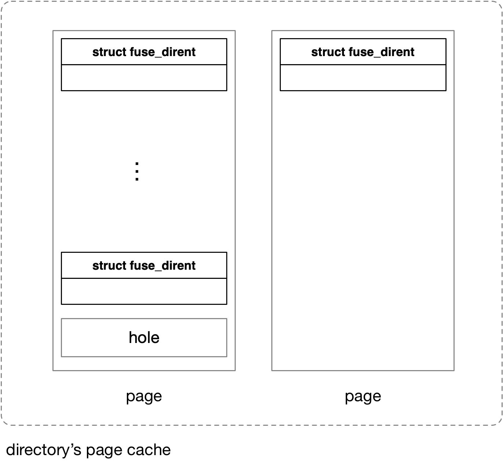
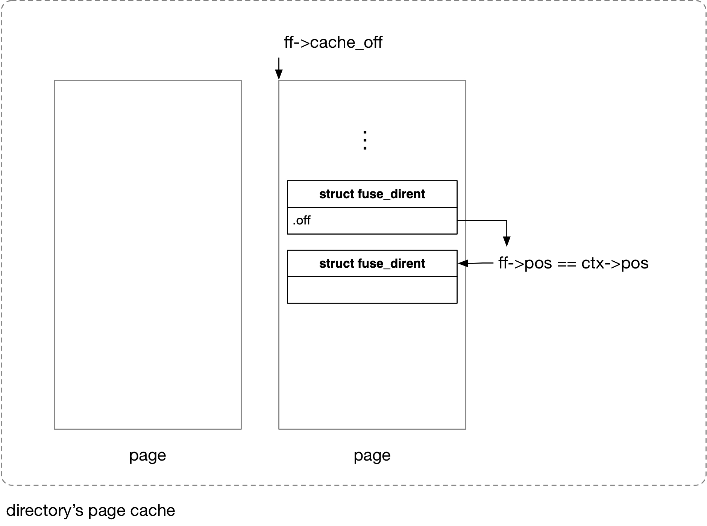

title:'FUSE - Feature - readdircache'
## FUSE - Feature - readdircache

v4.20 引入 readdircache 特性，对 readdir 的结果即 fuse_dirent 进行缓存，通过 FOPEN_CACHE_DIR 开启

> 18172b10b674 fuse: extract fuse_emit() helper
> 6433b8998a21 fuse: add FOPEN_CACHE_DIR

```c
struct fuse_dirent {
	uint64_t	ino;
	uint64_t	off;
	uint32_t	namelen;
	uint32_t	type;
	char name[];
};
```

@off 描述该 dirent 的下一个 dirent 在所在目录中的偏移


此时 directory inode 的 address_space (page cache) 用于缓存该目录下的一个个 dirent 条目，同时 directory inode 的 @rdc 字段维护 readdircache 的相关元数据信息

```c
struct fuse_inode {
		/* readdir cache (directory only) */
		struct {
			/* true if fully cached */
			bool cached;

			/* size of cache */
			loff_t size;

			/* position at end of cache (position of next entry) */
			loff_t pos;

			/* version of the cache */
			u64 version;

			/* modification time of directory when cache was
			 * started */
			struct timespec64 mtime;

			/* iversion of directory when cache was started */
			u64 iversion;

			/* protects above fields */
			spinlock_t lock;
		} rdc;
	...
}
```

directory inode 初始化的时候会初始化 @rdc 字段

```
fuse_init_dir
	fi->rdc.cached = false;
	fi->rdc.size = 0;
	fi->rdc.pos = 0;
	fi->rdc.version = 0;
```


### fill cache

> 69e34551152a fuse: allow caching readdir

fi->rdc.cached 字段描述 readdircache 的状态，即描述整个目录的所有 dirent 是否都已经被缓存，初始值为 0，即 uncached

fi->rdc.size 描述 readdircache 的大小，由于同一条 dirent 不能跨越一个 page boundary，因而一个 page 的结尾部分可能存在空洞




当 fi->rdc.cached 字段为 0，即第一次 readdir 的时候，就会对 readdircache 进行填充，将从 FUSE server 获取的 dirent 填充到目录的 page cache 中

```
f_ops->iterate_shared(), i.e. fuse_readdir()
    # if ff->open_flags & FOPEN_CACHE_DIR:
    fuse_readdir_cached
        # if !fi->rdc.cached:
        return UNCACHED
    
    fuse_readdir_uncached
        # for each dirent
            parse_dirfile/parse_dirplusfile
                fuse_emit
                    # if ff->open_flags & FOPEN_CACHE_DIR:
                    fuse_add_dirent_to_cache(..., dirent, ...)
                        # calculate the index and offset in the page cache for current dirent
                        size = fi->rdc.size;
                        offset = size & ~PAGE_MASK;
                        index = size >> PAGE_SHIFT;
                        
                        # if offset == 0:
                            find_or_create_page(..., index, ...)
                        # else:
                            find_lock_page(..., index, ...)
                        
                        # copy dirent to found page cache (readdircache)                
```

这一过程中多个并发的 readdir 可以并发地填充 readdircache，但是从 readdircache 的视角看，整个 readdircache 必须是被连续地依次填充的，即 readdir 实例 A 往 readdircache 填充一条 dirent X 之后，另一个 readdir 实例 B 可以往 readdircache 填充一条 dirent Y 之后，但是 dirent Y 必须是目录中紧接着 dirent X 之后的那一条 dirent

上述限制是通过 fi->rdc.pos 实现的，fi->rdc.pos 描述 readdircache 中下一个应该缓存的 dirent 对应在目录中的 offset，readdir 实例在填充 readdircache 区间的过程中，就会检查其当前要填充的 dirent 的 offset 与 fi->rdc.pos，只有当两者相等，当前的 readdir 实例才能继续填充 readdircache，否则当前这个 readdir 实例就会直接退出，放弃 readdircache 的填充

```
f_ops->iterate_shared(), i.e. fuse_readdir()    
    fuse_readdir_uncached
        # for each dirent
            parse_dirfile/parse_dirplusfile
                fuse_emit
                    # if ff->open_flags & FOPEN_CACHE_DIR:
                    fuse_add_dirent_to_cache(..., dirent, ...)
                        # dir_context->pos indicates the position of current dirent in the directory,
                        # fi->rdc.pos must matches dir_context->pos
                        if ctx->pos != dir_context->pos:
                            return
                        ...
```

最后如果 FUSE_READDIR 请求实际读取到的数据变为 0，即整个目录的 dirent 都已经读完了，就会将 fi->rdc.cached 置为 1，表示这个目录的所有 dirent 都已经被缓存

```
f_ops->iterate_shared(), i.e. fuse_readdir()    
    fuse_readdir_uncached
        # send FUSE_READDIR
        
        # if read zero bytes:
            # indicates have read the whole directory
            fuse_readdir_cache_end
                fi->rdc.cached = true
```


### read cache

> 5d7bc7e8680c fuse: allow using readdir cache

当 fi->rdc.cached 字段变为 1 的时候（表示这个目录的所有 dirent 都已经被缓存），后面的 readdir 就会直接从 readdircache 读取

当前 readdir 的目的就是，在已知的 readdircache 中找到 ctx->pos 位置处的 dirent，而为了加速以上寻找过程，在 fuse_file 中增加了相关字段

```c
struct fuse_file {
	/* Readdir related */
	struct {
		/* Dir stream position */
		loff_t pos;

		/* Offset in cache */
		loff_t cache_off;

	} readdir;
	...
}
```

> ff->cache_off

因为用户态可能多次连续调用 getdents(2) 来读取同一个目录，因而增加 ff->cache_off 字段来对（当前进程）上一次读到 readdircache 的哪个位置进行缓存，即下一次直接从 readdircache 的 @cache_off 这一位置开始查找，这样每次 getdents(2) 都可以直接从上一次 getdents(2) 读取的位置之后开始查找 readdircache

> ff->pos

由于 fuse_dirent->off 字段描述的是当前 dirent 的下一个 dirent (即 next dirent) 在目录中的偏移位置，因而在 readdircache 中遍历 dirent 的过程中，当前遍历到的 dirent 的 off 字段实际上描述的是其下一个 dirent 在目录中的偏移位置，因而需要通过其他办法来确定当前遍历到的 dirent 在目录中的偏移位置，之后比对当前遍历的 dirent 的偏移位置，与 ctx->pos 描述的目标 dirent 的偏移位置，才能确定当前遍历的 dirent 是否为当前需要查找的目标 dirent

ff->pos 字段就用于实现上述目的，该字段实际就缓存了上一个遍历的 dirent 的 off 字段，即当前遍历的 dirent 在目录中的偏移位置

由于 readdircache 中同一个 dirent 不能跨越 page boundary，因而 page 的尾部可以存在空洞，因而上述两个字段的值可以不同

> read readdircache

因而在 read readdircache 的过程中，实际上就是从 ff->readdir.cache_off 即上一次 getdents(2) 读取的位置之后开始，遍历一个个 dirent，最终当 ff->pos == ctx->pos 成立时，就说明当前需要查找的目标 dirent (ctx->pos) 找到了

```
f_ops->iterate_shared(), i.e. fuse_readdir()
    # if ff->open_flags & FOPEN_CACHE_DIR:
    fuse_readdir_cached
        # fi->rdc.cached must be true
        
        # read starting from ff->readdir.cache_off
        index = ff->readdir.cache_off >> PAGE_SHIFT
        page = find_get_page_flags(..., index, ...)
        addr = kmap(page);
        
        # search the target dirent (ctx->pos) in this page
        fuse_parse_cache(..., addr, ...)
            # for each dirent in this page: 
                if ff->readdir.pos == ctx->pos:
                    # found target dirent!
                    dir_emit(..., dirent, ...)                        
```




> reset ff->cache_off/ff->pos on seek

如之前所述，ff->cache_off 和 ff->pos 都是缓存了 readdircache 查找过程中的状态，其中 ff->cache_off 描述了缓存查找过程中下一次应该从缓存的什么位置开始查找；ff->pos 描述了上一次查找的 dirent 的 off 字段，即当前遍历的 dirent 在目录中的偏移位置，因而 ff->pos 字段和 ctx->pos 字段的值应该是相等的，只有当目录发生过 seek 的时候，才会出现这两个字段不相等的情况，这个时候就需要将 ff->cache_off 和 ff->pos 这两个字段都重置为 0，即从头开始查找缓存

```
f_ops->iterate_shared(), i.e. fuse_readdir()
    # if ff->open_flags & FOPEN_CACHE_DIR:
    fuse_readdir_cached
        # fi->rdc.cached must be true
        
        # Seeked?  If so, reset the cache stream
        # if ff->pos != ctx->pos:
            ff->cache_off = 0
            ff->pos =0                   
```


#### version verification

> 3494927e090b fuse: add readdir cache version
> 
>    Allow the cache to be invalidated when page(s) have gone missing.  In this
>    case increment the version of the cache and reset to an empty state.
>
>    Add a version number to the directory stream in struct fuse_file as well,
>    indicating the version of the cache it's supposed to be reading.  If the
>    cache version doesn't match the stream's version, then reset the stream to
>    the beginning of the cache.

缓存查找过程中如果 readdircache 出现 cache miss 的情况，即 readdircache 中 page missing，那么就需要将 fi->rdc.cached 重置为 0，即将 readdircache 失效掉，并将 fi->rdc.version 加一

```c
struct fuse_inode {
		/* readdir cache (directory only) */
		struct {
			/* version of the cache */
			u64 version;

		} rdc;
	...
}
```


```c
struct fuse_file {
	/* Readdir related */
	struct {
		/* Version of cache we are reading */
		u64 version;

	} readdir;
```

```
f_ops->iterate_shared(), i.e. fuse_readdir()
    # if ff->open_flags & FOPEN_CACHE_DIR:
    fuse_readdir_cached
        # at the beginning of the cache, than reset version to current
        if ff->readdir.pos == 0:
            ff->readdir.version = fi->rdc.version
        
        # read starting from ff->readdir.cache_off
        index = ff->readdir.cache_off >> PAGE_SHIFT
        page = find_get_page_flags(..., index, ...)
        
        # Uh-oh: page gone missing, cache is useless
        if !page && fi->rdc.version == ff->readdir.version:
            fuse_rdc_reset
                fi->rdc.cached = false;
                fi->rdc.version++
                fi->rdc.size = 0
                fi->rdc.pos = 0
```

在缓存查找过程中，ff->version 描述 (cached) supposed version，如果 readdircache 的 version (fi->rdc.version) 发生过变化，那么就会回退到 UNCACHED 模式

```
f_ops->iterate_shared(), i.e. fuse_readdir()
    # if ff->open_flags & FOPEN_CACHE_DIR:
    fuse_readdir_cached
        # read starting from ff->readdir.cache_off
        index = ff->readdir.cache_off >> PAGE_SHIFT
        page = find_get_page_flags(..., index, ...)
        
        # Make sure it's still the same version after getting the page
        if ff->readdir.version != fi->rdc.version:
            goto retry
            
    retry:
        if !fi->rdc.cached:
            return UNCACHED
```


#### mtime verification

>   fuse: use mtime for readdir cache verification

>    Store the modification time of the directory in the cache, obtained before
>    starting to fill the cache.
>
>    When reading the cache, verify that the directory hasn't changed, by
>    checking if current modification time is the same as the one stored in the
>    cache.
>
>    This only needs to be done when the current file position is at the
>    beginning of the directory, as mandated by POSIX.

允许通过目录的 mtime 实现 readdircache 的缓存一致性

在 UNCACHED 开始填充缓存的时候，将开始填充缓存时目录的 mtime 记录下来 (fi->rdc.mtime)

```
# readdircache is UNCACHED
f_ops->iterate_shared(), i.e. fuse_readdir()
    # if ff->open_flags & FOPEN_CACHE_DIR:
    fuse_readdir_cached
        if !fi->rdc.cached:
            if !ctx->pos && !fi->rdc.size:
                fi->rdc.mtime = inode->i_mtime
            return UNCACHED
```

或者在发生 version 不一致需要重新填充缓存的时候，也会将重新填充缓存时目录的 mtime 记录下来 (fi->rdc.mtime)

```
# version unmatch
f_ops->iterate_shared(), i.e. fuse_readdir()
    # if ff->open_flags & FOPEN_CACHE_DIR:
    fuse_readdir_cached
        # read starting from ff->readdir.cache_off
        index = ff->readdir.cache_off >> PAGE_SHIFT
        page = find_get_page_flags(..., index, ...)
        
        # Make sure it's still the same version after getting the page
        if ff->readdir.version != fi->rdc.version:
            if !ctx->pos && !fi->rdc.size:
                fi->rdc.mtime = inode->i_mtime
            return UNCACHED
```


后面在读缓存的时候，就会检查之前缓存的 fi->rdc.mtime 与目录当前的 inode->i_mtime 是否一致，如果不一致就说明目录的内容发生过修改，readdircache 中缓存的数据是 stale data，因而此时就会回退到 UNCACHED

这里需要注意的是，只有在从头开始读目录 (即 ctx->pos 为 0，例如 opendir(3) 之后第一次调用 getdents(2)) 的时候才会去检查 mtime 是否一致，也就是说 readdircache 遵循 CTO 语义中的 invalidate-on-open 语义，即只有重新 opendir(3) 之后，才能看到目录的最新修改，这也是符合 readdir(3) 的 POSIX 语义的

> If a file is removed from or added to the directory after the most recent call to opendir() or rewinddir(), whether a subsequent call to readdir_r() returns an entry for that file is unspecified.
> 
> https://pubs.opengroup.org/onlinepubs/9699919799.2018edition/nframe.html

```
f_ops->iterate_shared(), i.e. fuse_readdir()
    # if ff->open_flags & FOPEN_CACHE_DIR:
    fuse_readdir_cached
        if !ctx->pos:
            if !timespec64_equal(&fi->rdc.mtime, &inode->i_mtime):
                fuse_rdc_reset
                if !ctx->pos && !fi->rdc.size:
                    fi->rdc.mtime = inode->i_mtime
                return UNCACHED
```

同时当开启 auto_inval_data 的时候，在比对 mtime 之前，也会向 server 发送 FUSE_GETATTR 以自动更新 mtime

```
f_ops->iterate_shared(), i.e. fuse_readdir()
    # if ff->open_flags & FOPEN_CACHE_DIR:
    fuse_readdir_cached
        # We're just about to start reading into the cache or reading the
        # cache; both cases require an up-to-date mtime value.
        if !ctx->pos && fc->auto_inval_data:
            # update mtime
            fuse_update_attributes
        
        if !ctx->pos:
            if !timespec64_equal(&fi->rdc.mtime, &inode->i_mtime):
                fuse_rdc_reset
                if !ctx->pos && !fi->rdc.size:
                    fi->rdc.mtime = inode->i_mtime
                return UNCACHED
```

#### iversion verification

>   fuse: use iversion for readdir cache verification
>
>    Use the internal iversion counter to make sure modifications of the
>    directory through this filesystem are not missed by the mtime check (due to
>    mtime granularity).

writeback 模式下，目录文件的 mtime/ctime 并不在内核侧更新，此时目录的 mtime/ctime 完全由 fuse server 侧维护（这是通过给目录设置 S_NOCMTIME 实现的），这意味着内核侧对目录的修改（例如在目录下创建、删除文件），内核侧都不会立即更新 mtime，这就导致了当内核侧对目录进行修改时，上述 mtime 机制就无法检测到目录内容已经发生变化，从而继续使用 readdircache 中的 stale data

```sh
# slow path
path_lookupat
    link_path_walk
        walk_component
            lookup_slow
                dir->lookup(), i.e., fuse_lookup
                    fuse_lookup_name
                        fuse_simple_request
                            # send FUSE_LOOKUP request
                            # and get fuse_attr
                        
                        fuse_iget
                            iget5_locked
                                alloc_inode
                                    super_operations->alloc_inode(), i.e., fuse_alloc_inode
                            
                            inode->i_flags |= S_NOATIME;
                            if !S_ISREG(attr->mode):
                                inode->i_flags |= S_NOCMTIME
                            ...
```

因而对于内核侧自己对目录发生修改的情况，不能依赖 mtime 作一致性检查，因而引入了 iversion 机制，内核侧每次对目录进行修改的时候，都会增加目录的 inode->i_version

```
fuse_create_open/fuse_unlink/fuse_rmdir/fuse_rename_common/fuse_reverse_inval_entry
    fuse_dir_changed(dir)
        fuse_invalidate_attr(dir)
        inode_maybe_inc_iversion(dir, false)
```


之后在读 readdircache 的时候，和 mtime 机制一样，在 UNCACHED 开始填充缓存的时候，或者在发生 version 不一致需要重新填充缓存的时候，将开始填充缓存时目录的 iversion 记录下来 (fi->rdc.iversion)

```
# readdircache is UNCACHED
f_ops->iterate_shared(), i.e. fuse_readdir()
    # if ff->open_flags & FOPEN_CACHE_DIR:
    fuse_readdir_cached
        if !fi->rdc.cached:
            if !ctx->pos && !fi->rdc.size:
                fi->rdc.mtime = inode->i_mtime
                fi->rdc.iversion = inode_query_iversion(inode)
            return UNCACHED
```

```
# version unmatch
f_ops->iterate_shared(), i.e. fuse_readdir()
    # if ff->open_flags & FOPEN_CACHE_DIR:
    fuse_readdir_cached
        # read starting from ff->readdir.cache_off
        index = ff->readdir.cache_off >> PAGE_SHIFT
        page = find_get_page_flags(..., index, ...)
        
        # Make sure it's still the same version after getting the page
        if ff->readdir.version != fi->rdc.version:
            if !ctx->pos && !fi->rdc.size:
                fi->rdc.mtime = inode->i_mtime
                fi->rdc.iversion = inode_query_iversion(inode)
            return UNCACHED
```


后面在读缓存的时候，就会检查之前缓存的 fi->rdc.iversion 与目录当前的 inode->i_version 是否一致，如果不一致就说明内核侧对目录的内容发生过修改，readdircache 中缓存的数据是 stale data，因而此时就会回退到 UNCACHED

```
f_ops->iterate_shared(), i.e. fuse_readdir()
    # if ff->open_flags & FOPEN_CACHE_DIR:
    fuse_readdir_cached
        if !ctx->pos:
            if !timespec64_equal(&fi->rdc.mtime, &inode->i_mtime) ||
                inode_peek_iversion(inode) != fi->rdc.iversion:
                fuse_rdc_reset
                if !ctx->pos && !fi->rdc.size:
                    fi->rdc.mtime = inode->i_mtime
                return UNCACHED
```