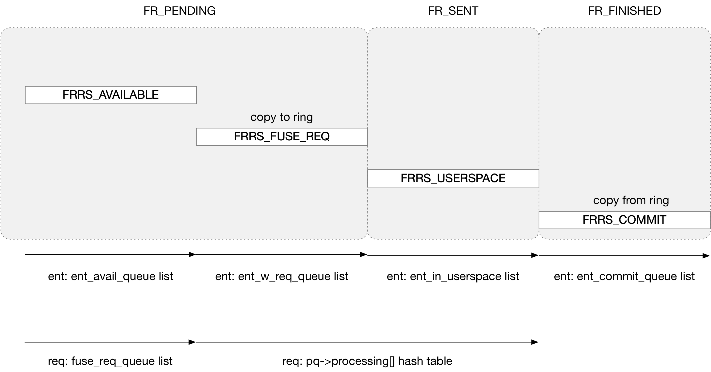

title:'FUSE - Feature - uring - state'
## FUSE - Feature - uring - state

entry state machine



```
FRRS_AVAILABLE -> FRRS_FUSE_REQ -> FRRS_USERSPACE -> FRRS_COMMIT -> FRRS_AVAILABLE
```

- FRRS_AVAILABLE 描述 entry 处于空闲状态
- FRRS_USERSPACE 描述 entry 被占用，同时对应的 FUSE 请求已经被发送给 FUSE server 的状态
- FRRS_FUSE_REQ 和 FRRS_COMMIT 都是临时状态，其中
    - 前者描述请求正处于 copy to ring 的临时状态
    - 后者描述请求正处于 copy from ring 的临时状态

### available

> 	/* The ring entry is waiting for new fuse requests */
>	FRRS_AVAILABLE,

entry 一开始注册的时候处于 available 状态，通过 queue->ent_avail_queue 链表维护

```
# case FUSE_IO_URING_CMD_REGISTER:
fuse_uring_register
    ...
    # create 'struct fuse_ring_ent' for FUSE_IO_URING_CMD_REGISTER cmd
    ent = fuse_uring_create_ring_ent(cmd, queue)
    fuse_uring_do_register(ent, ...)
        # move this ent to queue->ent_avail_queue list
        ent->state = FRRS_AVAILABLE
```

### assigned

> 	/* The ring entry got assigned a fuse req */
>	FRRS_FUSE_REQ,

之后下发 FUSE 请求的时候，会从 available 状态的 entry 中挑选出一个 entry，以用来发送这个 FUSE 请求，FRRS_FUSE_REQ 状态就描述这个 entry 与某个 FUSE 请求绑定，但是请求还没有发送给 FUSE server (即还没有执行 copy to ring 操作) 的这段时间，描述 entry 正处于 copy to ring 的过程中，此时通过 queue->ent_w_req_queue 链表维护

FRRS_FUSE_REQ 状态有多个入口：

- fuse_simple_request

```
fuse_simple_request
    __fuse_request_send
        fuse_send_one(fiq, req)
            fiq->ops->send_req(fiq, req), i.e. fuse_uring_queue_fuse_req()
                fuse_uring_add_req_to_ring_ent(ent, req)
                    ent->fuse_req = req
                    ent->state = FRRS_FUSE_REQ
                    # move this entry to queue->ent_w_req_queue list
                    
                    req->ring_entry = ent
                    # add this req to pq->processing[] hash table
                
                fuse_uring_dispatch_ent(ent)
                    # schedule uring worker (the uring worker context)
                    # to copy data to ring
```

- fuse_simple_background

```
fuse_simple_background
    fuse_request_queue_background
        fuse_request_queue_background_uring
            fuse_uring_queue_bq_req
                fuse_uring_add_req_to_ring_ent(ent, req)
                    ent->fuse_req = req
                    ent->state = FRRS_FUSE_REQ
                    # move this entry to queue->ent_w_req_queue list,
                    
                    req->ring_entry = ent
                    # add this req to pq->processing[] hash table
                
                fuse_uring_dispatch_ent
                    fuse_uring_send_in_task
                        # schedule uring worker (the uring worker context)
                        # to copy data to ring
```

- FUSE_IO_URING_CMD_REGISTER cmd

注册 entry 过程中如果之前已经有下发的 FUSE 请求等待在那边，那么会使用当前注册的 entry 直接发送该请求

```
# FUSE_IO_URING_CMD_REGISTER cmd
fuse_uring_register
    fuse_uring_do_register
        req = fuse_uring_ent_assign_req(ent)
            fuse_uring_add_req_to_ring_ent(ent, req)
                ent->fuse_req = req
                ent->state = FRRS_FUSE_REQ
                # move this entry to queue->ent_w_req_queue list,
                
                req->ring_entry = ent
                # add this req to pq->processing[] hash table
        
        # send this request in current uring worker context
        fuse_uring_send_next_to_ring(ent, req, ...)
```

- FUSE_IO_URING_CMD_COMMIT_AND_FETCH cmd

在完成上一个 FUSE 请求以后，如果当前还有等待下发的 FUSE 请求，那么会使用当前的 entry 直接发送该请求

```
# FUSE_IO_URING_CMD_COMMIT_AND_FETCH cmd
fuse_uring_commit_fetch
    fuse_uring_next_fuse_req
        req = fuse_uring_ent_assign_req(ent)
            fuse_uring_add_req_to_ring_ent(ent, req)
                ent->fuse_req = req
                ent->state = FRRS_FUSE_REQ
                # move this entry to queue->ent_w_req_queue list,
                
                req->ring_entry = ent
                # add this req to pq->processing[] hash table
        
        # send this request in current uring worker context
        fuse_uring_send_next_to_ring(ent, req, ...)
```


### in userspace

> 	/* The ring entry is in or on the way to user space */
>	FRRS_USERSPACE

entry 转变为 FRRS_FUSE_REQ 状态以后，会通知 uring worker 来执行 copy to ring 操作，在执行完 copy to ring 操作以后，就会填充一个 uring cqe 以通知 FUSE server，此时 entry 转变为 FRRS_USERSPACE 状态，通过 queue->ent_in_userspace 链表维护

```
fuse_uring_send_in_task
    fuse_uring_prepare_send(ent, req)
        # copy to ring
        fuse_uring_copy_to_ring
    
    fuse_uring_send(ent, ...)
        ent->state = FRRS_USERSPACE
        # move this entry (fuse_ring_ent) to queue->ent_in_userspace list
        
        # send as cqe replying to the previous FUSE_IO_URING_CMD_REGISTER cmd
        io_uring_cmd_done
```

### commit

> 	/* The ring entry received from userspace and it is being processed */
>	FRRS_COMMIT

在执行 FUSE_IO_URING_CMD_COMMIT_AND_FETCH 的入口，就会将 entry 标记为 FRRS_COMMIT 状态，描述 entry 正处于 copy from ring 的过程中，此时通过 queue->ent_commit_queue 链表维护

```
# case FUSE_IO_URING_CMD_COMMIT_AND_FETCH:
fuse_uring_commit_fetch
    fuse_ring_ent_set_commit(ent)
        ent->state = FRRS_COMMIT
        # move this ring entry to queue->ent_commit_queue list
    ...
```

之后 copy from ring 操作完成后，entry 就会恢复为 FRRS_AVAILABLE 状态

```
# case FUSE_IO_URING_CMD_COMMIT_AND_FETCH:
fuse_uring_commit_fetch
    fuse_ring_ent_set_commit(ent)
        ent->state = FRRS_COMMIT
        # move this ring entry to queue->ent_commit_queue list
    
    # copy from ring
    fuse_uring_commit(ent, req, ...)

    fuse_uring_next_fuse_req
        fuse_uring_ent_avail
            # move this ent to queue->ent_avail_queue list
            ent->state = FRRS_AVAILABLE
    ...
```