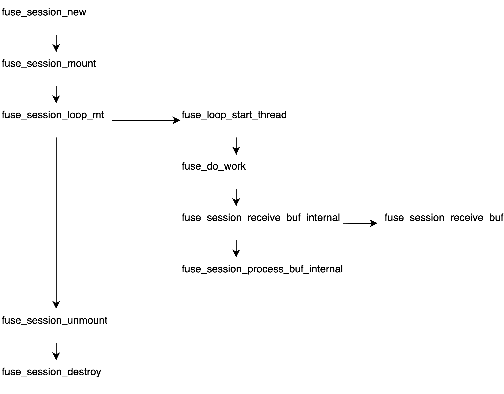

title:'libfuse - API'
## libfuse - API



- fuse_session_mount
open "/dev/fuse" 设备 fd，并执行 mount(2) 挂载


```c
int fuse_session_loop(struct fuse_session *se);
int fuse_session_loop_mt(struct fuse_session *se, struct fuse_loop_config *config);
```

fuse_session_loop() 是单线程的，只有一个 worker thread
fuse_session_loop_mt() 则是多线程的，传入的 config 参数可以配置 worker thread 的数量

```
fuse_session_loop_mt                        fuse_session_loop
    fuse_session_receive_buf_internal           fuse_session_receive_buf_internal(..., NULL)
                                                    fuse_session_process_buf
    fuse_session_process_buf_internal                   fuse_session_process_buf_internal(..., NULL)
                                                    
```


```c
int fuse_session_custom_io(struct fuse_session *se,
					const struct fuse_custom_io *io, size_t op_size, int fd)
```

fuse_session_custom_io() 注册 se->io，其中
- fd 是用来取代 "/dev/fuse" fd 的
- op_size 描述传入的 fuse_custom_io 的大小，即
    - 新版本 libfuse 搭配老版本 daemon 时，sizeof(fuse_custom_io) 大于 op_size
    - 老版本 libfuse 搭配新版本 daemon 时，sizeof(fuse_custom_io) 小于 op_size，此时会告警 "fuse: warning: library too old, some operations may not work"，此时只有老版本 libfuse 中定义的那些回调函数能工作