title:'LLM Basic'
# LLM Basic

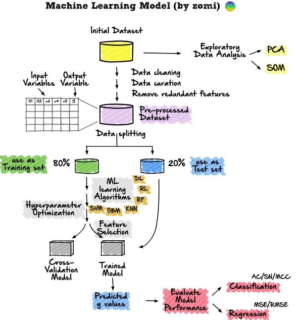


## 分词 Tokenizer

```
Text: “How are you”

Character Tokenization → [ “H”, “o”, “w”, “ ”, “a”, “r”, “e”, “ ”, “y”, “o”,”u”]
Word Tokenization → [“How”, “are”, “you”]
Subword Tokenization → [“How”, “ a”, “re”, “ y”, “ou”]
```

最直观的是 Character Tokenization （或称 Byte Tokenization），最直观的就是将每个英文字母映射为对应的 ASCII 字符（0～255）即 Unicode-8，每个英文字母用一个 byte 表示

另一种直观的是 Word Tokenization，即按照单词划分

Character Tokenization 会丢失语义信息（毕竟只有 256 个词汇），而 Word Tokenization 在面对一些特殊场景（例如缩略词 "I'm"、"don't"）时灵活度差一些


当前主流大模型广泛使用的是子词分词器（subword tokenizer）

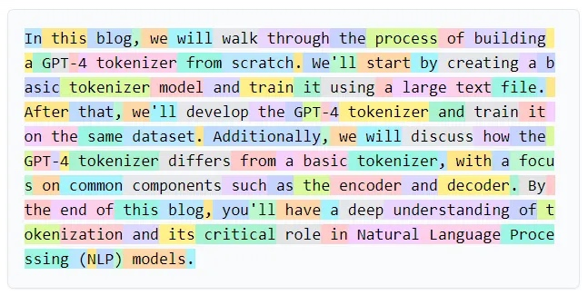

subword tokenizer 将单词进一步划分为词元（例如词根、前缀、后缀等），其最大优势就是使用尽可能少的词汇量（子词）的情况下描述各种单词

而 Byte Pair Encoding (BPE) 是一种广泛使用的 subword 编码技术，即将 subword (可以包含多个字节) 映射为一个编码，例如 GPT-4 使用的 BPE 词汇表中，`b'er'` 的 ASCII 描述为 `(101, 114)`，将这些相邻的字节映射为编码 256

> GPT-4 使用的 BPE 词汇表中:
> - 0~255 沿用 ASCII 编码
> - 256 之后使用 BPE 编码

```
b'er'  -> merged: (101, 114) -> 256
b'20'  -> merged: (50, 48)   -> 257
b'or'  -> merged: (111, 114) -> 258
b'in'  -> merged: (105, 110) -> 259
b'ed'  -> merged: (101, 100) -> 260
b' t'  -> merged: (32, 116)  -> 261
b'on'  -> merged: (111, 110) -> 262
b'he'  -> merged: (104, 101) -> 263
b' S'  -> merged: (32, 83)   -> 264
b'ar'  -> merged: (97, 114)  -> 265
b'an'  -> merged: (97, 110)  -> 266
b' A'  -> merged: (32, 65)   -> 267
b' the'-> merged: (261, 263) -> 268
b'al'  -> merged: (97, 108)  -> 269
b'ri'  -> merged: (114, 105) -> 270
b'ved' -> merged: (118, 260) -> 271
```

> 这里 b' the' 需要多步合并：
> 
> b' t'  -> merged: (32, 116)  -> 261
> b'he'  -> merged: (104, 101) -> 263
> b' the'-> merged: (261, 263) -> 268


## 词嵌入 Embedding

Tokenization 实现了词元（token）到一个数字编码（single digit）的转换，这个数字可以理解为一个 1*1 的矩阵，而 词嵌入 Embedding 就是将这个 1\*1 的矩阵扩展为 1\*M 的矩阵，例如 `man` -> `1937` -> `[-0.3, 0.85, 0.45]`

词嵌入 Embedding 的目的是将 词元（token）以更多维的数据表示，从而抽象出词元与词元间的关联，从而展现词元的特征。词元与词元之间是有特征关联的，例如

- 时态 go/going/gone
- 单复数 student/students

另外例如 `man` 和 `king` 之间的关联就比 `man` 和 `queen` 之间的关联大，通过高维矩阵可以数学化的方法描述词元的特征
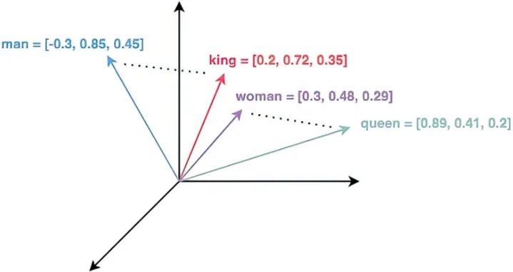


因而大模型的输入（一个自然语言的句子）经过 Tokenization & Embedding 之后就转换为一个 N*M 的矩阵，其中 N 中的每一行对应一个词元 token 对应的 1\*M 的特征矩阵 
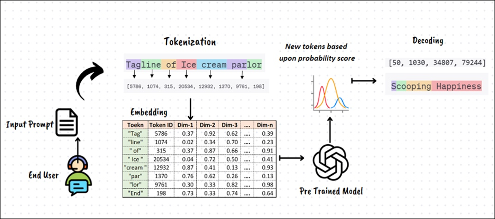


## 预训练 pre-training

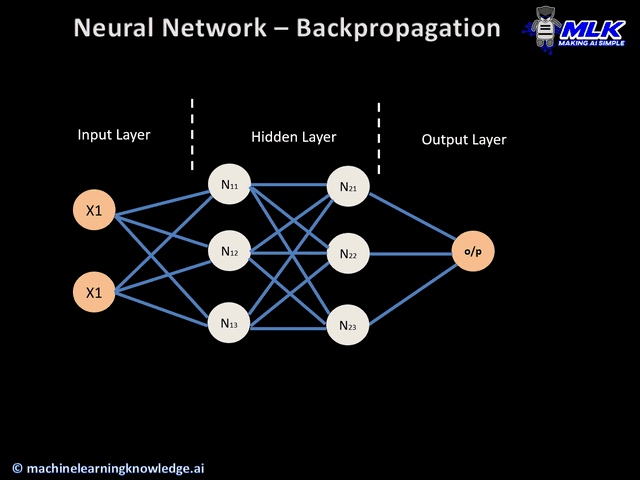

模型训练包含`前向传播`与`反向传播`两个过程：
- 先做一次前向传播（即做一次推理）
- 再做一次反向传播（更新模型权重）
将以上 前向传播 + 反向传播 的过程重复成千上万次，最终确定模型的权重

### 前向传播
前向传播可以简单理解为推理过程，以 RNN (Recurrent neural network，循环神经网络) 为例：在序列运算过程中，上一个 token 特征向量计算的输出会同时作为下一个 token 计算的输入，参与其下一个 token 的计算

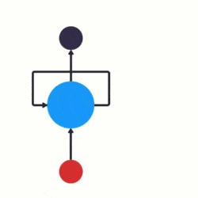

例如
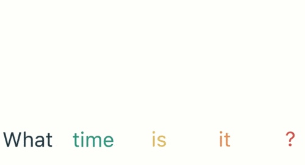
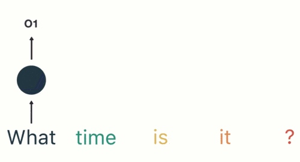
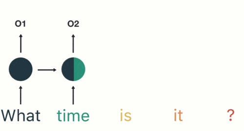

可以看到 RNN 的这个结构有以下特点：
- 序列中最后一个 token 的输出包含了序列中之前所有 token 的计算结果，从而实现一定的长期记忆；但是这种长期记忆效果比较弱，输出中绝大部份是短期记忆，因而无法处理很长的输入序列
- 整个序列是串型依次计算每个 token 的，无法并行计算，这就意味着训练效率很低、成本很大


### 训练数据集
在讲解反向传播之前，有必要讨论训练用的数据集。之前在 Tokenization & Embedding 概念中描述过每个 token 会映射为一个多维的特征矩阵 (x1, x2, ... x)，而所谓的训练数据，就是在整个特征矩阵后面再加上这个 token 预期的输出 (y)，两者合并为一个 1*M 的矩阵 (x1, x2, ... x, y)，N 条样本就得到一个 N\*M 的矩阵

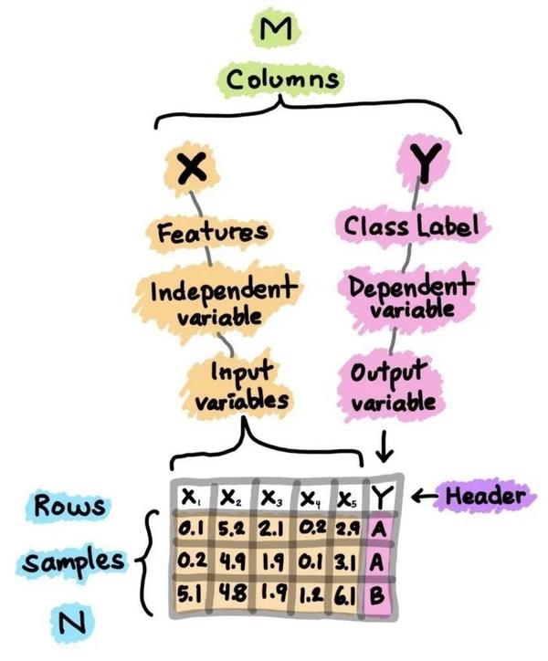


### 反向传播

在确定数据集以后，模型训练的过程，其实就是确定模型的一组参数，使得样本的特征矩阵经过模型之后的输出与预期的 y 尽可能的接近，这是

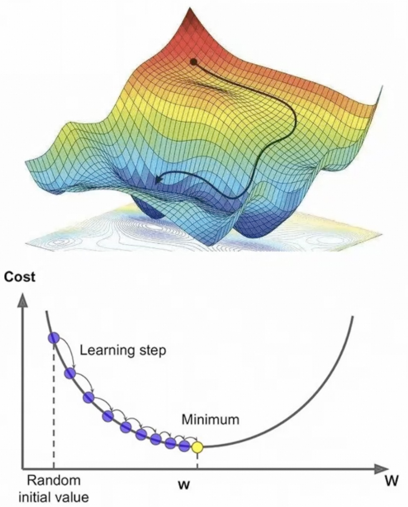


- 前向传播将样本的 特征矩阵 (x1, x2, ... x) 作为神经元的输入，计算得到一个输出结果
- 通过损失函数 (loss function) 将这个实际输出结果与训练数据预期的输出进行比较计算，得到一个 `梯度` (斜率)
- 反向传播根据 `学习率` (步长) 更新模型每一层的权重
- 重复以上过程，直到 梯度 小于某个阈值


### transformer
https://jalammar.github.io/illustrated-transformer/
https://codewithzichao.github.io/2020/02/17/NLP｜深入探究Transformer模型/

transformer 是 RNN、CNN 之后的一种神经网络结构，主体包含 Encoder 与 Decoder 两部分，输入序列 (𝑥1,𝑥2,𝑥3,…,𝑥𝑇𝑋) 经过 encoder，输出 (ℎ1,ℎ2,ℎ3,…,ℎ𝑇𝑋) 作为 decoder 的输入，最后经过 decoder 得到最终的输出序列 (𝑦1,𝑦2,𝑦3,..,𝑦𝑇𝑌)

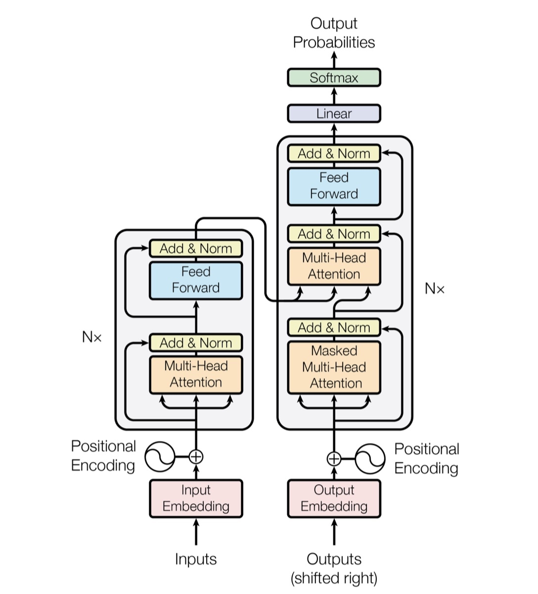
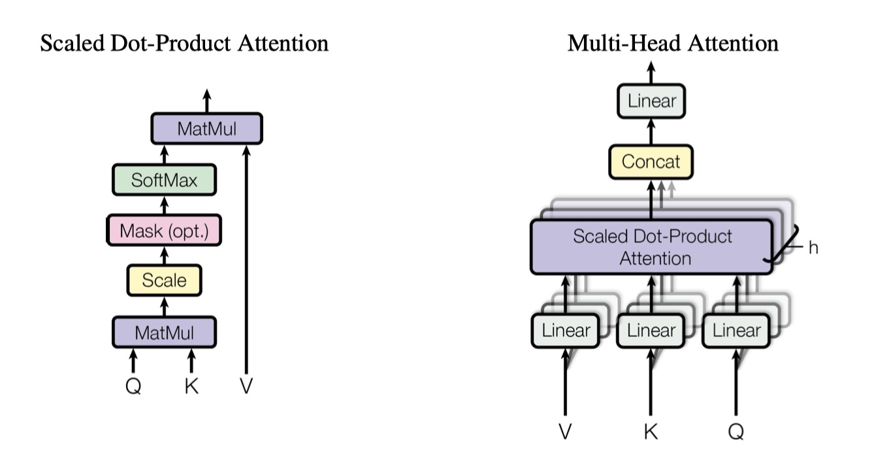


transformer 结构相对于之前的 RNN、CNN 有以下特点：
- 能够并行处理输入序列，提升训练效率
- 长期记忆表现更佳

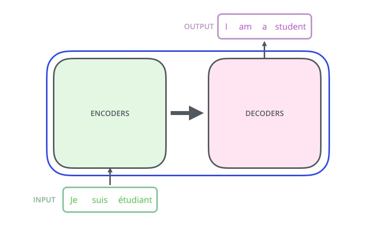


#### encoder

encoder 的作用是将输入序列的特征矩阵交给 self Attention 计算，得到输出矩阵，其流程如下：

##### self Attention

transformer 的核心是 self Attention 结构，self Attention 的作用是：获取输入序列中某一位置的 token 与序列中其他 token 之间的关联关系。例如在输入以下序列时：

`The animal didn't cross the street because it was too tired`

在处理 `it` token 时，self Attention 使得模型明白 it 实际指向前面的 animal (在数学表示上就是 it 指向 animal 的数学概率最高)

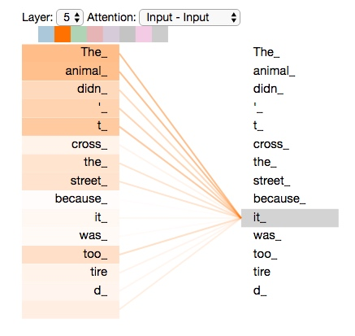


self Attention 的核心是 Q (Query)、K (Key)、V (Value) 三个矩阵，每个 self Attention 结构都有 Q、K、V 三个矩阵（即 pre-training 训练出来的结果，即模型权重，也称为权重矩阵），即 WQ、WK、WV

输入序列的特征矩阵与 self Attention 结构计算的过程就是：

1. 特征矩阵分别与 WQ、WK、WV 三个矩阵相乘，得到三个输出矩阵 q、k、v （需要注意的是输入序列中的每个 token 的特征向量会并行与当前这个 self Attention 结构的 WQ、WK、WV 权重矩阵进行相乘计算）
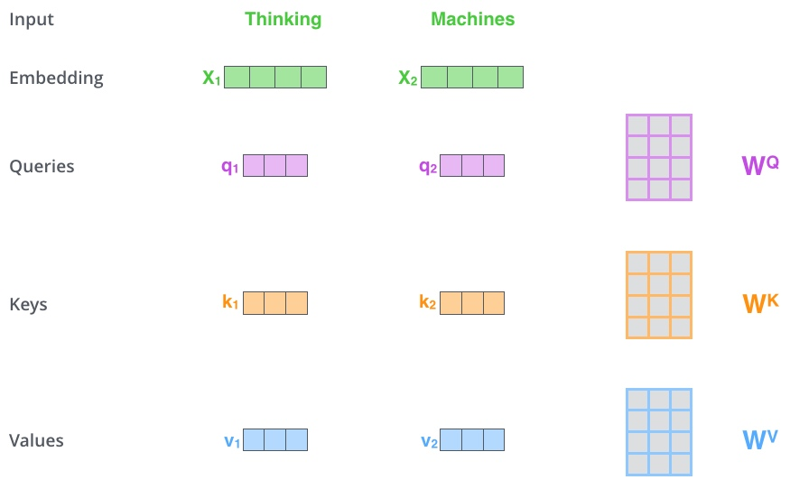


2. 计算 score

假设我们要关注 thinking 这个 token，那么需要计算输入序列中所有 token（包括当前这个 token 即 "thinking" 本身、以及序列中的其他 token）相对于当前这个 token 的 score 值，这个值描述了输入序列中其他 token 与当前这个 token 的关联关系。

例如关注 thinking 这个 token 时，首先计算 thinking 相对于它自己的一个 score。将当前关注的 token 的 q 矩阵、与当前计算 score 的 token 的 k 矩阵点乘（即 q 矩阵乘以 k 矩阵的转置），得到一个数字，即为 score。例如计算 thinking 相对于它自己 (thinking) 的 score 时，就是将 q1 与 k1 点乘，得到 thinking 的 score；之后计算序列中的下一个 token 即  machines 相对于 thinking 的 score（描述 machines 这个 token 对于 thinking 这个 token 的关联关系），就是将 q1 与 k2 点乘

类似地，当关注 machines 这个 token 时，将 q2 与 k1 点乘得到 thinking 相对于 machines 的 score，将 q2 与 k2 点乘得到 machines 相对于它自己 (machines) 的 score

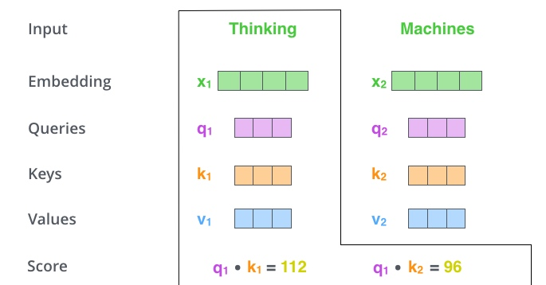


3. 缩放 score

回到关注 thinking 时计算得到的两个 score（即 q1 点乘 k1、q1 点乘 k2），将这两个 score 除以 "the square root of the dimension of the key vectors" 例如 8，即将这两个 score 值缩放，以更好地体现这些 score 值之间的梯度

4. 归一化 score

将上述缩放后的 score 值进行 softmax 求解。softmax 将 score 值作归一化处理，同时所有 softmax 之后的 score 值相加的和为 1，从而使得 score 值能描述对应的 token 与其他 token 之间的关联关系
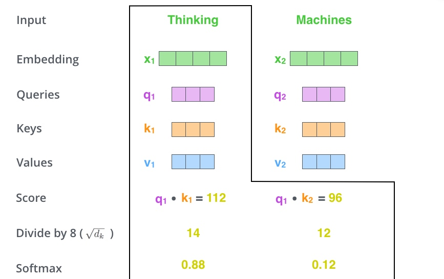

5. weighted value vector

将归一化后的 score 与各自的 v 矩阵相乘，这一步的目的是凸显强相关的 token 的 v 矩阵，而弱化不相关的 token；
最后将所有 token 上述计算后的 v 矩阵相加，得到当前关注的这个 token 的输出矩阵 z，即 z1

𝑧1=0.88𝑣1+0.12𝑣2 

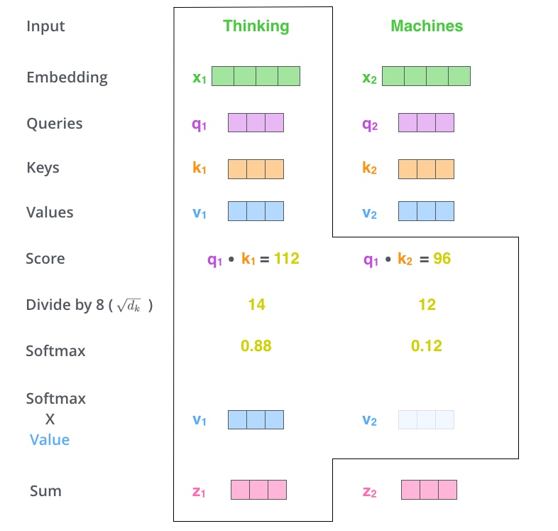

类似地重复以上过程，继续计算输入序列中的下一个 token 即 machines 的输出矩阵 z2


而在实际运算过程中，通过矩阵运算，输入序列中的每个 token 计算各自输出矩阵 z 是一个并行的过程
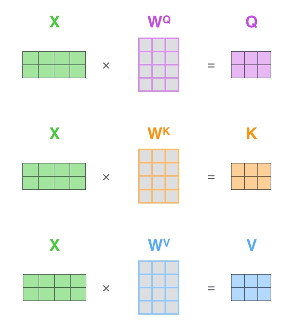

最终输入一个特征矩阵 X，经过这个 self Attention 神经元结构，其输出矩阵 Z
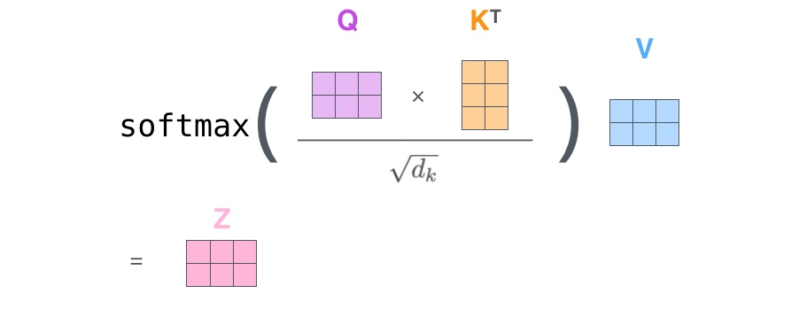


因而总结一下，输入序列的特征矩阵 X 经过一层 encoder，得到一个输出矩阵 Z

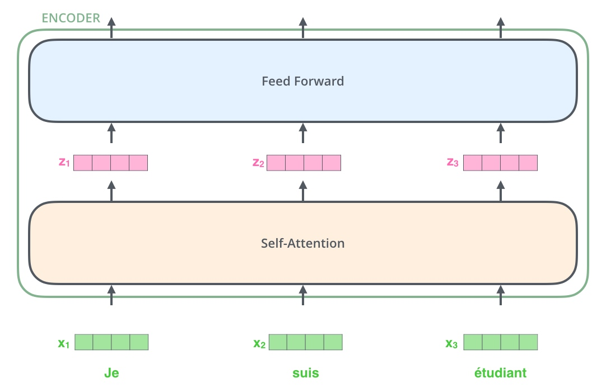

一个网络结构中通常包含多个 encoder，前一层 encoder 的输出矩阵 Z，会作为下一层 encoder 的输入矩阵 r
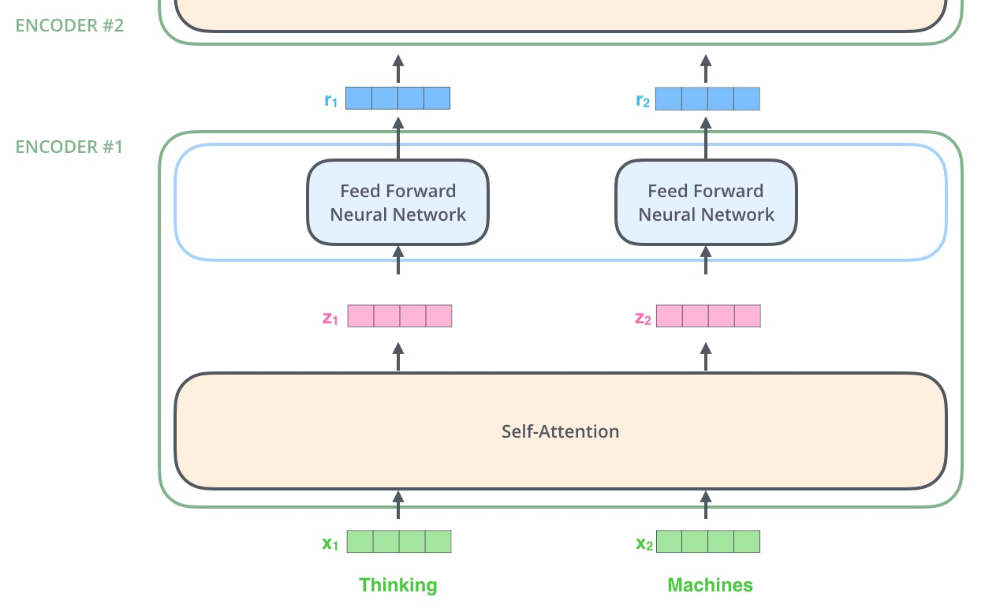


##### multi-Head Attention

之前说过，self Attention 结构的一大特点是，获取输入序列中某一位置的 token 与序列中其他 token 之间的关联关系。如前面所述的，一个 self Attention 结构可以输出某一个位置的 token 对应的输出矩阵 z，描述了序列中其他位置的 token 与该 token 的关联关系，例如以下输入序列的 `it` 的输出矩阵 z 描述了 "it" 与前面的 "The animal" 有很大的关联关系

`The animal didn't cross the street because it was too tired`

而 multi-Head self Attention 则更进一步，使得任一位置的 token 输出多个输出矩阵 z（一个 self Attention 结构输出一个输出矩阵 z），这就提供了多维视角来描述这个位置的 token 与序列中其他位置 token 的关联关系。例如还是上面的例子，此时另一个 self Attention 结构可能描述 "it" 与 "tired" 有很大的关联关系

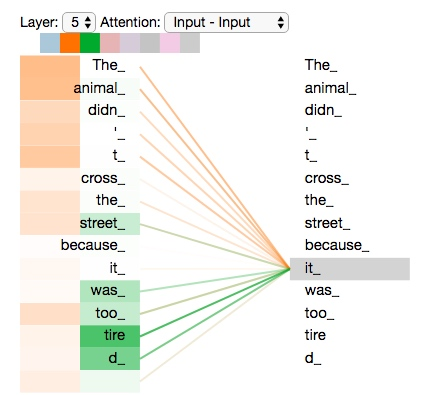


以下是 multi-Head Attention 的实现：

1. 一层 encoder 中可以包含多个 self Attention 结构，每个 self Attention 结构具有自己的 WQ、WK、WV 权重
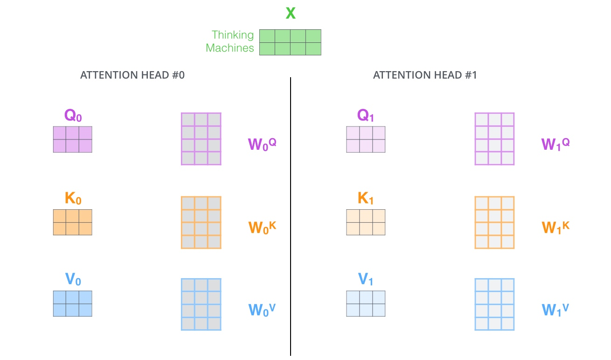

2. 每个 self Attention 结构输出一个输出矩阵 z
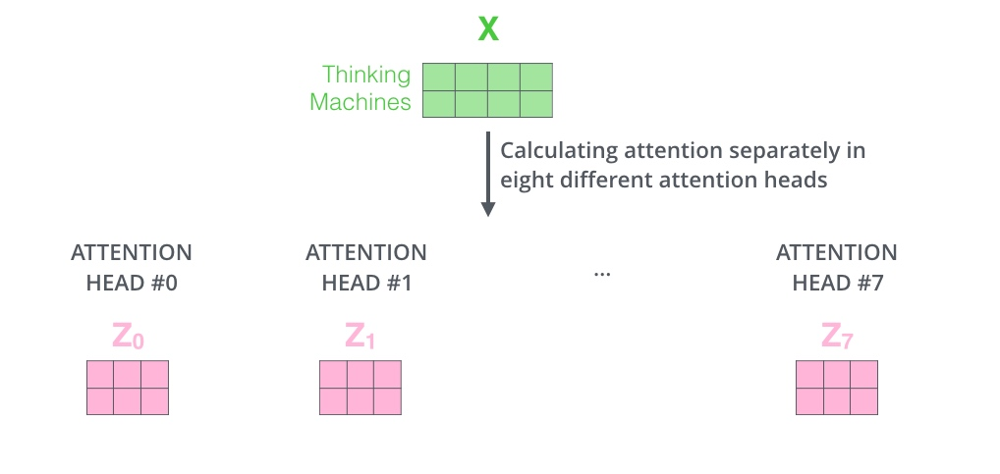

3. 由于 self Attention 结构后面的前向传播结构 (feed-forward layer) 的输入只接受一个矩阵输入，而无法接受多个矩阵输入，因而需要将多个输出矩阵 (z0, z1, ...z7) 转换为一个输出矩阵。首先将所有输出矩阵 (z0, z1, ...z7) 拼接为一个大矩阵，然后将拼接后的大矩阵与另一个权重矩阵 WO 相乘，最终得到一个汇总后的输出矩阵 z
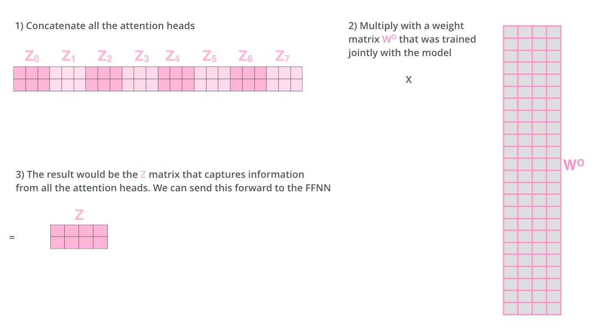

总结一下，以下就是 multi-Head Attention 的工作全景：
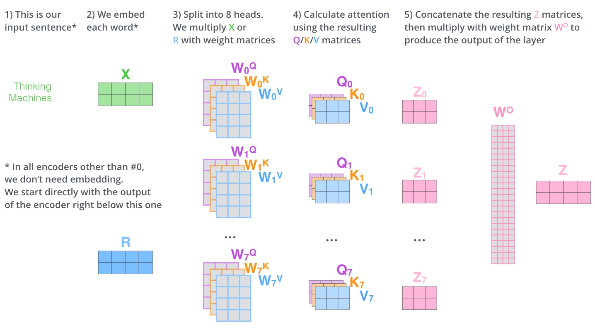


#### decoder

前面描述的 encoder 的 multi-Head Attention 结构将输入序列的特征矩阵转换为一个输出矩阵 Z

而 decoder 的工作过程如下，例如对于第一层 decoder 的 self Attention 结构：
- K 方向：根据 encoder 的输出矩阵 Z 作为输入，与 decoder 的 self Attention 结构的 WK 权重矩阵相乘
- V 方向：根据 encoder 的输出矩阵 Z 作为输入，与 decoder 的 self Attention 结构的 WV 权重矩阵相乘
- Q 方向：根据起始字符 `<BOS>` (Begin Of Sentence) 的特征矩阵作为输入，与 decoder 的 self Attention 结构的 WQ 权重矩阵相乘

因而 encoder 部分的工作实际就是为 decoder 提供 KV 矩阵，其中 K 矩阵 (Key) 描述输入序列提供了哪些信息，V 矩阵 (Value) 则描述了这些信息的值分别是什么；decoder 则利用 Q (Query) 矩阵依次从 encoder 提供的 KV 矩阵中查询当前位置应该输出的 token


decoder 依次跑过所有层的 decoder 层称为一轮，decoder 每一轮只能输出一个 token，例如第一轮输出第一个 token，第二轮输出第二个 token，...

- 每一轮 decoder 的最后一层 self Attention 结构同样输出一个输出矩阵
- 后面的 linear 层将这个输出矩阵映射为一个一维矩阵。例如对于一个包含 1000 个 token 的词表，linear 层输出一个 1*1000 的矩阵，矩阵中的每一个元素就描述当前这一轮输出对应 token 的 score (打分)
- 随后的 softmax 层对 linear 层输出的 1*1000 矩阵作归一化以及 softmax 处理（类似地将 linear 层输出的 score 转换为概率，同时这 1000 个概率相加的总和为 1），此时 softmax 层的输出就描述了词表中各个 token 在当前这一轮输出的概率

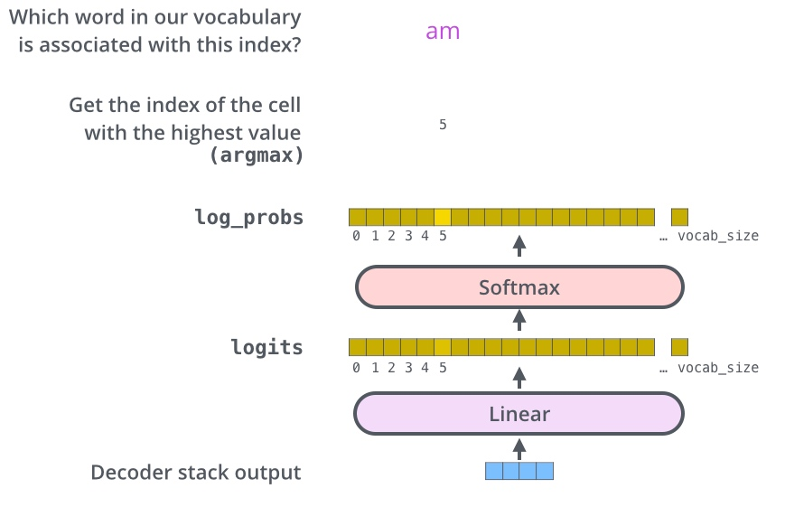

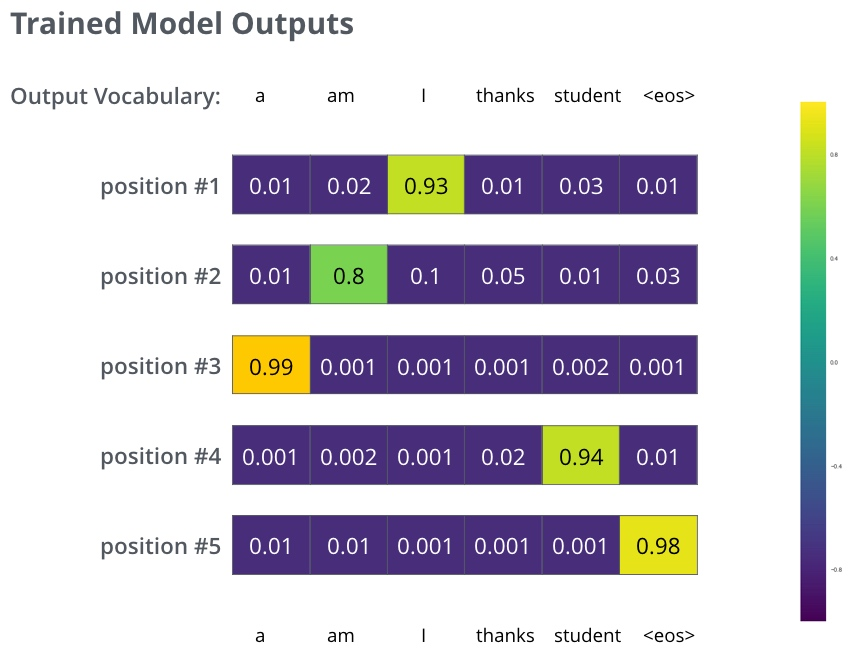


在跑完一轮 decoder 之后，进行下一轮 decoder：
- K、V 方向不变，仍然是 encoder 的输出矩阵 Z 作为输入
- Q 方向，上一轮 decoder 的输出矩阵作为输入


## KV Cache

- Prefill：encoder 过程中并行处理输入序列，得到 KV 矩阵，并生成第一个 token
- Decode：逐个生成输出序列中的剩余 token


## 后训练 post-training

预训练 pre-training 阶段获得的基础模型是一个用于处理通用任务的语言模型，如何让这个处理通用任务的基础模型在特定任务的场景取得最佳效果，称为后训练 post-training

### 微调 fine-tuning

fine-tuning 的特征是准备特定任务场景下的一组标注好的训练数据集、以及损失函数，然后按照预训练一样的流程，使用有监督学习的方式对基础模型进行训练

### 强化学习 reinforcement learning

RL 是指没有训练数据集的情况下，让模型自己探索获得一个输出，然后（由人或者另一个专门的模型 Reward Model）对模型的输出进行打分，从而使得模型自己调整策略，最终自己探索出一个最优策略


## 其他

### 混合专家模型 MoE (Mix of Experts)

传统模型推理过程中，模型的所有参数都会参与运算，但是只有其中非常小的一部分参数会实际影响输出，换句话说在高昂计算成本的条件下参数的利用率很低

而混合专家模型在推理阶段，则是根据输入的特定问题激活特定的专家模型，这些专家模型的参数量通常比普通模型的全量参数小很多，从而降低计算量（降低计算成本）


### 基于检索的模型 RAG 

已经训练好的模型在推理阶段遇到训练阶段没有对应样本训练过的问题，往往也能比较好地回答，这称为模型的泛化能力。但是这也有其局限性：
- 训练（包括预训练和后训练）阶段的训练数据集存在时限性，即不知道最新数据
- 不知道私有数据
- 模型的泛化能力容易造成模型幻觉

因而当模型的使用者维护有一个私有数据库的时候，就可以使用 RAG 方法，其原理是

- 在私有数据库中检索用户输入
- 将检索到的相关资料与用户输入的问题一起作为 prompt 输入给基础模型，从而获得输出

RAG 相对于 fine-tuning 的一个优势是，RAG 不需要对模型进行重新训练，而是在推理阶段实现，因而成本小很多